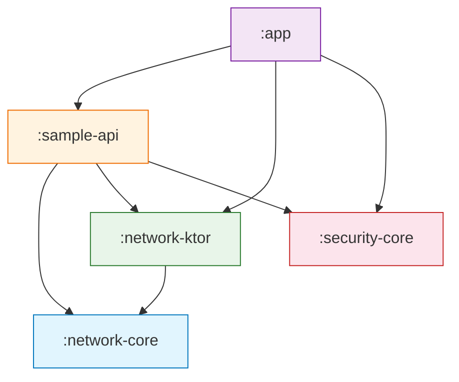
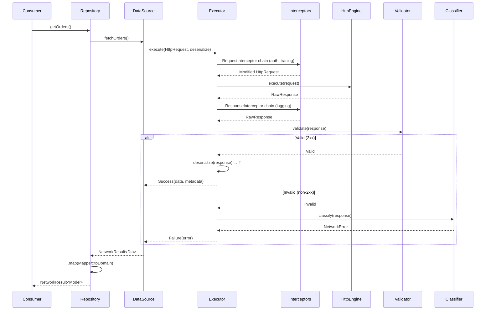
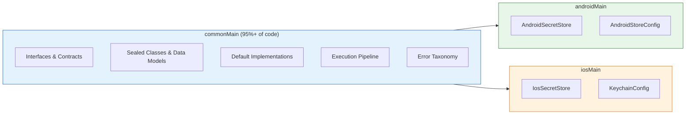
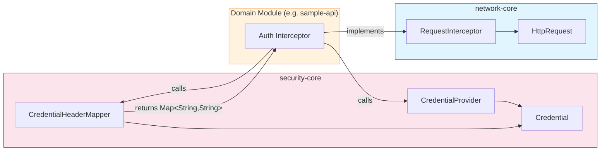

# Core Data Platform

**Kotlin Multiplatform SDK for Secure Remote Data Access**

A reusable, modular Kotlin Multiplatform (KMP) library designed to provide a secure, scalable, and transport-agnostic foundation for remote data operations across Android and iOS applications.

---

## Table of Contents

- [Overview](#overview)
- [Project Objectives](#project-objectives)
- [Architecture](#architecture)
- [Module Structure](#module-structure)
- [Folder Structure](#folder-structure)
- [KMP Strategy](#kmp-strategy)
- [Requirements](#requirements)
- [Usage Guide](#usage-guide)
- [Request Execution Flow](#request-execution-flow)
- [Error Handling](#error-handling)
- [Security](#security)
- [Extensibility](#extensibility)
- [Best Practices](#best-practices)
- [Diagrams](#diagrams)
- [Integration Example](#integration-example)
- [Roadmap](#roadmap)
- [Design Rules](#design-rules)

---

## Overview

Core Data Platform is an internal SDK built with Kotlin Multiplatform that provides a unified, secure, and extensible foundation for making remote API calls from mobile applications. It is designed to be consumed by multiple large-scale apps without coupling them to any specific HTTP client, serialization library, or backend contract.

### What problem does it solve?

In organizations that maintain multiple mobile applications, each team tends to build its own networking and security stack. This leads to:

- **Duplicated infrastructure** — retry logic, error handling, and auth flows reimplemented per app.
- **Inconsistent error handling** — each app classifies and surfaces errors differently.
- **Security fragmentation** — credential storage, log sanitization, and TLS policies vary across teams.
- **Difficult testing** — tightly coupled networking code makes unit testing expensive.

Core Data Platform solves this by providing a **single, well-tested, contract-driven foundation** that all apps share, while keeping each app free to define its own domain logic, serialization, and UI.

### Where can it be used?

- Multi-app mobile organizations (banking, fintech, insurance, retail, health)
- Teams adopting Kotlin Multiplatform for shared business logic
- Any project that needs a clean separation between transport infrastructure and domain logic

---

## Project Objectives

| Objective | How it is achieved |
|---|---|
| **Reusable** | Pure contracts in `network-core` and `security-core` — no app-specific logic, no backend assumptions |
| **Decoupled** | `network-core` has zero knowledge of Ktor, OkHttp, or any HTTP library. Transport is pluggable via `HttpEngine` |
| **Secure** | Credential abstraction, platform-secure storage, log sanitization, TLS trust policies — all as first-class contracts |
| **Scalable** | New domain modules (payments, loyalty, etc.) are added without modifying core modules |
| **Portable** | Kotlin Multiplatform with `commonMain` contracts and `androidMain`/`iosMain` platform implementations |
| **Maintainable** | Small, focused interfaces. Open classes for extension. Sealed types for exhaustive handling. No God objects |

---

## Architecture

### Design Philosophy

The architecture follows three core principles:

1. **Contracts over implementations** — Every major component is defined as an interface or abstract class in `commonMain`. Concrete implementations are injected, never hardcoded.

2. **Layered separation** — The project separates *what* the SDK does (contracts) from *how* it does it (implementations) and *who* uses it (domain modules).

3. **Zero lateral coupling** — `network-core` and `security-core` are completely independent modules. Neither knows the other exists. They are composed only at the point of consumption (domain modules or the app).

### Why are `network-core` and `security-core` separated?

These modules address fundamentally different concerns:

- **`network-core`** answers: *"How do I execute, validate, retry, and classify HTTP operations safely?"*
- **`security-core`** answers: *"How do I store secrets, manage sessions, evaluate trust, and protect sensitive data?"*

Keeping them independent means:

- A module that only needs secure storage does not pull in HTTP dependencies.
- A module that only needs networking does not pull in security dependencies.
- The integration point (credential injection into HTTP headers) is handled by a lightweight mapper (`CredentialHeaderMapper`) that lives in `security-core` and returns plain `Map<String, String>` — no network types required.

### How does it fit into large applications?

```
┌──────────────────────────────────────────────────────────────┐
│                      YOUR APPLICATION                        │
│                                                              │
│   ┌──────────┐  ┌──────────┐  ┌──────────┐                   │
│   │ Feature A│  │ Feature B│  │ Feature C│  ← App layers     │
│   └────┬─────┘  └────┬─────┘  └────┬─────┘                   │
│        │              │              │                       │
│   ┌────▼──────────────▼──────────────▼────┐                  │
│   │        Domain API Modules             │  ← :payments-api │
│   │   (DTOs, Mappers, DataSources, Repos) │     :loyalty-api │
│   └────┬──────────────┬──────────────┬────┘     :users-api   │
│        │              │              │                       │
├────────┼──────────────┼──────────────┼───────────────────────┤
│        ▼              ▼              ▼                       │
│   ┌──────────┐  ┌────────────┐  ┌──────────────┐             │
│   │ network  │  │  network   │  │  security    │  ← SDK      │
│   │  -core   │  │   -ktor    │  │   -core      │             │
│   └──────────┘  └────────────┘  └──────────────┘             │
└──────────────────────────────────────────────────────────────┘
```

The SDK modules sit at the bottom of the dependency graph. Application features never import Ktor, never see `RawResponse`, and never handle retry logic directly.

---

## Module Structure

### `:network-core`

**Responsibility:** Pure abstractions for HTTP execution, error modeling, validation, retry, and observability.

| Exposes | Does NOT expose |
|---|---|
| `HttpEngine`, `HttpRequest`, `RawResponse`, `HttpMethod` | Any HTTP client library |
| `SafeRequestExecutor`, `RequestInterceptor`, `ResponseInterceptor` | Ktor, OkHttp, URLSession types |
| `NetworkResult<T>`, `NetworkError`, `Diagnostic` | Raw `Throwable` in public API |
| `NetworkEventObserver` (observability contract) | Logging implementations |
| `ErrorClassifier`, `ResponseValidator`, `RetryPolicy` | Hardcoded retry decisions |
| `RemoteDataSource` (abstract base class) | Deserialization strategy |
| `NetworkConfig`, `RequestContext`, `ResponseMetadata` | Backend-specific configuration |

**Dependencies:** `kotlinx-coroutines-core` only.

---

### `:network-ktor`

**Responsibility:** Ktor-based implementation of `HttpEngine`. Encapsulates all Ktor-specific code.

| Exposes | Does NOT expose |
|---|---|
| `KtorHttpEngine` (implements `HttpEngine`) | Internal Ktor `HttpClient` configuration |
| `KtorErrorClassifier` (extends `DefaultErrorClassifier`) | Ktor exception types to consumers |
| Factory method `KtorHttpEngine.create(config)` | Platform engine selection logic |

**Dependencies:** `:network-core`, `ktor-client-core`, `ktor-client-okhttp` (Android), `ktor-client-darwin` (iOS).

**Key design decision:** `expectSuccess = false` — Ktor does not throw on HTTP 4xx/5xx. All error handling flows through `ResponseValidator` and `ErrorClassifier`.

---

### `:security-core`

**Responsibility:** Security abstractions — credentials, sessions, secure storage, trust, and log sanitization.

| Exposes | Does NOT expose |
|---|---|
| `Credential` (Bearer, ApiKey, Basic, Custom) | Platform keystore internals |
| `CredentialProvider`, `CredentialHeaderMapper` | Android Context, iOS Keychain API |
| `SessionController`, `SessionState`, `SessionEvent` | Token refresh implementation |
| `SecretStore` interface | EncryptedSharedPreferences, kSecAttrAccessible |
| `TrustPolicy`, `CertificatePin`, `TrustEvaluation` | Platform TLS implementation |
| `LogSanitizer`, `SecurityConfig` | Redaction algorithm internals |
| `SecurityError`, `Diagnostic` | Raw platform exceptions |

**Dependencies:** `kotlinx-coroutines-core` only.

**Platform implementations (skeleton status):**
- `AndroidSecretStore` — Prepared for EncryptedSharedPreferences + Android Keystore. Contains TODO bodies with step-by-step implementation guidance.
- `IosSecretStore` — Prepared for iOS Keychain Services. Contains TODO bodies with Keychain query patterns.

---

### `:sample-api`

**Responsibility:** Pilot reference module demonstrating the correct usage pattern for domain API modules.

| Layer | Class | Responsibility |
|---|---|---|
| DTO | `UserDto`, `CompanyDto` | `@Serializable` models matching API JSON exactly |
| Model | `User` | Clean domain model — no serialization annotations |
| Mapper | `UserMapper` | DTO → Domain conversion, pure and stateless |
| DataSource | `UserRemoteDataSource` | Extends `RemoteDataSource`, builds `HttpRequest`, deserializes |
| Repository | `UserRepository` | Maps `NetworkResult<UserDto>` → `NetworkResult<User>` |
| Wiring | `SampleApiFactory` | Full assembly: engine → executor → data source → repository |

**Dependencies:** `:network-core`, `:network-ktor`, `:security-core`, `kotlinx-serialization-json`.

---

### Module Dependency Graph

```
:sample-api ──▶ :network-core
:sample-api ──▶ :network-ktor ──▶ :network-core
:sample-api ──▶ :security-core

:network-ktor ──▶ :network-core

:network-core ──▶ (none)
:security-core ──▶ (none)
```

**Critical invariant:** `:network-core` and `:security-core` have **zero mutual dependency**. This is by design and must be preserved.

---

## Folder Structure

```
core-data-platform/
├── build.gradle.kts                          # Root build — plugin declarations
├── settings.gradle.kts                       # Module registration
├── gradle/libs.versions.toml                 # Centralized version catalog
│
├── network-core/                             # Pure network abstractions
│   └── src/commonMain/kotlin/com/dancr/platform/network/
│       ├── client/
│       │   ├── HttpEngine.kt                 # Transport abstraction
│       │   ├── HttpMethod.kt                 # GET, POST, PUT, DELETE, PATCH, HEAD, OPTIONS
│       │   ├── HttpRequest.kt                # Request model (path, method, headers, query, body)
│       │   └── RawResponse.kt                # Response model (statusCode, headers, body)
│       ├── config/
│       │   ├── NetworkConfig.kt              # Base URL, timeouts, default headers, retry policy
│       │   └── RetryPolicy.kt               # None, FixedDelay, ExponentialBackoff
│       ├── datasource/
│       │   └── RemoteDataSource.kt           # Abstract base for all remote data sources
│       ├── execution/
│       │   ├── SafeRequestExecutor.kt        # Execution pipeline interface
│       │   ├── DefaultSafeRequestExecutor.kt # Full pipeline: prepare → intercept → retry → validate → deserialize
│       │   ├── RequestInterceptor.kt         # Pre-request hook (auth, headers, tracing)
│       │   ├── ResponseInterceptor.kt        # Post-response hook (logging, caching, metrics)
│       │   ├── ErrorClassifier.kt            # Exception/response → NetworkError mapping interface
│       │   ├── DefaultErrorClassifier.kt     # Heuristic classifier (open for extension)
│       │   ├── ResponseValidator.kt          # Response validation contract + ValidationOutcome
│       │   ├── DefaultResponseValidator.kt   # Default: 2xx = valid
│       │   └── RequestContext.kt             # Per-request metadata (operationId, tags, tracing)
│       ├── observability/
│       │   └── NetworkEventObserver.kt       # Lifecycle callbacks for metrics/tracing/logging
│       └── result/
│           ├── NetworkResult.kt              # Success<T> | Failure — with map, fold, flatMap
│           ├── NetworkError.kt               # Semantic error taxonomy (sealed class)
│           ├── Diagnostic.kt                 # Internal error details (description, cause, metadata)
│           └── ResponseMetadata.kt           # Status code, headers, duration, attempt count
│
├── network-ktor/                             # Ktor transport adapter
│   └── src/commonMain/kotlin/com/dancr/platform/network/ktor/
│       ├── KtorHttpEngine.kt                 # HttpEngine implementation over Ktor HttpClient
│       └── KtorErrorClassifier.kt            # Ktor-aware error classification
│
├── security-core/                            # Security abstractions
│   └── src/
│       ├── commonMain/kotlin/com/dancr/platform/security/
│       │   ├── config/
│       │   │   └── SecurityConfig.kt         # Sensitive headers/keys, redaction placeholder
│       │   ├── credential/
│       │   │   ├── Credential.kt             # Sealed interface: Bearer, ApiKey, Basic, Custom
│       │   │   ├── CredentialProvider.kt     # Supplies active credential for requests
│       │   │   └── CredentialHeaderMapper.kt # Credential → HTTP header map (no network dependency)
│       │   ├── error/
│       │   │   ├── SecurityError.kt          # Semantic security errors (sealed class)
│       │   │   └── Diagnostic.kt             # Internal error details
│       │   ├── sanitizer/
│       │   │   ├── LogSanitizer.kt           # Key-aware value redaction interface
│       │   │   └── DefaultLogSanitizer.kt    # Redacts sensitive headers and body keys
│       │   ├── session/
│       │   │   ├── SessionController.kt      # Session lifecycle contract (StateFlow-based)
│       │   │   ├── SessionState.kt           # Idle | Active(credential) | Expired
│       │   │   ├── SessionCredentials.kt     # Credential + refresh token + expiry
│       │   │   └── SessionEvent.kt           # Started, Refreshed, Expired, Ended, RefreshFailed
│       │   ├── store/
│       │   │   └── SecretStore.kt            # Secure key-value storage interface
│       │   ├── trust/
│       │   │   ├── TrustPolicy.kt            # Host evaluation + certificate pinning interface
│       │   │   ├── TrustEvaluation.kt        # Trusted | Denied(reason)
│       │   │   ├── CertificatePin.kt         # Algorithm + hash pair
│       │   │   └── DefaultTrustPolicy.kt     # Always-trust default (override for production)
│       │   └── util/
│       │       └── Base64.kt                 # Cross-platform Base64 encoding
│       ├── androidMain/kotlin/com/dancr/platform/security/store/
│       │   ├── AndroidSecretStore.kt         # SecretStore impl (skeleton — EncryptedSharedPreferences)
│       │   └── AndroidStoreConfig.kt         # Android-specific storage configuration
│       └── iosMain/kotlin/com/dancr/platform/security/store/
│           ├── IosSecretStore.kt             # SecretStore impl (skeleton — Keychain Services)
│           └── KeychainConfig.kt             # iOS-specific Keychain configuration
│
└── sample-api/                               # Pilot reference module
    └── src/commonMain/kotlin/com/dancr/platform/sample/
        ├── dto/UserDto.kt                    # Technical model (@Serializable)
        ├── model/User.kt                     # Public domain model (clean)
        ├── mapper/UserMapper.kt              # DTO → Domain
        ├── datasource/UserRemoteDataSource.kt # Extends RemoteDataSource
        ├── repository/UserRepository.kt      # Domain mapping layer
        └── di/SampleApiFactory.kt            # Full wiring example
```

---

## KMP Strategy

### What goes where

| Sou r ce Se t | Content | Rationale |
|---------------|---|---|
| `commonMain`  | All interfaces, contracts, sealed classes, data classes, default implementations, execution pipeline, error model | Shared across all platforms. This is where 95%+ of the SDK logic lives. |
| `androidMain` | `AndroidSecretStore`, `AndroidStoreConfig` | Uses Android-specific APIs: `EncryptedSharedPreferences`, `android.content.Context`, Android Keystore. |
| `iosMain`     | `IosSecretStore`, `KeychainConfig` | Uses iOS-specific APIs: Keychain Services (`SecItemAdd`, `SecItemCopyMatching`), `kSecAttrAccessible`. |

### Why this split?

The goal is to **maximize the common surface** and push platform-specific code to the absolute edges:

- **Business logic** — always in `commonMain`. No exceptions.
- **Configuration data classes** — always in `commonMain`.
- **Platform I/O** — only in platform source sets (`androidMain`, `iosMain`).
- **Transport engines** — Ktor auto-selects the platform engine (OkHttp on Android, Darwin on iOS) via Gradle dependency resolution in `:network-ktor`. No platform source sets needed in the transport module.

This means that adding a new security feature (e.g., biometric authentication) only requires:
1. Define the interface in `commonMain`.
2. Implement in `androidMain` (BiometricPrompt) and `iosMain` (LAContext).
3. No changes to `network-core` or any domain module.

---

## Requirements

| Tool | Version | Notes |
|---|---|---|
| **Kotlin** | 2.1.20 | Kotlin Multiplatform plugin |
| **Gradle** | 9.3.1+ | With version catalog (`libs.versions.toml`) |
| **AGP** | 9.1.0 | Uses `com.android.kotlin.multiplatform.library` plugin |
| **Android Studio** | Ladybug or later | KMP support required |
| **Xcode** | 15+ | For iOS target compilation |
| **Android `compileSdk`** | 36 | |
| **Android `minSdk`** | 29 | Android 10+ |
| **iOS targets** | `iosX64`, `iosArm64`, `iosSimulatorArm64` | |

### Key dependencies

| Library | Version | Module |
|---|---|---|
| `kotlinx-coroutines-core` | 1.10.1 | `network-core`, `security-core` |
| `ktor-client-core` | 3.0.3 | `network-ktor` |
| `ktor-client-okhttp` | 3.0.3 | `network-ktor` (Android) |
| `ktor-client-darwin` | 3.0.3 | `network-ktor` (iOS) |
| `kotlinx-serialization-json` | 1.7.3 | `sample-api` (domain modules) |

---

## Usage Guide

### 1. Add modules to your project

In your app's `build.gradle.kts`:

```kotlin
dependencies {
    // Core contracts (always required)
    implementation(project(":network-core"))

    // Transport implementation (pick one)
    implementation(project(":network-ktor"))

    // Security (if you need auth, secure storage, or session management)
    implementation(project(":security-core"))

    // Serialization (in your domain modules)
    implementation(libs.kotlinx.serialization.json)
}
```

### 2. Define your configuration

```kotlin
val config = NetworkConfig(
    baseUrl = "https://api.yourcompany.com",
    defaultHeaders = mapOf(
        "Accept" to "application/json",
        "X-App-Version" to "1.0.0"
    ),
    connectTimeout = 15.seconds,
    readTimeout = 30.seconds,
    retryPolicy = RetryPolicy.ExponentialBackoff(
        maxRetries = 3,
        initialDelay = 1.seconds,
        maxDelay = 15.seconds
    )
)
```

### 3. Create the execution pipeline

```kotlin
val engine = KtorHttpEngine.create(config)

val executor = DefaultSafeRequestExecutor(
    engine = engine,
    config = config,
    classifier = KtorErrorClassifier(),
    interceptors = listOf(myAuthInterceptor),
    responseInterceptors = listOf(myLoggingInterceptor),
    observers = listOf(myMetricsObserver)
)
```

### 4. Build your data source

```kotlin
class OrderRemoteDataSource(
    executor: SafeRequestExecutor
) : RemoteDataSource(executor) {

    private val json = Json { ignoreUnknownKeys = true }

    suspend fun fetchOrders(): NetworkResult<List<OrderDto>> = execute(
        request = HttpRequest(path = "/orders", method = HttpMethod.GET),
        deserialize = { response ->
            json.decodeFromString(response.body!!.decodeToString())
        }
    )
}
```

### 5. Consume results in your UI/ViewModel

```kotlin
repository.getOrders().fold(
    onSuccess = { orders -> /* List<Order> — clean domain models */ },
    onFailure = { error -> showError(error.message) }
)
```

Your ViewModel never imports Ktor. Never sees `RawResponse`. Never handles retries.

---

## Request Execution Flow

The following describes the complete lifecycle of a single request through the SDK:

```
Consumer calls: repository.getOrders()
│
├─ 1. UserRepository
│     Calls dataSource.fetchOrders()
│     Maps result: .map(OrderMapper::toDomain)
│
├─ 2. OrderRemoteDataSource : RemoteDataSource
│     Calls execute(HttpRequest, deserialize)
│     Delegates to SafeRequestExecutor
│
├─ 3. DefaultSafeRequestExecutor
│     │
│     ├─ 3a. PREPARE REQUEST
│     │     • Merge defaultHeaders from NetworkConfig
│     │     • Build full URL: baseUrl + path
│     │     • Run RequestInterceptor chain (auth, tracing, custom headers)
│     │
│     ├─ 3b. NOTIFY OBSERVERS
│     │     • observer.onRequestStarted(request, context)
│     │
│     ├─ 3c. RETRY LOOP (controlled by RetryPolicy)
│     │     │
│     │     ├─ TRANSPORT: HttpEngine.execute(request) → RawResponse
│     │     │
│     │     ├─ RESPONSE INTERCEPTORS: run ResponseInterceptor chain
│     │     │
│     │     ├─ NOTIFY: observer.onResponseReceived(request, response, durationMs)
│     │     │
│     │     ├─ VALIDATE: ResponseValidator.validate(response) → Valid | Invalid
│     │     │     • 2xx + Valid → continue to deserialization
│     │     │     • 2xx + Invalid → ResponseValidation error
│     │     │     • non-2xx → ErrorClassifier.classify(response) → semantic error
│     │     │
│     │     ├─ DESERIALIZE: deserialize(response) → T
│     │     │
│     │     └─ On failure:
│     │           • If error.isRetryable AND attempts remain → delay → retry
│     │           • observer.onRetryScheduled(attempt, maxAttempts, error, delayMs)
│     │           • Otherwise → return Failure
│     │
│     └─ 3d. RETURN NetworkResult<T>
│           • Success(data, ResponseMetadata) — includes statusCode, durationMs, attemptCount
│           • Failure(NetworkError) — semantic, with Diagnostic for internal debugging
│
└─ 4. Consumer receives NetworkResult<Order>
      • .fold(), .map(), .onSuccess(), .onFailure()
      • Never sees RawResponse, HttpEngine, or Ktor types
```

---

## Error Handling

### The Result Model

Every operation returns `NetworkResult<T>`, a sealed class:

```kotlin
sealed class NetworkResult<out T> {
    data class Success<T>(val data: T, val metadata: ResponseMetadata)
    data class Failure(val error: NetworkError)
}
```

Consumers use a rich API to handle results:

| Method | Purpose |
|---|---|
| `.fold(onSuccess, onFailure)` | Exhaustive handling |
| `.map { transform }` | Transform success data, preserving metadata |
| `.flatMap { transform }` | Chain dependent operations |
| `.onSuccess { }` / `.onFailure { }` | Side effects |
| `.getOrNull()` / `.errorOrNull()` | Nullable extraction |

### Error Taxonomy

`NetworkError` is a sealed class organized by layer:

| Layer | Error | `isRetryable` | Public Message |
|---|---|---|---|
| **Transport** | `Connectivity` | ✅ | "Unable to reach the server" |
| | `Timeout` | ✅ | "The request timed out" |
| | `Cancelled` | ❌ | "The request was cancelled" |
| **HTTP Semantic** | `Authentication` | ❌ | "Authentication required" |
| | `Authorization` | ❌ | "Access denied" |
| | `ClientError(statusCode)` | ❌ | "Invalid request" |
| | `ServerError(statusCode)` | ✅ | "Server error" |
| **Data Processing** | `Serialization` | ❌ | "Failed to process response data" |
| | `ResponseValidation(reason)` | ❌ | "Response validation failed" |
| **Catch-all** | `Unknown` | ❌ | "An unexpected error occurred" |

### Two audiences, one model

- **`error.message`** — Safe for end users. Never exposes technical details.
- **`error.diagnostic`** — For developers and logging. Contains `description`, `cause` (Throwable), and `metadata` (Map). Never shown to users.

```kotlin
result.onFailure { error ->
    // For UI
    showToast(error.message)

    // For logging (internal only)
    logger.error(error.diagnostic?.description, error.diagnostic?.cause)
}
```

---

## Security

### Architecture Overview

`security-core` provides abstractions for five security concerns. All contracts are in `commonMain`; platform-specific implementations are in `androidMain`/`iosMain`.

### 1. Credential Management

```kotlin
sealed interface Credential {
    data class Bearer(val token: String)
    data class ApiKey(val key: String, val headerName: String = "X-API-Key")
    data class Basic(val username: String, val password: String)
    data class Custom(val type: String, val properties: Map<String, String>)
}
```

`CredentialProvider` supplies the current credential. `CredentialHeaderMapper` converts any `Credential` into HTTP headers without importing any network types:

```kotlin
val headers: Map<String, String> = CredentialHeaderMapper.toHeaders(credential)
// Bearer → {"Authorization": "Bearer <token>"}
// ApiKey → {"X-API-Key": "<key>"}
// Basic → {"Authorization": "Basic <base64>"}
```

### 2. Session Lifecycle

`SessionController` manages the full authentication lifecycle with reactive state:

```kotlin
interface SessionController {
    val state: StateFlow<SessionState>   // Idle | Active(credential) | Expired
    val events: Flow<SessionEvent>       // Started, Refreshed, Expired, Ended, RefreshFailed
    suspend fun startSession(credentials: SessionCredentials)
    suspend fun refreshSession(): Boolean
    suspend fun endSession()
}
```

> **Status:** Interface defined. Implementation is pending — requires `SecretStore` implementations to be completed first.

### 3. Secure Storage

`SecretStore` provides platform-secure key-value storage:

```kotlin
interface SecretStore {
    suspend fun putString(key: String, value: String)
    suspend fun getString(key: String): String?
    suspend fun putBytes(key: String, value: ByteArray)
    suspend fun getBytes(key: String): ByteArray?
    suspend fun remove(key: String)
    suspend fun clear()
    suspend fun contains(key: String): Boolean
}
```

| Platform | Implementation | Backend | Status |
|---|---|---|---|
| Android | `AndroidSecretStore` | EncryptedSharedPreferences + Android Keystore | Skeleton with TODOs |
| iOS | `IosSecretStore` | Keychain Services (`kSecClassGenericPassword`) | Skeleton with TODOs |

### 4. Trust Policy

```kotlin
interface TrustPolicy {
    fun evaluateHost(hostname: String): TrustEvaluation  // Trusted | Denied(reason)
    fun pinnedCertificates(): Map<String, Set<CertificatePin>>
}
```

`DefaultTrustPolicy` trusts all hosts (development default). Production apps override with domain-specific pin sets.

> **Status:** Contract defined. Integration with Ktor TLS configuration is pending (requires platform source sets in `network-ktor`).

### 5. Log Sanitization

```kotlin
interface LogSanitizer {
    fun sanitize(key: String, value: String): String
}
```

`DefaultLogSanitizer` redacts values for keys matching `SecurityConfig.sensitiveHeaders` (e.g., `authorization`, `cookie`) and `SecurityConfig.sensitiveKeys` (e.g., `password`, `token`, `api_key`).

---

## Extensibility

### Adding a new domain API module

Follow the pattern established by `:sample-api`:

1. Create a new module (e.g., `:payments-api`).
2. Depend on `:network-core`, `:network-ktor`, `:security-core`.
3. Create your layers:
   - `dto/` — `@Serializable` models matching the API response
   - `model/` — Clean domain models (no annotations)
   - `mapper/` — DTO → Domain conversion
   - `datasource/` — Extends `RemoteDataSource`
   - `repository/` — Maps `NetworkResult<Dto>` → `NetworkResult<Model>`
   - `di/` — Factory wiring

**No changes to core modules required.**

### Adding a new transport engine

Implement `HttpEngine` in a new module (e.g., `:network-okhttp`):

```kotlin
class OkHttpEngine(private val client: OkHttpClient) : HttpEngine {
    override suspend fun execute(request: HttpRequest): RawResponse { /* ... */ }
    override fun close() { client.dispatcher.executorService.shutdown() }
}
```

Extend `DefaultErrorClassifier` for type-safe exception matching:

```kotlin
class OkHttpErrorClassifier : DefaultErrorClassifier() {
    override fun classifyThrowable(cause: Throwable): NetworkError = when (cause) {
        is SocketTimeoutException -> NetworkError.Timeout(/* ... */)
        else -> super.classifyThrowable(cause)
    }
}
```

### Adding observability

Implement `NetworkEventObserver` — only override the callbacks you need:

```kotlin
class MetricsObserver(private val metrics: MetricsClient) : NetworkEventObserver {
    override fun onResponseReceived(request: HttpRequest, response: RawResponse, durationMs: Long, context: RequestContext?) {
        metrics.recordLatency("http.request.duration", durationMs, tags = mapOf("path" to request.path))
    }
    override fun onRequestFailed(request: HttpRequest, error: NetworkError, durationMs: Long, context: RequestContext?) {
        metrics.increment("http.request.error", tags = mapOf("type" to error::class.simpleName.orEmpty()))
    }
}
```

Wire it in:

```kotlin
DefaultSafeRequestExecutor(
    engine = engine,
    config = config,
    observers = listOf(MetricsObserver(myMetricsClient), TracingObserver(myTracer))
)
```

### Adding response interceptors

Implement `ResponseInterceptor` for post-transport processing:

```kotlin
val loggingInterceptor = ResponseInterceptor { response, request, context ->
    logger.info("${request.method} ${request.path} → ${response.statusCode}")
    response  // return unmodified, or transform as needed
}
```

### Adding custom retry behavior

`NetworkError.isRetryable` is an `open val`. The `DefaultErrorClassifier` returns standard error types with built-in retryability. To customize, create an `ErrorClassifier` that returns errors with different retryability characteristics, or extend `DefaultErrorClassifier` and override `classifyResponse`/`classifyThrowable`.

---

## Best Practices

### Do

- **Use `RemoteDataSource`** as the base for all data sources. It enforces the `SafeRequestExecutor` pipeline.
- **Separate DTOs from domain models.** DTOs match the API contract; domain models match your app's vocabulary.
- **Inject `SafeRequestExecutor`** — never `DefaultSafeRequestExecutor` directly. Code to the interface.
- **Use `RequestContext`** for per-request metadata (operation IDs, tracing spans, auth flags).
- **Handle `NetworkResult` exhaustively** with `.fold()` — never ignore the failure branch.
- **Keep mappers pure.** `UserMapper.toDomain(dto)` should be a stateless, side-effect-free function.
- **Test with mock `HttpEngine`.** The interface is trivial to mock — return a `RawResponse` with the status code and body you want.

### Don't

- **Don't import Ktor types in domain modules.** If you see `io.ktor` in a data source or repository, the abstraction is leaking.
- **Don't catch `NetworkResult.Failure` as an exception.** It is a value, not a thrown error. Use `.fold()` or `.onFailure()`.
- **Don't put business logic in interceptors.** Interceptors are for cross-cutting infrastructure (auth, logging, tracing). Business validation belongs in the repository or domain layer.
- **Don't create a `Json` instance per request.** Create it once in the data source and reuse.
- **Don't expose `Diagnostic` to end users.** It contains internal debugging information (`Throwable`, stack context). Show `error.message` to users.
- **Don't depend on `network-core` from `security-core`** (or vice versa). This invariant preserves module independence.
- **Don't hardcode base URLs in data sources.** Pass them via `NetworkConfig` at the wiring level.

### Common integration mistakes

| Mistake | Fix |
|---|---|
| Using `response.body!!` without error context | Wrap in `try` or check for null with a descriptive error |
| Creating a new `KtorHttpEngine` per request | Create once, share across data sources via the executor |
| Forgetting to call `engine.close()` | Use the engine lifecycle management in your DI framework |
| Putting the `Json` configuration in `commonMain` of a core module | Keep serialization in domain modules — core modules are serialization-agnostic |

---

## Diagrams

### Module Dependency Graph



### Execution Pipeline



### KMP Source Set Distribution



### Network ↔ Security Integration



---

## Integration Example

A complete, minimal example showing how a consuming app wires and uses the SDK:

```kotlin
// -- Step 1: Configuration --
val config = NetworkConfig(
    baseUrl = "https://jsonplaceholder.typicode.com",
    defaultHeaders = mapOf("Accept" to "application/json"),
    connectTimeout = 15.seconds,
    readTimeout = 30.seconds,
    retryPolicy = RetryPolicy.ExponentialBackoff(maxRetries = 2)
)

// -- Step 2: Transport --
val engine = KtorHttpEngine.create(config)

// -- Step 3: Auth interceptor (using security-core) --
val authInterceptor = RequestInterceptor { request, _ ->
    val credential = myCredentialProvider.current()
        ?: return@RequestInterceptor request
    val headers = CredentialHeaderMapper.toHeaders(credential)
    request.copy(headers = request.headers + headers)
}

// -- Step 4: Executor --
val executor = DefaultSafeRequestExecutor(
    engine = engine,
    config = config,
    classifier = KtorErrorClassifier(),
    interceptors = listOf(authInterceptor)
)

// -- Step 5: Data source + Repository --
val dataSource = UserRemoteDataSource(executor)
val repository = UserRepository(dataSource)

// -- Step 6: Consume --
val result: NetworkResult<List<User>> = repository.getUsers()

result.fold(
    onSuccess = { users ->
        // Clean domain models. No Ktor, no DTOs, no RawResponse.
        users.forEach { println("${it.displayName} (@${it.handle})") }
    },
    onFailure = { error ->
        // Semantic error with user-safe message.
        println("Error: ${error.message}")
        // Internal diagnostic for logging.
        error.diagnostic?.let { d -> logger.error(d.description, d.cause) }
    }
)
```

---

## Roadmap

### Phase 1 — Core Functionality

| Task | Module | Status |
|---|---|---|
| Implement `AndroidSecretStore` with EncryptedSharedPreferences | `security-core` | 🟡 Skeleton ready |
| Implement `IosSecretStore` with Keychain Services | `security-core` | 🟡 Skeleton ready |
| Implement `DefaultSessionController` with StateFlow + token storage | `security-core` | 🔴 Not started |
| Implement `CredentialProvider` backed by SessionController | `security-core` | 🔴 Not started |

### Phase 2 — Observability & Testing

| Task | Module | Status |
|---|---|---|
| `LoggingObserver` — structured request lifecycle logging | `network-core` | 🔴 Not started |
| `MetricsObserver` — latency, error rate, retry count | `network-core` | 🔴 Not started |
| Integration tests with Ktor `MockEngine` | `network-ktor` | 🔴 Not started |
| Unit tests for `DefaultSafeRequestExecutor` | `network-core` | 🔴 Not started |

### Phase 3 — Advanced Security

| Task | Module | Status |
|---|---|---|
| Certificate pinning via `TrustPolicy` → OkHttp / Darwin TLS | `network-ktor` | 🔴 Not started |
| Auth refresh interceptor (401 → refresh → retry) | Bridge module | 🔴 Not started |
| Sanitized response logging with `LogSanitizer` | Bridge module | 🔴 Not started |

### Phase 4 — Scale

| Task | Module | Status |
|---|---|---|
| Unify `Diagnostic` into `:platform-common` module | New module | 🔴 Not started |
| `TracingObserver` with `parentSpanId` propagation | `network-core` | 🔴 Not started |
| Circuit breaker retry policy | `network-core` | 🔴 Not started |
| First production domain module | New module | 🔴 Not started |

---

## Design Rules

These are the architectural invariants of the project. All contributions must respect them.

1. **The public API never exposes transport details.**
   Consumers see `HttpRequest`, `NetworkResult`, `NetworkError`. Never `io.ktor.*`, `okhttp3.*`, or `NSURLSession`.

2. **`network-core` and `security-core` must never depend on each other.**
   They integrate only at the consumer level via composition.

3. **Errors are values, not exceptions.**
   `NetworkResult.Failure` wraps `NetworkError`. Exceptions are caught at the executor boundary and classified into semantic types.

4. **`Diagnostic` is internal. `message` is public.**
   `error.message` is safe for end users. `error.diagnostic` is for logging and debugging only.

5. **Retry decisions belong to the error model.**
   `NetworkError.isRetryable` determines retryability. The executor does not hardcode which errors to retry.

6. **Interceptors are for infrastructure, not business logic.**
   Auth headers, tracing context, logging — yes. Order validation, price calculation — no.

7. **DTOs and domain models are always separate.**
   DTOs have `@Serializable` and match the API contract. Domain models are clean and API-agnostic.

8. **Platform-specific code lives at the edges.**
   Interfaces in `commonMain`. Implementations in `androidMain`/`iosMain`. Never the other way around.

9. **Every major component is injectable.**
   `HttpEngine`, `ErrorClassifier`, `ResponseValidator`, `CredentialProvider`, `SecretStore` — all interfaces, all injected via constructor.

10. **New features are additive.**
    New modules, new interceptors, new observers, new error subtypes. Existing contracts are stable.

---

*Core Data Platform — Built for teams that ship multiple apps from a shared foundation.*
