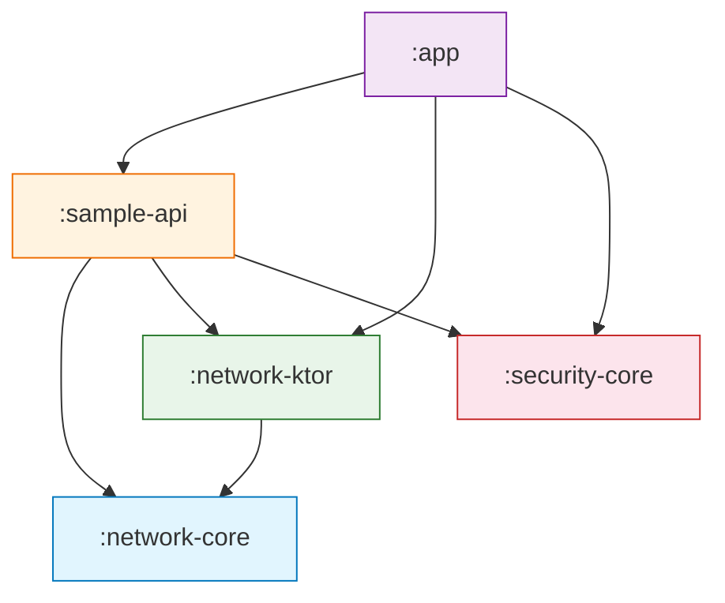
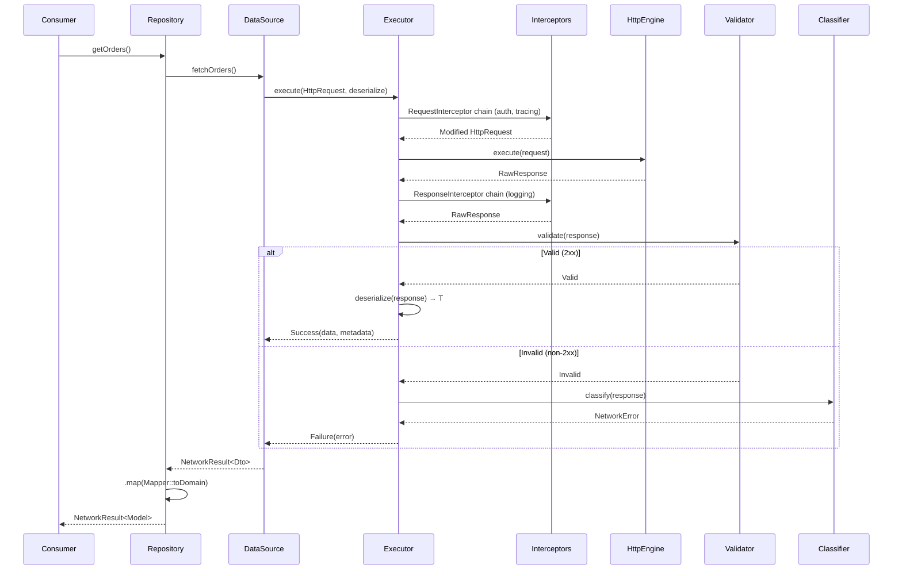
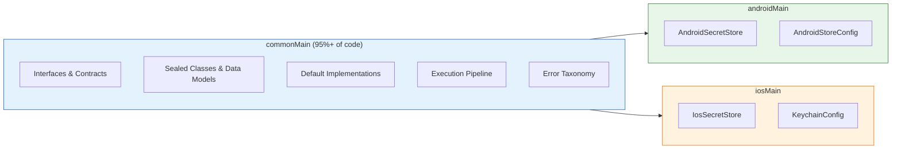
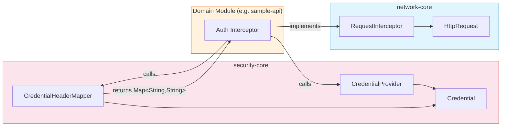

# Core Data Platform

**SDK Kotlin Multiplatform para Acceso Remoto Seguro de Datos**

Una librería Kotlin Multiplatform (KMP) reutilizable y modular diseñada para proveer una base segura, escalable y agnóstica de transporte para operaciones de datos remotos en aplicaciones Android e iOS.

---

## Tabla de Contenidos

- [Documentación](#documentación)
- [Resumen](#resumen)
- [Objetivos del Proyecto](#objetivos-del-proyecto)
- [Arquitectura](#arquitectura)
- [Estructura de Módulos](#estructura-de-módulos)
- [Estructura de Carpetas](#estructura-de-carpetas)
- [Estrategia KMP](#estrategia-kmp)
- [Requisitos](#requisitos)
- [Guía de Uso](#guía-de-uso)
- [Flujo de Ejecución de Requests](#flujo-de-ejecución-de-requests)
- [Manejo de Errores](#manejo-de-errores)
- [Seguridad](#seguridad)
- [Extensibilidad](#extensibilidad)
- [Buenas Prácticas](#buenas-prácticas)
- [Diagramas](#diagramas)
- [Ejemplo de Integración](#ejemplo-de-integración)
- [Roadmap](#roadmap)
- [Reglas de Diseño](#reglas-de-diseño)

---

## Documentación

### Guías

- [Guía de Integración](docs/integration-guide.md) — Cómo agregar el SDK como dependencia y conectar módulos de dominio
- [Guía Rápida para Android](docs/android-quickstart.md) — Primeros pasos para desarrolladores Android sin contexto previo
- [Integración con Clean Architecture](docs/clean-architecture-integration.md) — Cómo usar el SDK en la capa `data` de un proyecto con Clean Architecture

### READMEs de Módulos

- [network-core](network-core/README.md) — Abstracciones puras de red, pipeline de ejecución, taxonomía de errores
- [network-ktor](network-ktor/README.md) — Adaptador de transporte HTTP basado en Ktor
- [security-core](security-core/README.md) — Credenciales, sesiones, almacenamiento seguro, confianza TLS, sanitización de logs
- [sample-api](sample-api/README.md) — Módulo piloto de referencia para integración de API de dominio

### Registros de Decisiones de Arquitectura (ADRs)

- [Índice de ADRs](docs/adr/README.md)
- [ADR-001: Separación network-core / security-core](docs/adr/ADR-001-separation-network-core-security-core.md)
- [ADR-002: Contratos primero, implementación después](docs/adr/ADR-002-contracts-first-implementation-after.md)
- [ADR-003: Sin detalles de transporte en API pública](docs/adr/ADR-003-no-transport-details-in-public-api.md)
- [ADR-004: Separación commonMain / platformMain](docs/adr/ADR-004-commonmain-platformmain-separation.md)
- [ADR-005: Pipeline de ejecución segura centralizado](docs/adr/ADR-005-centralized-safe-execution-pipeline.md)
- [ADR-006: Clasificación de errores centralizada](docs/adr/ADR-006-centralized-error-classification.md)

### Diagramas

- [Índice de Diagramas](docs/diagrams/README.md)
- [01 — Arquitectura General](docs/diagrams/01-general-architecture.md)
- [02 — Dependencias entre Módulos](docs/diagrams/02-module-dependencies.md)
- [03 — Flujo de Ejecución de Requests](docs/diagrams/03-request-execution-flow.md)
- [04 — Estrategia KMP](docs/diagrams/04-kmp-strategy.md)
- [05 — Relaciones entre Contratos](docs/diagrams/05-contract-relationships.md)

---

## Resumen

Core Data Platform es un SDK interno construido con Kotlin Multiplatform que provee una base unificada, segura y extensible para hacer llamadas a APIs remotas desde aplicaciones móviles. Está diseñado para ser consumido por múltiples apps a gran escala sin acoplarlas a ningún cliente HTTP, librería de serialización o contrato de backend específico.

### ¿Qué problema resuelve?

En organizaciones que mantienen múltiples aplicaciones móviles, cada equipo tiende a construir su propio stack de networking y seguridad. Esto lleva a:

- **Infraestructura duplicada** — lógica de reintentos, manejo de errores y flujos de auth reimplementados por app.
- **Manejo de errores inconsistente** — cada app clasifica y muestra errores de forma diferente.
- **Fragmentación de seguridad** — almacenamiento de credenciales, sanitización de logs y políticas TLS varían entre equipos.
- **Testing difícil** — código de networking fuertemente acoplado hace que el unit testing sea costoso.

Core Data Platform resuelve esto proveyendo una **única base bien testeada y dirigida por contratos** que todas las apps comparten, manteniendo cada app libre de definir su propia lógica de dominio, serialización y UI.

### ¿Dónde puede usarse?

- Organizaciones móviles multi-app (banca, fintech, seguros, retail, salud)
- Equipos adoptando Kotlin Multiplatform para lógica de negocio compartida
- Cualquier proyecto que necesite una separación limpia entre infraestructura de transporte y lógica de dominio

---

## Objetivos del Proyecto

| Objetivo | Cómo se logra |
|---|---|
| **Reutilizable** | Contratos puros en `network-core` y `security-core` — sin lógica específica de app, sin suposiciones de backend |
| **Desacoplado** | `network-core` tiene cero conocimiento de Ktor, OkHttp o cualquier librería HTTP. El transporte es pluggable vía `HttpEngine` |
| **Seguro** | Abstracción de credenciales, almacenamiento seguro de plataforma, sanitización de logs, políticas de confianza TLS — todo como contratos de primera clase |
| **Escalable** | Nuevos módulos de dominio (pagos, fidelidad, etc.) se agregan sin modificar módulos core |
| **Portable** | Kotlin Multiplatform con contratos en `commonMain` e implementaciones de plataforma en `androidMain`/`iosMain` |
| **Mantenible** | Interfaces pequeñas y enfocadas. Clases open para extensión. Tipos sealed para manejo exhaustivo. Sin God objects |

---

## Arquitectura

### Filosofía de Diseño

La arquitectura sigue tres principios fundamentales:

1. **Contratos sobre implementaciones** — Cada componente principal se define como una interfaz o clase abstracta en `commonMain`. Las implementaciones concretas se inyectan, nunca se hardcodean.

2. **Separación por capas** — El proyecto separa *qué* hace el SDK (contratos) de *cómo* lo hace (implementaciones) y *quién* lo usa (módulos de dominio).

3. **Cero acoplamiento lateral** — `network-core` y `security-core` son módulos completamente independientes. Ninguno sabe que el otro existe. Solo se componen en el punto de consumo (módulos de dominio o la app).

### ¿Por qué están separados `network-core` y `security-core`?

Estos módulos abordan preocupaciones fundamentalmente diferentes:

- **`network-core`** responde: *"¿Cómo ejecuto, valido, reintento y clasifico operaciones HTTP de forma segura?"*
- **`security-core`** responde: *"¿Cómo almaceno secretos, gestiono sesiones, evalúo confianza y protejo datos sensibles?"*

Mantenerlos independientes significa:

- Un módulo que solo necesita almacenamiento seguro no trae dependencias HTTP.
- Un módulo que solo necesita networking no trae dependencias de seguridad.
- El punto de integración (inyección de credenciales en headers HTTP) se maneja con un mapper ligero (`CredentialHeaderMapper`) que vive en `security-core` y retorna un simple `Map<String, String>` — sin tipos de red requeridos.

### ¿Cómo encaja en aplicaciones grandes?

```
┌──────────────────────────────────────────────────────────────┐
│                      YOUR APPLICATION                        │
│                                                              │
│   ┌──────────┐  ┌──────────┐  ┌──────────┐                   │
│   │ Feature A│  │ Feature B│  │ Feature C│  ← App layers     │
│   └────┬─────┘  └────┬─────┘  └────┬─────┘                   │
│        │              │              │                       │
│   ┌────▼──────────────▼──────────────▼────┐                  │
│   │        Domain API Modules             │  ← :payments-api │
│   │   (DTOs, Mappers, DataSources, Repos) │     :loyalty-api │
│   └────┬──────────────┬──────────────┬────┘     :users-api   │
│        │              │              │                       │
├────────┼──────────────┼──────────────┼───────────────────────┤
│        ▼              ▼              ▼                       │
│   ┌──────────┐  ┌────────────┐  ┌──────────────┐             │
│   │ network  │  │  network   │  │  security    │  ← SDK      │
│   │  -core   │  │   -ktor    │  │   -core      │             │
│   └──────────┘  └────────────┘  └──────────────┘             │
└──────────────────────────────────────────────────────────────┘
```

Los módulos del SDK se sitúan en la parte inferior del grafo de dependencias. Las funcionalidades de la aplicación nunca importan Ktor, nunca ven `RawResponse`, y nunca manejan lógica de reintentos directamente.

---

## Estructura de Módulos

### `:network-core`

**Responsabilidad:** Abstracciones puras para ejecución HTTP, modelado de errores, validación, reintentos y observabilidad.

| Expone | NO expone |
|---|---|
| `HttpEngine`, `HttpRequest`, `RawResponse`, `HttpMethod` | Ninguna librería de cliente HTTP |
| `SafeRequestExecutor`, `RequestInterceptor`, `ResponseInterceptor` | Tipos de Ktor, OkHttp, URLSession |
| `NetworkResult<T>`, `NetworkError`, `Diagnostic` | `Throwable` crudo en API público |
| `NetworkEventObserver` (contrato de observabilidad) | Implementaciones de logging |
| `ErrorClassifier`, `ResponseValidator`, `RetryPolicy` | Decisiones de reintento hardcodeadas |
| `RemoteDataSource` (clase base abstracta) | Estrategia de deserialización |
| `NetworkConfig`, `RequestContext`, `ResponseMetadata` | Configuración específica de backend |

**Dependencias:** Solo `kotlinx-coroutines-core`.

---

### `:network-ktor`

**Responsabilidad:** Implementación de `HttpEngine` basada en Ktor. Encapsula todo el código específico de Ktor.

| Expone | NO expone |
|---|---|
| `KtorHttpEngine` (implementa `HttpEngine`) | Configuración interna de `HttpClient` de Ktor |
| `KtorErrorClassifier` (extiende `DefaultErrorClassifier`) | Tipos de excepción de Ktor a consumidores |
| Método factory `KtorHttpEngine.create(config)` | Lógica de selección de engine de plataforma |

**Dependencias:** `:network-core`, `ktor-client-core`, `ktor-client-okhttp` (Android), `ktor-client-darwin` (iOS).

**Decisión de diseño clave:** `expectSuccess = false` — Ktor no lanza excepciones en HTTP 4xx/5xx. Todo el manejo de errores fluye a través de `ResponseValidator` y `ErrorClassifier`.

---

### `:security-core`

**Responsabilidad:** Abstracciones de seguridad — credenciales, sesiones, almacenamiento seguro, confianza y sanitización de logs.

| Expone | NO expone |
|---|---|
| `Credential` (Bearer, ApiKey, Basic, Custom) | Internos del keystore de plataforma |
| `CredentialProvider`, `CredentialHeaderMapper` | Android Context, iOS Keychain API |
| `SessionController`, `SessionState`, `SessionEvent` | Implementación de refresh de tokens |
| Interfaz `SecretStore` | EncryptedSharedPreferences, kSecAttrAccessible |
| `TrustPolicy`, `CertificatePin`, `TrustEvaluation` | Implementación TLS de plataforma |
| `LogSanitizer`, `SecurityConfig` | Internos del algoritmo de redacción |
| `SecurityError`, `Diagnostic` | Excepciones crudas de plataforma |

**Dependencias:** Solo `kotlinx-coroutines-core`.

**Implementaciones de plataforma (estado skeleton):**
- `AndroidSecretStore` — Preparado para EncryptedSharedPreferences + Android Keystore. Contiene cuerpos TODO con guía de implementación paso a paso.
- `IosSecretStore` — Preparado para iOS Keychain Services. Contiene cuerpos TODO con patrones de queries de Keychain.

---

### `:sample-api`

**Responsabilidad:** Módulo piloto de referencia que demuestra el patrón de uso correcto para módulos de dominio API.

| Capa | Clase | Responsabilidad |
|---|---|---|
| DTO | `UserDto`, `CompanyDto` | Modelos `@Serializable` que coinciden exactamente con el JSON del API |
| Modelo | `User` | Modelo de dominio limpio — sin anotaciones de serialización |
| Mapper | `UserMapper` | Conversión DTO → Dominio, pura y sin estado |
| DataSource | `UserRemoteDataSource` | Extiende `RemoteDataSource`, construye `HttpRequest`, deserializa |
| Repository | `UserRepository` | Mapea `NetworkResult<UserDto>` → `NetworkResult<User>` |
| Cableado | `SampleApiFactory` | Ensamblaje completo: engine → executor → data source → repository |

**Dependencias:** `:network-core`, `:network-ktor`, `:security-core`, `kotlinx-serialization-json`.

---

### Grafo de Dependencias de Módulos

```
:sample-api ──▶ :network-core
:sample-api ──▶ :network-ktor ──▶ :network-core
:sample-api ──▶ :security-core

:network-ktor ──▶ :network-core

:network-core ──▶ (ninguno)
:security-core ──▶ (ninguno)
```

**Invariante crítica:** `:network-core` y `:security-core` tienen **cero dependencia mutua**. Esto es por diseño y debe preservarse.

---

## Estructura de Carpetas

```
core-data-platform/
├── build.gradle.kts                          # Build raíz — declaraciones de plugins
├── settings.gradle.kts                       # Registro de módulos
├── gradle/libs.versions.toml                 # Catálogo de versiones centralizado
│
├── network-core/                             # Abstracciones puras de red
│   └── src/commonMain/kotlin/com/dancr/platform/network/
│       ├── client/
│       │   ├── HttpEngine.kt                 # Abstracción de transporte
│       │   ├── HttpMethod.kt                 # GET, POST, PUT, DELETE, PATCH, HEAD, OPTIONS
│       │   ├── HttpRequest.kt                # Modelo de request (path, method, headers, query, body)
│       │   └── RawResponse.kt                # Modelo de respuesta (statusCode, headers, body)
│       ├── config/
│       │   ├── NetworkConfig.kt              # URL base, timeouts, headers por defecto, política de reintentos
│       │   └── RetryPolicy.kt               # None, FixedDelay, ExponentialBackoff
│       ├── datasource/
│       │   └── RemoteDataSource.kt           # Base abstracta para todos los data sources remotos
│       ├── execution/
│       │   ├── SafeRequestExecutor.kt        # Interfaz del pipeline de ejecución
│       │   ├── DefaultSafeRequestExecutor.kt # Pipeline completo: preparar → interceptar → reintentar → validar → deserializar
│       │   ├── RequestInterceptor.kt         # Hook pre-request (auth, headers, tracing)
│       │   ├── ResponseInterceptor.kt        # Hook post-respuesta (logging, caching, métricas)
│       │   ├── ErrorClassifier.kt            # Interfaz de mapeo excepción/respuesta → NetworkError
│       │   ├── DefaultErrorClassifier.kt     # Clasificador heurístico (open para extensión)
│       │   ├── ResponseValidator.kt          # Contrato de validación de respuesta + ValidationOutcome
│       │   ├── DefaultResponseValidator.kt   # Por defecto: 2xx = válido
│       │   └── RequestContext.kt             # Metadata por request (operationId, tags, tracing)
│       ├── observability/
│       │   └── NetworkEventObserver.kt       # Callbacks de ciclo de vida para métricas/tracing/logging
│       └── result/
│           ├── NetworkResult.kt              # Success<T> | Failure — con map, fold, flatMap
│           ├── NetworkError.kt               # Taxonomía de errores semánticos (sealed class)
│           ├── Diagnostic.kt                 # Detalles internos de error (description, cause, metadata)
│           └── ResponseMetadata.kt           # Código de estado, headers, duración, número de intentos
│
├── network-ktor/                             # Adaptador de transporte Ktor
│   └── src/commonMain/kotlin/com/dancr/platform/network/ktor/
│       ├── KtorHttpEngine.kt                 # Implementación de HttpEngine sobre Ktor HttpClient
│       └── KtorErrorClassifier.kt            # Clasificación de errores consciente de Ktor
│
├── security-core/                            # Abstracciones de seguridad
│   └── src/
│       ├── commonMain/kotlin/com/dancr/platform/security/
│       │   ├── config/
│       │   │   └── SecurityConfig.kt         # Headers/claves sensibles, placeholder de redacción
│       │   ├── credential/
│       │   │   ├── Credential.kt             # Sealed interface: Bearer, ApiKey, Basic, Custom
│       │   │   ├── CredentialProvider.kt     # Provee la credencial activa para requests
│       │   │   └── CredentialHeaderMapper.kt # Credential → mapa de headers HTTP (sin dependencia de red)
│       │   ├── error/
│       │   │   ├── SecurityError.kt          # Errores de seguridad semánticos (sealed class)
│       │   │   └── Diagnostic.kt             # Detalles internos de error
│       │   ├── sanitizer/
│       │   │   ├── LogSanitizer.kt           # Interfaz de redacción de valores por clave
│       │   │   └── DefaultLogSanitizer.kt    # Redacta headers sensibles y claves de body
│       │   ├── session/
│       │   │   ├── SessionController.kt      # Contrato de ciclo de vida de sesión (basado en StateFlow)
│       │   │   ├── SessionState.kt           # Idle | Active(credential) | Expired
│       │   │   ├── SessionCredentials.kt     # Credential + refresh token + expiry
│       │   │   └── SessionEvent.kt           # Started, Refreshed, Expired, Ended, RefreshFailed
│       │   ├── store/
│       │   │   └── SecretStore.kt            # Interfaz de almacenamiento seguro clave-valor
│       │   ├── trust/
│       │   │   ├── TrustPolicy.kt            # Interfaz de evaluación de host + certificate pinning
│       │   │   ├── TrustEvaluation.kt        # Trusted | Denied(reason)
│       │   │   ├── CertificatePin.kt         # Par algoritmo + hash
│       │   │   └── DefaultTrustPolicy.kt     # Default que confía en todo (sobreescribir en producción)
│       │   └── util/
│       │       └── Base64.kt                 # Codificación Base64 cross-platform
│       ├── androidMain/kotlin/com/dancr/platform/security/store/
│       │   ├── AndroidSecretStore.kt         # Impl de SecretStore (skeleton — EncryptedSharedPreferences)
│       │   └── AndroidStoreConfig.kt         # Configuración de almacenamiento específica de Android
│       └── iosMain/kotlin/com/dancr/platform/security/store/
│           ├── IosSecretStore.kt             # Impl de SecretStore (skeleton — Keychain Services)
│           └── KeychainConfig.kt             # Configuración de Keychain específica de iOS
│
└── sample-api/                               # Módulo piloto de referencia
    └── src/commonMain/kotlin/com/dancr/platform/sample/
        ├── dto/UserDto.kt                    # Modelo técnico (@Serializable)
        ├── model/User.kt                     # Modelo de dominio público (limpio)
        ├── mapper/UserMapper.kt              # DTO → Dominio
        ├── datasource/UserRemoteDataSource.kt # Extiende RemoteDataSource
        ├── repository/UserRepository.kt      # Capa de mapeo de dominio
        └── di/SampleApiFactory.kt            # Ejemplo de cableado completo
```

---

## Estrategia KMP

### Qué va dónde

| Source Set    | Contenido | Razón |
|---------------|---|---|
| `commonMain`  | Todas las interfaces, contratos, sealed classes, data classes, implementaciones por defecto, pipeline de ejecución, modelo de errores | Compartido entre todas las plataformas. Aquí vive el 95%+ de la lógica del SDK. |
| `androidMain` | `AndroidSecretStore`, `AndroidStoreConfig` | Usa APIs específicas de Android: `EncryptedSharedPreferences`, `android.content.Context`, Android Keystore. |
| `iosMain`     | `IosSecretStore`, `KeychainConfig` | Usa APIs específicas de iOS: Keychain Services (`SecItemAdd`, `SecItemCopyMatching`), `kSecAttrAccessible`. |

### ¿Por qué esta división?

El objetivo es **maximizar la superficie común** y empujar el código específico de plataforma a los bordes absolutos:

- **Lógica de negocio** — siempre en `commonMain`. Sin excepciones.
- **Data classes de configuración** — siempre en `commonMain`.
- **I/O de plataforma** — solo en source sets de plataforma (`androidMain`, `iosMain`).
- **Engines de transporte** — Ktor auto-selecciona el engine de plataforma (OkHttp en Android, Darwin en iOS) vía resolución de dependencias Gradle en `:network-ktor`. No se necesitan source sets de plataforma en el módulo de transporte.

Esto significa que agregar una nueva funcionalidad de seguridad (ej. autenticación biométrica) solo requiere:
1. Definir la interfaz en `commonMain`.
2. Implementar en `androidMain` (BiometricPrompt) e `iosMain` (LAContext).
3. Sin cambios en `network-core` ni en ningún módulo de dominio.

---

## Requisitos

| Herramienta | Versión | Notas |
|---|---|---|
| **Kotlin** | 2.1.20 | Plugin Kotlin Multiplatform |
| **Gradle** | 9.3.1+ | Con catálogo de versiones (`libs.versions.toml`) |
| **AGP** | 9.1.0 | Usa plugin `com.android.kotlin.multiplatform.library` |
| **Android Studio** | Ladybug o posterior | Requiere soporte KMP |
| **Xcode** | 15+ | Para compilación de target iOS |
| **Android `compileSdk`** | 36 | |
| **Android `minSdk`** | 29 | Android 10+ |
| **Targets iOS** | `iosX64`, `iosArm64`, `iosSimulatorArm64` | |

### Dependencias clave

| Librería | Versión | Módulo |
|---|---|---|
| `kotlinx-coroutines-core` | 1.10.1 | `network-core`, `security-core` |
| `ktor-client-core` | 3.0.3 | `network-ktor` |
| `ktor-client-okhttp` | 3.0.3 | `network-ktor` (Android) |
| `ktor-client-darwin` | 3.0.3 | `network-ktor` (iOS) |
| `kotlinx-serialization-json` | 1.7.3 | `sample-api` (módulos de dominio) |

---

## Guía de Uso

### 1. Agrega módulos a tu proyecto

En el `build.gradle.kts` de tu app:

```kotlin
dependencies {
    // Contratos core (siempre requeridos)
    implementation(project(":network-core"))

    // Implementación de transporte (elige uno)
    implementation(project(":network-ktor"))

    // Seguridad (si necesitas auth, almacenamiento seguro o gestión de sesiones)
    implementation(project(":security-core"))

    // Serialización (en tus módulos de dominio)
    implementation(libs.kotlinx.serialization.json)
}
```

### 2. Define tu configuración

```kotlin
val config = NetworkConfig(
    baseUrl = "https://api.yourcompany.com",
    defaultHeaders = mapOf(
        "Accept" to "application/json",
        "X-App-Version" to "1.0.0"
    ),
    connectTimeout = 15.seconds,
    readTimeout = 30.seconds,
    retryPolicy = RetryPolicy.ExponentialBackoff(
        maxRetries = 3,
        initialDelay = 1.seconds,
        maxDelay = 15.seconds
    )
)
```

### 3. Crea el pipeline de ejecución

```kotlin
val engine = KtorHttpEngine.create(config)

val executor = DefaultSafeRequestExecutor(
    engine = engine,
    config = config,
    classifier = KtorErrorClassifier(),
    interceptors = listOf(myAuthInterceptor),
    responseInterceptors = listOf(myLoggingInterceptor),
    observers = listOf(myMetricsObserver)
)
```

### 4. Construye tu data source

```kotlin
class OrderRemoteDataSource(
    executor: SafeRequestExecutor
) : RemoteDataSource(executor) {

    private val json = Json { ignoreUnknownKeys = true }

    suspend fun fetchOrders(): NetworkResult<List<OrderDto>> = execute(
        request = HttpRequest(path = "/orders", method = HttpMethod.GET),
        deserialize = { response ->
            json.decodeFromString(response.body!!.decodeToString())
        }
    )
}
```

### 5. Consume resultados en tu UI/ViewModel

```kotlin
repository.getOrders().fold(
    onSuccess = { orders -> /* List<Order> — clean domain models */ },
    onFailure = { error -> showError(error.message) }
)
```

Tu ViewModel nunca importa Ktor. Nunca ve `RawResponse`. Nunca maneja reintentos.

---

## Flujo de Ejecución de Requests

Lo siguiente describe el ciclo de vida completo de una única request a través del SDK:

```
El consumidor llama: repository.getOrders()
│
├─ 1. UserRepository
│     Llama dataSource.fetchOrders()
│     Mapea resultado: .map(OrderMapper::toDomain)
│
├─ 2. OrderRemoteDataSource : RemoteDataSource
│     Llama execute(HttpRequest, deserialize)
│     Delega a SafeRequestExecutor
│
├─ 3. DefaultSafeRequestExecutor
│     │
│     ├─ 3a. PREPARAR REQUEST
│     │     • Combinar defaultHeaders de NetworkConfig
│     │     • Construir URL completa: baseUrl + path
│     │     • Ejecutar cadena de RequestInterceptor (auth, tracing, headers custom)
│     │
│     ├─ 3b. NOTIFICAR OBSERVERS
│     │     • observer.onRequestStarted(request, context)
│     │
│     ├─ 3c. BUCLE DE REINTENTOS (controlado por RetryPolicy)
│     │     │
│     │     ├─ TRANSPORTE: HttpEngine.execute(request) → RawResponse
│     │     │
│     │     ├─ INTERCEPTORS DE RESPUESTA: ejecutar cadena de ResponseInterceptor
│     │     │
│     │     ├─ NOTIFICAR: observer.onResponseReceived(request, response, durationMs)
│     │     │
│     │     ├─ VALIDAR: ResponseValidator.validate(response) → Valid | Invalid
│     │     │     • 2xx + Valid → continuar a deserialización
│     │     │     • 2xx + Invalid → error ResponseValidation
│     │     │     • no-2xx → ErrorClassifier.classify(response) → error semántico
│     │     │
│     │     ├─ DESERIALIZAR: deserialize(response) → T
│     │     │
│     │     └─ En caso de fallo:
│     │           • Si error.isRetryable Y quedan intentos → delay → reintentar
│     │           • observer.onRetryScheduled(attempt, maxAttempts, error, delayMs)
│     │           • En caso contrario → retornar Failure
│     │
│     └─ 3d. RETORNAR NetworkResult<T>
│           • Success(data, ResponseMetadata) — incluye statusCode, durationMs, attemptCount
│           • Failure(NetworkError) — semántico, con Diagnostic para debugging interno
│
└─ 4. El consumidor recibe NetworkResult<Order>
      • .fold(), .map(), .onSuccess(), .onFailure()
      • Nunca ve RawResponse, HttpEngine, ni tipos de Ktor
```

---

## Manejo de Errores

### El Modelo de Resultado

Cada operación retorna `NetworkResult<T>`, una sealed class:

```kotlin
sealed class NetworkResult<out T> {
    data class Success<T>(val data: T, val metadata: ResponseMetadata)
    data class Failure(val error: NetworkError)
}
```

Los consumidores usan un API rico para manejar resultados:

| Método | Propósito |
|---|---|
| `.fold(onSuccess, onFailure)` | Manejo exhaustivo |
| `.map { transform }` | Transformar datos de éxito, preservando metadata |
| `.flatMap { transform }` | Encadenar operaciones dependientes |
| `.onSuccess { }` / `.onFailure { }` | Efectos secundarios |
| `.getOrNull()` / `.errorOrNull()` | Extracción nullable |

### Taxonomía de Errores

`NetworkError` es una sealed class organizada por capa:

| Capa | Error | `isRetryable` | Mensaje Público |
|---|---|---|---|
| **Transporte** | `Connectivity` | ✅ | "Unable to reach the server" |
| | `Timeout` | ✅ | "The request timed out" |
| | `Cancelled` | ❌ | "The request was cancelled" |
| **Semántica HTTP** | `Authentication` | ❌ | "Authentication required" |
| | `Authorization` | ❌ | "Access denied" |
| | `ClientError(statusCode)` | ❌ | "Invalid request" |
| | `ServerError(statusCode)` | ✅ | "Server error" |
| **Procesamiento de Datos** | `Serialization` | ❌ | "Failed to process response data" |
| | `ResponseValidation(reason)` | ❌ | "Response validation failed" |
| **Catch-all** | `Unknown` | ❌ | "An unexpected error occurred" |

### Dos audiencias, un modelo

- **`error.message`** — Seguro para usuarios finales. Nunca expone detalles técnicos.
- **`error.diagnostic`** — Para desarrolladores y logging. Contiene `description`, `cause` (Throwable), y `metadata` (Map). Nunca se muestra a usuarios.

```kotlin
result.onFailure { error ->
    // Para UI
    showToast(error.message)

    // Para logging (solo interno)
    logger.error(error.diagnostic?.description, error.diagnostic?.cause)
}
```

---

## Seguridad

### Vista General de Arquitectura

`security-core` provee abstracciones para cinco preocupaciones de seguridad. Todos los contratos están en `commonMain`; las implementaciones específicas de plataforma están en `androidMain`/`iosMain`.

### 1. Gestión de Credenciales

```kotlin
sealed interface Credential {
    data class Bearer(val token: String)
    data class ApiKey(val key: String, val headerName: String = "X-API-Key")
    data class Basic(val username: String, val password: String)
    data class Custom(val type: String, val properties: Map<String, String>)
}
```

`CredentialProvider` provee la credencial actual. `CredentialHeaderMapper` convierte cualquier `Credential` en headers HTTP sin importar ningún tipo de red:

```kotlin
val headers: Map<String, String> = CredentialHeaderMapper.toHeaders(credential)
// Bearer → {"Authorization": "Bearer <token>"}
// ApiKey → {"X-API-Key": "<key>"}
// Basic → {"Authorization": "Basic <base64>"}
```

### 2. Ciclo de Vida de Sesión

`SessionController` gestiona el ciclo de vida completo de autenticación con estado reactivo:

```kotlin
interface SessionController {
    val state: StateFlow<SessionState>   // Idle | Active(credential) | Expired
    val events: Flow<SessionEvent>       // Started, Refreshed, Expired, Ended, RefreshFailed
    suspend fun startSession(credentials: SessionCredentials)
    suspend fun refreshSession(): Boolean
    suspend fun endSession()
}
```

> **Estado:** Interfaz definida. Implementación pendiente — requiere que las implementaciones de `SecretStore` se completen primero.

### 3. Almacenamiento Seguro

`SecretStore` provee almacenamiento seguro clave-valor de plataforma:

```kotlin
interface SecretStore {
    suspend fun putString(key: String, value: String)
    suspend fun getString(key: String): String?
    suspend fun putBytes(key: String, value: ByteArray)
    suspend fun getBytes(key: String): ByteArray?
    suspend fun remove(key: String)
    suspend fun clear()
    suspend fun contains(key: String): Boolean
}
```

| Plataforma | Implementación | Backend | Estado |
|---|---|---|---|
| Android | `AndroidSecretStore` | EncryptedSharedPreferences + Android Keystore | Skeleton con TODOs |
| iOS | `IosSecretStore` | Keychain Services (`kSecClassGenericPassword`) | Skeleton con TODOs |

### 4. Política de Confianza

```kotlin
interface TrustPolicy {
    fun evaluateHost(hostname: String): TrustEvaluation  // Trusted | Denied(reason)
    fun pinnedCertificates(): Map<String, Set<CertificatePin>>
}
```

`DefaultTrustPolicy` confía en todos los hosts (default de desarrollo). Las apps de producción sobreescriben con conjuntos de pines específicos de dominio.

> **Estado:** Contrato definido. La integración con la configuración TLS de Ktor está pendiente (requiere source sets de plataforma en `network-ktor`).

### 5. Sanitización de Logs

```kotlin
interface LogSanitizer {
    fun sanitize(key: String, value: String): String
}
```

`DefaultLogSanitizer` redacta valores para claves que coincidan con `SecurityConfig.sensitiveHeaders` (ej. `authorization`, `cookie`) y `SecurityConfig.sensitiveKeys` (ej. `password`, `token`, `api_key`).

---

## Extensibilidad

### Agregar un nuevo módulo de dominio API

Sigue el patrón establecido por `:sample-api`:

1. Crea un nuevo módulo (ej. `:payments-api`).
2. Depende de `:network-core`, `:network-ktor`, `:security-core`.
3. Crea tus capas:
   - `dto/` — Modelos `@Serializable` que coinciden con la respuesta del API
   - `model/` — Modelos de dominio limpios (sin anotaciones)
   - `mapper/` — Conversión DTO → Dominio
   - `datasource/` — Extiende `RemoteDataSource`
   - `repository/` — Mapea `NetworkResult<Dto>` → `NetworkResult<Model>`
   - `di/` — Cableado de factory

**No se requieren cambios en módulos core.**

### Agregar un nuevo engine de transporte

Implementa `HttpEngine` en un nuevo módulo (ej. `:network-okhttp`):

```kotlin
class OkHttpEngine(private val client: OkHttpClient) : HttpEngine {
    override suspend fun execute(request: HttpRequest): RawResponse { /* ... */ }
    override fun close() { client.dispatcher.executorService.shutdown() }
}
```

Extiende `DefaultErrorClassifier` para matching de excepciones type-safe:

```kotlin
class OkHttpErrorClassifier : DefaultErrorClassifier() {
    override fun classifyThrowable(cause: Throwable): NetworkError = when (cause) {
        is SocketTimeoutException -> NetworkError.Timeout(/* ... */)
        else -> super.classifyThrowable(cause)
    }
}
```

### Agregar observabilidad

Implementa `NetworkEventObserver` — solo sobreescribe los callbacks que necesites:

```kotlin
class MetricsObserver(private val metrics: MetricsClient) : NetworkEventObserver {
    override fun onResponseReceived(request: HttpRequest, response: RawResponse, durationMs: Long, context: RequestContext?) {
        metrics.recordLatency("http.request.duration", durationMs, tags = mapOf("path" to request.path))
    }
    override fun onRequestFailed(request: HttpRequest, error: NetworkError, durationMs: Long, context: RequestContext?) {
        metrics.increment("http.request.error", tags = mapOf("type" to error::class.simpleName.orEmpty()))
    }
}
```

Cabéalo:

```kotlin
DefaultSafeRequestExecutor(
    engine = engine,
    config = config,
    observers = listOf(MetricsObserver(myMetricsClient), TracingObserver(myTracer))
)
```

### Agregar interceptors de respuesta

Implementa `ResponseInterceptor` para procesamiento post-transporte:

```kotlin
val loggingInterceptor = ResponseInterceptor { response, request, context ->
    logger.info("${request.method} ${request.path} → ${response.statusCode}")
    response  // return unmodified, or transform as needed
}
```

### Agregar comportamiento de reintento personalizado

`NetworkError.isRetryable` es un `open val`. El `DefaultErrorClassifier` retorna tipos de error estándar con reintentabilidad incorporada. Para personalizar, crea un `ErrorClassifier` que retorne errores con características de reintentabilidad diferentes, o extiende `DefaultErrorClassifier` y sobreescribe `classifyResponse`/`classifyThrowable`.

---

## Buenas Prácticas

### Hacer

- **Usa `RemoteDataSource`** como base para todos los data sources. Fuerza el pipeline de `SafeRequestExecutor`.
- **Separa DTOs de modelos de dominio.** Los DTOs coinciden con el contrato del API; los modelos de dominio coinciden con el vocabulario de tu app.
- **Inyecta `SafeRequestExecutor`** — nunca `DefaultSafeRequestExecutor` directamente. Programa contra la interfaz.
- **Usa `RequestContext`** para metadata por request (IDs de operación, spans de tracing, flags de auth).
- **Maneja `NetworkResult` exhaustivamente** con `.fold()` — nunca ignores la rama de fallo.
- **Mantén los mappers puros.** `UserMapper.toDomain(dto)` debe ser una función sin estado y sin efectos secundarios.
- **Testea con mock de `HttpEngine`.** La interfaz es trivial de mockear — retorna un `RawResponse` con el código de estado y body que quieras.

### No hacer

- **No importes tipos de Ktor en módulos de dominio.** Si ves `io.ktor` en un data source o repository, la abstracción está fugando.
- **No captures `NetworkResult.Failure` como excepción.** Es un valor, no un error lanzado. Usa `.fold()` o `.onFailure()`.
- **No pongas lógica de negocio en interceptors.** Los interceptors son para infraestructura transversal (auth, logging, tracing). La validación de negocio pertenece al repository o la capa de dominio.
- **No crees una instancia de `Json` por request.** Créala una vez en el data source y reúsala.
- **No expongas `Diagnostic` a usuarios finales.** Contiene información interna de debugging (`Throwable`, contexto de stack). Muestra `error.message` a usuarios.
- **No dependas de `network-core` desde `security-core`** (ni viceversa). Esta invariante preserva la independencia de módulos.
- **No hardcodees URLs base en data sources.** Pásalas vía `NetworkConfig` a nivel de cableado.

### Errores comunes de integración

| Error | Solución |
|---|---|
| Usar `response.body!!` sin contexto de error | Envuelve en `try` o verifica null con un error descriptivo |
| Crear un nuevo `KtorHttpEngine` por request | Crea uno, compártelo entre data sources vía el executor |
| Olvidar llamar `engine.close()` | Usa la gestión de ciclo de vida del engine en tu framework de DI |
| Poner la configuración de `Json` en `commonMain` de un módulo core | Mantén la serialización en módulos de dominio — los módulos core son agnósticos de serialización |

---

## Diagramas

### Grafo de Dependencias de Módulos



### Pipeline de Ejecución



### Distribución de Source Sets KMP



### Integración Network ↔ Security



---

## Ejemplo de Integración

Un ejemplo completo y mínimo que muestra cómo una app consumidora cablea y usa el SDK:

```kotlin
// -- Paso 1: Configuración --
val config = NetworkConfig(
    baseUrl = "https://jsonplaceholder.typicode.com",
    defaultHeaders = mapOf("Accept" to "application/json"),
    connectTimeout = 15.seconds,
    readTimeout = 30.seconds,
    retryPolicy = RetryPolicy.ExponentialBackoff(maxRetries = 2)
)

// -- Paso 2: Transporte --
val engine = KtorHttpEngine.create(config)

// -- Paso 3: Interceptor de auth (usando security-core) --
val authInterceptor = RequestInterceptor { request, _ ->
    val credential = myCredentialProvider.current()
        ?: return@RequestInterceptor request
    val headers = CredentialHeaderMapper.toHeaders(credential)
    request.copy(headers = request.headers + headers)
}

// -- Paso 4: Executor --
val executor = DefaultSafeRequestExecutor(
    engine = engine,
    config = config,
    classifier = KtorErrorClassifier(),
    interceptors = listOf(authInterceptor)
)

// -- Paso 5: Data source + Repository --
val dataSource = UserRemoteDataSource(executor)
val repository = UserRepository(dataSource)

// -- Paso 6: Consumir --
val result: NetworkResult<List<User>> = repository.getUsers()

result.fold(
    onSuccess = { users ->
        // Modelos de dominio limpios. Sin Ktor, sin DTOs, sin RawResponse.
        users.forEach { println("${it.displayName} (@${it.handle})") }
    },
    onFailure = { error ->
        // Error semántico con mensaje seguro para usuario.
        println("Error: ${error.message}")
        // Diagnostic interno para logging.
        error.diagnostic?.let { d -> logger.error(d.description, d.cause) }
    }
)
```

---

## Roadmap

### Fase 1 — Funcionalidad Core

| Tarea | Módulo | Estado |
|---|---|---|
| Implementar `AndroidSecretStore` con EncryptedSharedPreferences | `security-core` | 🟡 Skeleton listo |
| Implementar `IosSecretStore` con Keychain Services | `security-core` | 🟡 Skeleton listo |
| Implementar `DefaultSessionController` con StateFlow + almacenamiento de tokens | `security-core` | 🔴 No iniciado |
| Implementar `CredentialProvider` respaldado por SessionController | `security-core` | 🔴 No iniciado |

### Fase 2 — Observabilidad y Testing

| Tarea | Módulo | Estado |
|---|---|---|
| `LoggingObserver` — logging estructurado del ciclo de vida de requests | `network-core` | 🔴 No iniciado |
| `MetricsObserver` — latencia, tasa de errores, conteo de reintentos | `network-core` | 🔴 No iniciado |
| Tests de integración con Ktor `MockEngine` | `network-ktor` | 🔴 No iniciado |
| Tests unitarios para `DefaultSafeRequestExecutor` | `network-core` | 🔴 No iniciado |

### Fase 3 — Seguridad Avanzada

| Tarea | Módulo | Estado |
|---|---|---|
| Certificate pinning vía `TrustPolicy` → OkHttp / Darwin TLS | `network-ktor` | 🔴 No iniciado |
| Interceptor de auth refresh (401 → refresh → retry) | Módulo puente | 🔴 No iniciado |
| Logging de respuestas sanitizado con `LogSanitizer` | Módulo puente | 🔴 No iniciado |

### Fase 4 — Escala

| Tarea | Módulo | Estado |
|---|---|---|
| Unificar `Diagnostic` en módulo `:platform-common` | Nuevo módulo | 🔴 No iniciado |
| `TracingObserver` con propagación de `parentSpanId` | `network-core` | 🔴 No iniciado |
| Política de reintento circuit breaker | `network-core` | 🔴 No iniciado |
| Primer módulo de dominio en producción | Nuevo módulo | 🔴 No iniciado |

---

## Reglas de Diseño

Estas son las invariantes arquitectónicas del proyecto. Todas las contribuciones deben respetarlas.

1. **El API público nunca expone detalles de transporte.**
   Los consumidores ven `HttpRequest`, `NetworkResult`, `NetworkError`. Nunca `io.ktor.*`, `okhttp3.*`, ni `NSURLSession`.

2. **`network-core` y `security-core` nunca deben depender el uno del otro.**
   Solo se integran a nivel del consumidor vía composición.

3. **Los errores son valores, no excepciones.**
   `NetworkResult.Failure` envuelve `NetworkError`. Las excepciones se capturan en el límite del executor y se clasifican en tipos semánticos.

4. **`Diagnostic` es interno. `message` es público.**
   `error.message` es seguro para usuarios finales. `error.diagnostic` es solo para logging y debugging.

5. **Las decisiones de reintento pertenecen al modelo de error.**
   `NetworkError.isRetryable` determina la reintentabilidad. El executor no hardcodea qué errores reintentar.

6. **Los interceptors son para infraestructura, no lógica de negocio.**
   Headers de auth, contexto de tracing, logging — sí. Validación de órdenes, cálculo de precios — no.

7. **DTOs y modelos de dominio siempre están separados.**
   Los DTOs tienen `@Serializable` y coinciden con el contrato del API. Los modelos de dominio son limpios y agnósticos del API.

8. **El código específico de plataforma vive en los bordes.**
   Interfaces en `commonMain`. Implementaciones en `androidMain`/`iosMain`. Nunca al revés.

9. **Cada componente principal es inyectable.**
   `HttpEngine`, `ErrorClassifier`, `ResponseValidator`, `CredentialProvider`, `SecretStore` — todas interfaces, todas inyectadas vía constructor.

10. **Las nuevas funcionalidades son aditivas.**
    Nuevos módulos, nuevos interceptors, nuevos observers, nuevos subtipos de error. Los contratos existentes son estables.

---

*Core Data Platform — Construido para equipos que envían múltiples apps desde una base compartida.*
