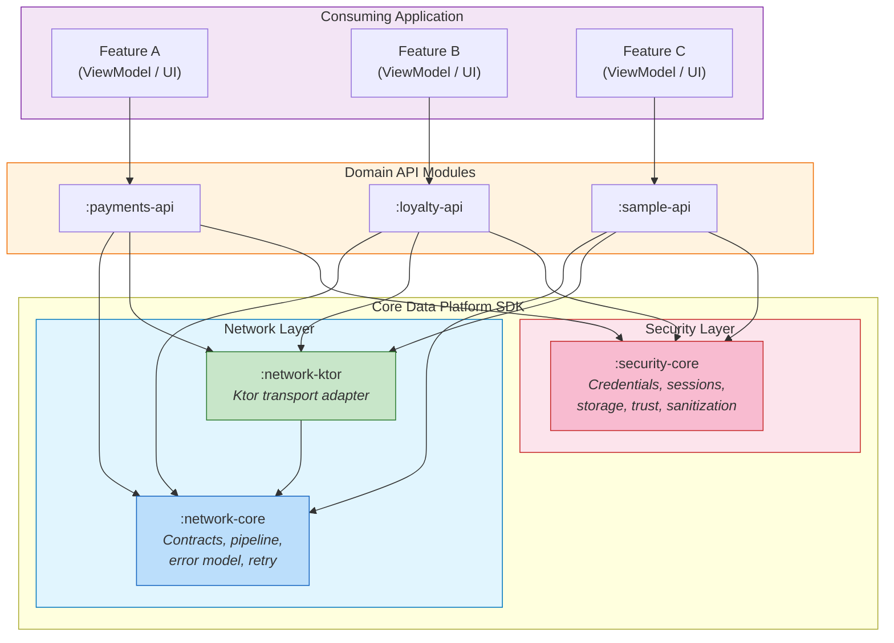

# Arquitectura General

Vista general de cómo el SDK Core Data Platform encaja dentro de una aplicación consumidora. El SDK provee la capa base (networking + seguridad), los módulos de dominio API se sitúan encima, y las funcionalidades de la aplicación consumen modelos de dominio limpios sin conocimiento de los detalles internos de transporte o seguridad.

Código fuente Mermaid

## Principios Clave

- **Las funcionalidades de la aplicación** nunca importan tipos del SDK directamente. Reciben modelos de dominio limpios (`User`, `Order`, `Payment`) de los repositories.
- **Los módulos de dominio API** son el punto de integración. Dependen tanto de `:network-core` como de `:security-core`, componiéndolos vía factories.
- **`:network-core` y `:security-core` son independientes.** Ninguno importa al otro. Solo se componen a nivel de módulo de dominio.
- **`:network-ktor` es reemplazable.** Es el único módulo que importa Ktor. Intercambiarlo requiere cero cambios en cualquier otro módulo.
