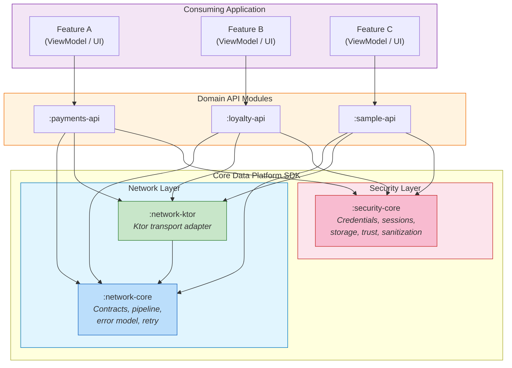

# General Architecture

Overview of how the Core Data Platform SDK fits within a consuming application. The SDK provides the foundation layer (networking + security), domain API modules sit on top, and application features consume clean domain models without knowledge of transport or security internals.

Mermaid source

## Key Principles

- **Application features** never import SDK types directly. They receive clean domain models (`User`, `Order`, `Payment`) from repositories.
- **Domain API modules** are the integration point. They depend on both `:network-core` and `:security-core`, composing them via factories.
- **`:network-core` and `:security-core` are independent.** Neither imports the other. They are composed only at the domain module level.
- **`:network-ktor` is replaceable.** It is the only module that imports Ktor. Swapping it requires zero changes to any other module.
