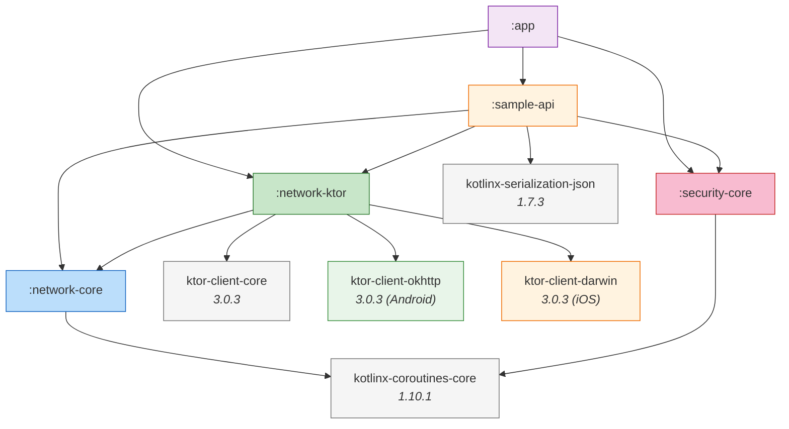

# Module Dependencies

Dependency graph showing how the project's modules relate to each other and to external libraries. Arrows point from the dependent to the dependency.

Mermaid source

## Module Roles

| Module | Role | External Dependencies |
|---|---|---|
| `:network-core` | Pure abstractions — contracts, pipeline, error model | `kotlinx-coroutines-core` only |
| `:network-ktor` | Ktor transport adapter | `ktor-client-core`, `ktor-client-okhttp` (Android), `ktor-client-darwin` (iOS) |
| `:security-core` | Security abstractions — credentials, sessions, storage, trust | `kotlinx-coroutines-core` only |
| `:sample-api` | Pilot reference module | `kotlinx-serialization-json` |
| `:app` | Host application | Depends on all modules |

## Critical Invariant

`:network-core` and `:security-core` have **zero mutual dependency**. This is enforced by design and must be preserved. They share no types — not even `Diagnostic` (which is intentionally duplicated as accepted tech debt).
