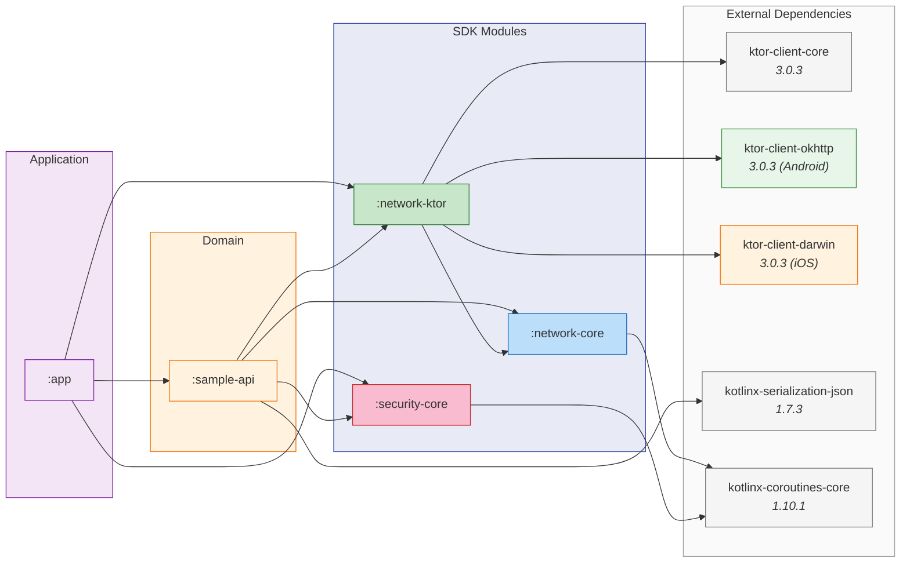

# Dependencias de Módulos

Grafo de dependencias que muestra cómo los módulos del proyecto se relacionan entre sí y con librerías externas. Las flechas apuntan desde el dependiente hacia la dependencia.

Código fuente Mermaid

## Roles de Módulos

| Módulo | Rol | Dependencias Externas |
|---|---|---|
| `:network-core` | Abstracciones puras — contratos, pipeline, modelo de errores | Solo `kotlinx-coroutines-core` |
| `:network-ktor` | Adaptador de transporte Ktor | `ktor-client-core`, `ktor-client-okhttp` (Android), `ktor-client-darwin` (iOS) |
| `:security-core` | Abstracciones de seguridad — credenciales, sesiones, almacenamiento, confianza | Solo `kotlinx-coroutines-core` |
| `:sample-api` | Módulo piloto de referencia | `kotlinx-serialization-json` |
| `:app` | Aplicación host | Depende de todos los módulos |

## Invariante Crítica

`:network-core` y `:security-core` tienen **cero dependencia mutua**. Esto se aplica por diseño y debe preservarse. No comparten tipos — ni siquiera `Diagnostic` (que está intencionalmente duplicado como deuda técnica aceptada).
