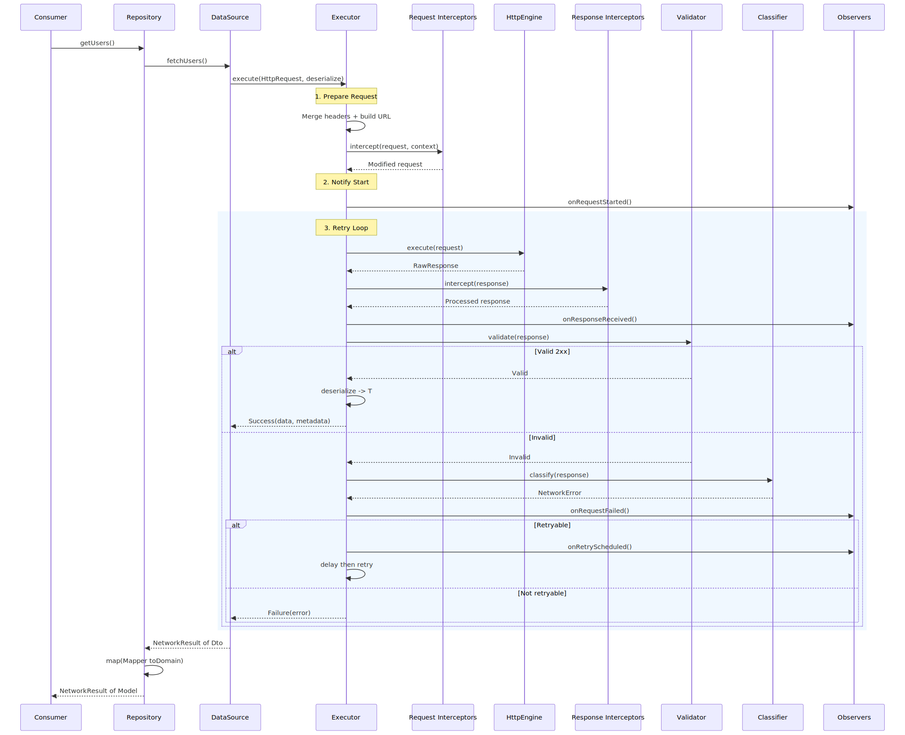

# Request Execution Flow

Complete lifecycle of a network request, from the consumer calling a repository method to receiving a `NetworkResult<T>` with clean domain models.

## Sequence Diagram



<details>
<summary>Mermaid source</summary>

```mermaid
sequenceDiagram
    participant C as Consumer<br/>(ViewModel)
    participant R as Repository
    participant DS as DataSource<br/>(RemoteDataSource)
    participant E as DefaultSafe<br/>RequestExecutor
    participant RI as Request<br/>Interceptors
    participant H as HttpEngine<br/>(KtorHttpEngine)
    participant RsI as Response<br/>Interceptors
    participant V as Response<br/>Validator
    participant CL as Error<br/>Classifier
    participant O as Observers

    C->>R: getUsers()
    R->>DS: fetchUsers()
    DS->>E: execute(HttpRequest, deserialize)

    Note over E: ① Prepare Request
    E->>E: Merge defaultHeaders + build URL
    E->>RI: intercept(request, context)
    RI-->>E: Modified request (+ auth headers)

    Note over E: ② Notify Start
    E->>O: onRequestStarted(request, context)

    Note over E: ③ Retry Loop
    rect rgb(240, 248, 255)
        E->>H: execute(request)
        alt Transport failure
            H-->>E: throws Throwable
            E->>CL: classify(null, cause)
            CL-->>E: NetworkError
            E->>O: onRequestFailed(...)
        else Success
            H-->>E: RawResponse
        end

        Note over E: ④ Response Interceptors
        E->>RsI: intercept(response, request, context)
        RsI-->>E: Processed response

        E->>O: onResponseReceived(request, response, durationMs)

        Note over E: ⑤ Validate
        E->>V: validate(response)
        alt Valid (2xx)
            V-->>E: ValidationOutcome.Valid
            Note over E: ⑥ Deserialize
            E->>E: deserialize(response) → T
            E-->>DS: NetworkResult.Success(data, metadata)
        else Invalid (non-2xx)
            V-->>E: ValidationOutcome.Invalid
            E->>CL: classify(response, null)
            CL-->>E: NetworkError (semantic)
            E->>O: onRequestFailed(...)
            alt error.isRetryable AND attempts left
                E->>O: onRetryScheduled(attempt, max, error, delayMs)
                E->>E: delay(delayMs)
                Note over E: Retry from ③
            else No retry
                E-->>DS: NetworkResult.Failure(error)
            end
        end
    end

    DS-->>R: NetworkResult&lt;UserDto&gt;
    R->>R: .map(UserMapper::toDomain)
    R-->>C: NetworkResult&lt;User&gt;
```

</details>

## Pipeline Stages Summary

| Stage | Component | Responsibility |
|---|---|---|
| ① Prepare | `DefaultSafeRequestExecutor` | Merge headers, build URL, run `RequestInterceptor` chain |
| ② Observe | `NetworkEventObserver` | `onRequestStarted` — metrics, tracing |
| ③ Transport | `HttpEngine` | Send HTTP request, receive raw response |
| ④ Post-process | `ResponseInterceptor` | Logging, caching, header extraction |
| ⑤ Validate | `ResponseValidator` | 2xx = valid, non-2xx = classify as error |
| ⑥ Deserialize | Consumer-provided lambda | `(RawResponse) -> T` |
| ⑦ Retry | `RetryPolicy` + `error.isRetryable` | Delay and retry if applicable |
| ⑧ Return | `NetworkResult<T>` | `Success(data, metadata)` or `Failure(error)` |
