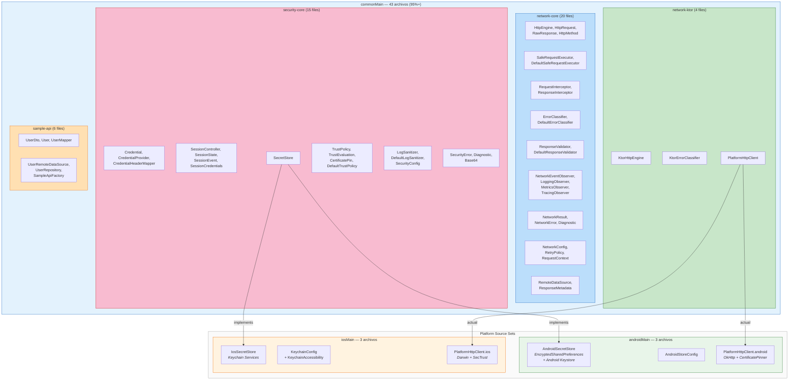
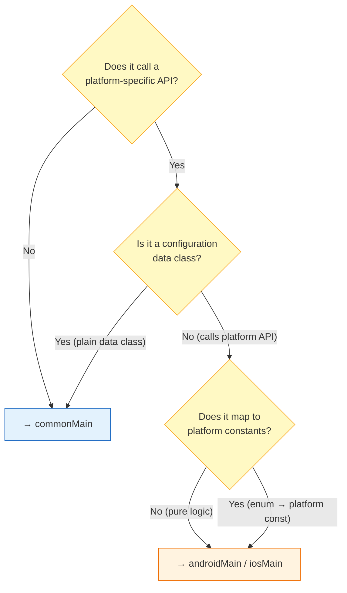

# Estrategia de Source Sets KMP

Distribución de código entre source sets de Kotlin Multiplatform. El proyecto maximiza `commonMain` y empuja el código específico de plataforma a los bordes absolutos.

## Distribución de Source Sets

Código fuente Mermaid

## Reglas de Decisión

Código fuente Mermaid

| Regla | Ejemplo |
|---|---|
| Interfaces y contratos → `commonMain` | `SecretStore`, `HttpEngine`, `TrustPolicy` |
| Sealed classes y modelos de datos → `commonMain` | `NetworkError`, `Credential`, `SessionState` |
| Implementaciones por defecto (lógica pura) → `commonMain` | `DefaultSafeRequestExecutor`, `DefaultLogSanitizer` |
| Data classes de configuración → `commonMain` | `AndroidStoreConfig`, `KeychainConfig`, `NetworkConfig` |
| I/O de plataforma → source set de plataforma | `AndroidSecretStore`, `IosSecretStore` |
| Enums de plataforma → source set de plataforma | `KeychainAccessibility` (mapea a `kSecAttrAccessible*`) |
| Selección de engine Ktor → dependencias Gradle | `ktor-client-okhttp` (androidMain.dependencies), `ktor-client-darwin` (iosMain.dependencies) |
