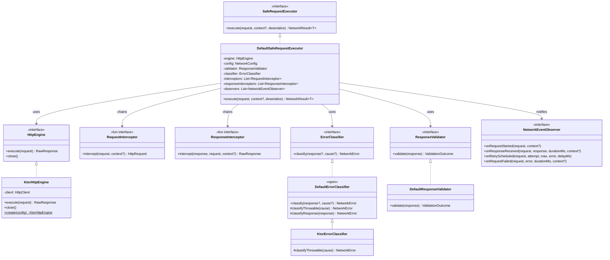
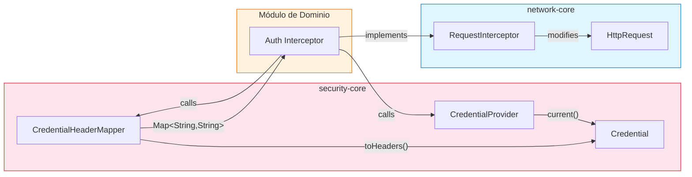

# Relaciones Principales de Contratos

Cómo las interfaces principales, sealed classes e implementaciones se relacionan entre sí a través del SDK.

## Contratos del Pipeline de Ejecución

Código fuente Mermaid

## Modelo de Resultado y Error

```mermaid
classDiagram
    direction TB

    class NetworkResult~T~ {
        <<sealed>>
        +isSuccess: Boolean
        +isFailure: Boolean
        +map(transform) NetworkResult~R~
        +flatMap(transform) NetworkResult~R~
        +fold(onSuccess, onFailure) R
        +onSuccess(action) NetworkResult~T~
        +onFailure(action) NetworkResult~T~
        +getOrNull() T?
        +errorOrNull() NetworkError?
    }

    class Success~T~ {
        +data: T
        +metadata: ResponseMetadata
    }

    class Failure {
        +error: NetworkError
    }

    class ResponseMetadata {
        +statusCode: Int
        +headers: Map
        +durationMs: Long
        +requestId: String?
        +attemptCount: Int
    }

    class NetworkError {
        <<sealed>>
        +message: String
        +diagnostic: Diagnostic?
        +isRetryable: Boolean
    }

    class Connectivity { +isRetryable = true }
    class Timeout { +isRetryable = true }
    class Cancelled { +isRetryable = false }
    class Authentication { +isRetryable = false }
    class Authorization { +isRetryable = false }
    class ClientError { +statusCode: Int }
    class ServerError { +statusCode: Int&#59; isRetryable = true }
    class Serialization { +isRetryable = false }
    class ResponseValidation { +reason: String }
    class Unknown { +isRetryable = false }

    class Diagnostic {
        +description: String
        +cause: Throwable?
        +metadata: Map
    }

    NetworkResult <|-- Success
    NetworkResult <|-- Failure
    Success --> ResponseMetadata
    Failure --> NetworkError
    NetworkError <|-- Connectivity
    NetworkError <|-- Timeout
    NetworkError <|-- Cancelled
    NetworkError <|-- Authentication
    NetworkError <|-- Authorization
    NetworkError <|-- ClientError
    NetworkError <|-- ServerError
    NetworkError <|-- Serialization
    NetworkError <|-- ResponseValidation
    NetworkError <|-- Unknown
    NetworkError --> Diagnostic
```

Código fuente Mermaid

## Contratos de Seguridad

```mermaid
classDiagram
    direction TB

    class Credential {
        <<sealed interface>>
    }
    class Bearer { +token: String }
    class ApiKey { +key: String&#59; +headerName: String }
    class Basic { +username: String&#59; +password: String }
    class Custom { +type: String&#59; +properties: Map }

    class CredentialProvider {
        <<interface>>
        +current() Credential?
    }

    class CredentialHeaderMapper {
        <<object>>
        +toHeaders(credential) Map~String,String~
    }

    class SessionController {
        <<interface>>
        +state: StateFlow~SessionState~
        +events: Flow~SessionEvent~
        +startSession(credentials)
        +refreshSession() Boolean
        +endSession()
    }

    class SessionState {
        <<sealed interface>>
    }
    class Idle
    class Active { +credential: Credential }
    class Expired

    class SessionCredentials {
        +credential: Credential
        +refreshToken: String?
        +expiresAtMs: Long?
    }

    class SecretStore {
        <<interface>>
        +putString(key, value)
        +getString(key) String?
        +putBytes(key, value)
        +getBytes(key) ByteArray?
        +remove(key)
        +clear()
        +contains(key) Boolean
    }

    class TrustPolicy {
        <<interface>>
        +evaluateHost(hostname) TrustEvaluation
        +pinnedCertificates() Map
    }

    class LogSanitizer {
        <<interface>>
        +sanitize(key, value) String
    }

    Credential <|.. Bearer
    Credential <|.. ApiKey
    Credential <|.. Basic
    Credential <|.. Custom
    CredentialProvider --> Credential : provides
    CredentialHeaderMapper --> Credential : converts
    SessionController --> SessionState : exposes
    SessionState <|.. Idle
    SessionState <|.. Active
    SessionState <|.. Expired
    Active --> Credential : contains
    SessionCredentials --> Credential : wraps
    SessionController --> SessionCredentials : receives
```

Código fuente Mermaid

## Integración Cross-Module

Código fuente Mermaid

El módulo de dominio es el **único lugar** donde los tipos de `security-core` y `network-core` se encuentran. El puente es un `RequestInterceptor` que llama a `CredentialProvider.current()`, pasa el resultado por `CredentialHeaderMapper.toHeaders()`, y combina los headers en el `HttpRequest`.
