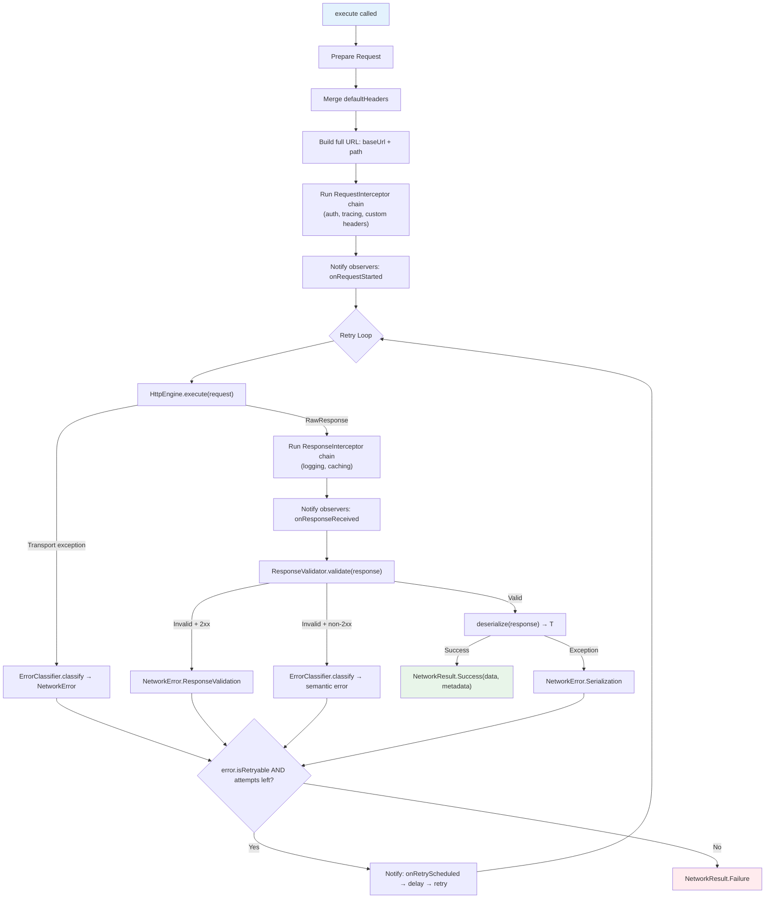

# :network-core

**Abstracciones Puras de Red para Kotlin Multiplatform**

Este módulo define toda la superficie de contratos para ejecución HTTP, modelado de errores, validación de respuestas, políticas de reintentos y observabilidad — sin depender de ninguna librería de cliente HTTP.

---

## Propósito

`:network-core` es la **capa base** del SDK Core Data Platform. Responde una pregunta:

> *"¿Cómo ejecuto, valido, reintento y clasifico operaciones HTTP de forma segura — sin saber qué librería HTTP se usa por debajo?"*

Cada clase en este módulo es una **interfaz**, una **sealed class**, una **data class**, o una **implementación por defecto** que puede sobreescribirse. No hay Ktor, no hay OkHttp, no hay URLSession — solo Kotlin puro y `kotlinx-coroutines`.

---

## Responsabilidades

| Responsabilidad | Dueño |
|---|---|
| Definir la abstracción de transporte | `HttpEngine` |
| Modelar requests y respuestas HTTP | `HttpRequest`, `RawResponse`, `HttpMethod` |
| Ejecutar requests de forma segura con límites de error | `SafeRequestExecutor`, `DefaultSafeRequestExecutor` |
| Interceptar requests antes del transporte | `RequestInterceptor` |
| Interceptar respuestas después del transporte | `ResponseInterceptor` |
| Validar respuestas antes de la deserialización | `ResponseValidator`, `DefaultResponseValidator` |
| Clasificar errores en tipos semánticos | `ErrorClassifier`, `DefaultErrorClassifier` |
| Modelar errores con mensajes seguros para usuario + diagnósticos internos | `NetworkError`, `Diagnostic` |
| Envolver resultados con semántica de éxito/fallo | `NetworkResult<T>`, `ResponseMetadata` |
| Configurar comportamiento de reintentos | `RetryPolicy` (None, FixedDelay, ExponentialBackoff) |
| Proveer hooks de observabilidad | `NetworkEventObserver` |
| Proveer clase base para data sources remotos | `RemoteDataSource` |
| Contener configuración de red | `NetworkConfig` |

---

## Contratos Principales

### Transporte

```kotlin
interface HttpEngine {
    suspend fun execute(request: HttpRequest): RawResponse
    fun close()
}
```

**Regla del contrato:** `HttpEngine` **nunca debe lanzar excepciones** para códigos de estado HTTP de error (4xx, 5xx). Los retorna como `RawResponse`. Solo las fallas a nivel de transporte (conectividad, timeout, TLS) deben lanzar.

### Modelo de Request

```kotlin
data class HttpRequest(
    val path: String,
    val method: HttpMethod = HttpMethod.GET,
    val headers: Map<String, String> = emptyMap(),
    val queryParams: Map<String, String> = emptyMap(),
    val body: ByteArray? = null
)
```

- `path` es relativo (ej. `/users/1`). El executor antepone `NetworkConfig.baseUrl`.
- `headers` son de valor único. Los headers multi-valor no se necesitan para requests salientes en la práctica.
- `body` es `ByteArray` crudo — el módulo es agnóstico de serialización.

### Modelo de Respuesta

```kotlin
data class RawResponse(
    val statusCode: Int,
    val headers: Map<String, List<String>>,
    val body: ByteArray? = null
) {
    val isSuccessful: Boolean get() = statusCode in 200..299
    val contentType: String? get() = headers[...]
}
```

- `headers` son multi-valor (HTTP estándar permite múltiples valores por nombre de header).
- `body` es nullable (ej. 204 No Content).

### Pipeline de Ejecución

```kotlin
interface SafeRequestExecutor {
    suspend fun <T> execute(
        request: HttpRequest,
        context: RequestContext? = null,
        deserialize: (RawResponse) -> T
    ): NetworkResult<T>
}
```

Este es el **punto de entrada principal** para todas las operaciones de red. Los consumidores nunca llaman a `HttpEngine` directamente.

### Modelo de Resultado

```kotlin
sealed class NetworkResult<out T> {
    data class Success<T>(val data: T, val metadata: ResponseMetadata)
    data class Failure(val error: NetworkError)

    // Functional API
    fun <R> map(transform: (T) -> R): NetworkResult<R>
    fun <R> flatMap(transform: (T) -> NetworkResult<R>): NetworkResult<R>
    fun <R> fold(onSuccess: (T) -> R, onFailure: (NetworkError) -> R): R
    fun onSuccess(action: (T) -> Unit): NetworkResult<T>
    fun onFailure(action: (NetworkError) -> Unit): NetworkResult<T>
    fun getOrNull(): T?
    fun errorOrNull(): NetworkError?
}
```

### Taxonomía de Errores

```kotlin
sealed class NetworkError {
    abstract val message: String           // Seguro para usuarios finales
    abstract val diagnostic: Diagnostic?   // Solo debugging interno
    open val isRetryable: Boolean = false   // Controla reintento automático

    // Capa de transporte
    class Connectivity   // isRetryable = true
    class Timeout        // isRetryable = true
    class Cancelled      // isRetryable = false

    // Capa semántica HTTP
    class Authentication // 401
    class Authorization  // 403
    class ClientError    // 4xx (otros)
    class ServerError    // 5xx — isRetryable = true

    // Procesamiento de datos
    class Serialization
    class ResponseValidation

    // Catch-all
    class Unknown
}
```

---

## Estructura Interna

```
network-core/src/commonMain/kotlin/com/dancr/platform/network/
│
├── client/                         # Abstracción de transporte
│   ├── HttpEngine.kt               # Interfaz — execute + close
│   ├── HttpMethod.kt               # Enum: GET, POST, PUT, DELETE, PATCH, HEAD, OPTIONS
│   ├── HttpRequest.kt              # Data class — path, method, headers, query, body
│   └── RawResponse.kt              # Data class — statusCode, headers, body
│
├── config/                         # Configuración
│   ├── NetworkConfig.kt            # baseUrl, timeouts, defaultHeaders, retryPolicy
│   └── RetryPolicy.kt             # Sealed: None, FixedDelay, ExponentialBackoff
│
├── datasource/                     # Clase base para data sources remotos
│   └── RemoteDataSource.kt         # Abstracta — envuelve SafeRequestExecutor.execute()
│
├── execution/                      # Pipeline de ejecución
│   ├── SafeRequestExecutor.kt      # Interfaz — el punto de entrada público
│   ├── DefaultSafeRequestExecutor.kt  # Implementación completa del pipeline
│   ├── RequestInterceptor.kt       # fun interface — modificación de request pre-transporte
│   ├── ResponseInterceptor.kt      # fun interface — procesamiento de respuesta post-transporte
│   ├── ErrorClassifier.kt          # Interfaz — excepción/respuesta → NetworkError
│   ├── DefaultErrorClassifier.kt   # Clasificador heurístico (clase open)
│   ├── ResponseValidator.kt        # Interfaz + sealed class ValidationOutcome
│   ├── DefaultResponseValidator.kt # Por defecto: 2xx = Valid
│   └── RequestContext.kt           # Metadata por request (operationId, tags, tracing)
│
├── observability/                  # Hooks de observabilidad
│   └── NetworkEventObserver.kt     # Callbacks de ciclo de vida con default no-op
│
└── result/                         # Tipos de resultado
    ├── NetworkResult.kt            # Sealed: Success<T> | Failure
    ├── NetworkError.kt             # Sealed class de errores semánticos
    ├── Diagnostic.kt               # Detalles internos de error (description, cause, metadata)
    └── ResponseMetadata.kt         # statusCode, headers, durationMs, requestId, attemptCount
```

---

## Cómo Funciona

### Pipeline de DefaultSafeRequestExecutor



### Comportamientos clave

1. **CancellationException siempre se relanza** — nunca se captura, nunca se clasifica. La cancelación de coroutines se propaga correctamente.
2. **El reintento es controlado por el modelo de error** — `error.isRetryable` decide. El executor no hardcodea qué errores reintentar.
3. **Los observers son notificados en cada punto del ciclo de vida** — inicio, respuesta, reintento, fallo. Todos los callbacks son no-op por defecto.
4. **Los interceptors de respuesta se ejecutan después del transporte pero antes de la validación** — pueden modificar la respuesta (ej. cachearla) antes de que el pipeline decida si es válida.

---

## Ejemplos de Uso

### Crear un executor

```kotlin
val executor = DefaultSafeRequestExecutor(
    engine = myHttpEngine,
    config = NetworkConfig(
        baseUrl = "https://api.example.com",
        defaultHeaders = mapOf("Accept" to "application/json"),
        connectTimeout = 15.seconds,
        readTimeout = 30.seconds,
        retryPolicy = RetryPolicy.ExponentialBackoff(maxRetries = 3)
    ),
    classifier = MyErrorClassifier(),
    interceptors = listOf(authInterceptor, tracingInterceptor),
    responseInterceptors = listOf(loggingInterceptor),
    observers = listOf(metricsObserver)
)
```

### Construir un data source

```kotlin
class OrderDataSource(executor: SafeRequestExecutor) : RemoteDataSource(executor) {

    private val json = Json { ignoreUnknownKeys = true }

    suspend fun fetchOrders(): NetworkResult<List<OrderDto>> = execute(
        request = HttpRequest(path = "/orders", method = HttpMethod.GET),
        deserialize = { response ->
            json.decodeFromString(response.body!!.decodeToString())
        }
    )
}
```

### Consumir resultados

```kotlin
dataSource.fetchOrders()
    .map { dtos -> dtos.map(OrderMapper::toDomain) }
    .fold(
        onSuccess = { orders -> display(orders) },
        onFailure = { error -> showError(error.message) }
    )
```

### Interceptor de request personalizado

```kotlin
val tracingInterceptor = RequestInterceptor { request, context ->
    val spanId = context?.parentSpanId ?: generateSpanId()
    request.copy(headers = request.headers + ("X-Trace-Id" to spanId))
}
```

### Interceptor de respuesta personalizado

```kotlin
val loggingInterceptor = ResponseInterceptor { response, request, context ->
    logger.info("${request.method} ${request.path} → ${response.statusCode}")
    response
}
```

### Observer personalizado

```kotlin
class MetricsObserver(private val client: MetricsClient) : NetworkEventObserver {
    override fun onResponseReceived(request: HttpRequest, response: RawResponse, durationMs: Long, context: RequestContext?) {
        client.recordLatency("http.duration", durationMs)
    }
    override fun onRequestFailed(request: HttpRequest, error: NetworkError, durationMs: Long, context: RequestContext?) {
        client.increment("http.error", tags = mapOf("type" to error::class.simpleName.orEmpty()))
    }
}
```

---

## Decisiones de Diseño

| Decisión | Razón |
|---|---|
| **`HttpEngine` retorna `RawResponse` para todos los códigos de estado** | Separa transporte de validación. El trabajo del engine es entregar la respuesta; el del validator es juzgarla. |
| **`NetworkError` es sealed** | Matching `when` exhaustivo en tiempo de compilación. Sin subtipos "desconocidos" colándose. |
| **`isRetryable` es un `open val` en `NetworkError`** | La política de reintentos es propiedad del error, no hardcodeada en el executor. Esto hace el comportamiento de reintento transparente y extensible. |
| **`DefaultErrorClassifier` usa heurísticas de nombre de clase** | En `commonMain`, los tipos de excepción de plataforma (ej. `java.net.SocketTimeoutException`) no están disponibles. El matching por nombre de clase es una heurística cross-platform razonable. Los módulos de plataforma sobreescriben con matching type-safe. |
| **`Diagnostic` está separado de `message`** | `message` es seguro para usuarios finales ("Unable to reach the server"). `Diagnostic` es para desarrolladores (incluye `Throwable`, metadata). Estas audiencias nunca deben mezclarse. |
| **Los interceptors son `fun interface`** | Permite implementaciones basadas en clase y en lambda. Kotlin idiomático. |
| **Los observers tienen métodos default no-op** | Los implementadores solo sobreescriben lo que necesitan. No se requieren clases adapter. |
| **`ResponseMetadata` incluye `attemptCount`** | Los consumidores pueden saber si su request requirió reintentos sin inspeccionar logs. |
| **`RemoteDataSource` es una clase abstracta, no una interfaz** | Provee un método protected `execute()` que envuelve `SafeRequestExecutor`. Usar una clase previene la re-exposición accidental del executor. |

---

## Extensibilidad

| Punto de Extensión | Cómo |
|---|---|
| **Nuevo transporte** | Implementar `HttpEngine` en un nuevo módulo (ej. `:network-okhttp`) |
| **Clasificación de errores de plataforma** | Extender `DefaultErrorClassifier`, sobreescribir `classifyThrowable()` para matching type-safe |
| **Validación de respuesta personalizada** | Implementar `ResponseValidator` (ej. rechazar respuestas sin un header requerido) |
| **Procesamiento pre-request** | Agregar un `RequestInterceptor` (auth, tracing, headers custom) |
| **Procesamiento post-respuesta** | Agregar un `ResponseInterceptor` (logging, caching, extracción de headers) |
| **Observabilidad** | Implementar `NetworkEventObserver` (métricas, tracing, logging estructurado) |
| **Políticas de reintento personalizadas** | Agregar nuevos subtipos de `RetryPolicy` (requiere modificar la sealed class) |

---

## Limitaciones Actuales

| Limitación | Contexto |
|---|---|
| **Ningún interceptor de respuesta puede disparar un reintento** | El bucle de reintentos solo reacciona a `error.isRetryable`. Un interceptor de respuesta que detecta un 401 no puede disparar un refresh de token + reintento. Esto requiere un futuro patrón `AuthRefreshInterceptor`. |
| **`RetryPolicy` es sealed** | Agregar nuevas estrategias (ej. circuit breaker) requiere modificar este archivo. Considerar convertirlo en interfaz en el futuro si emergen más estrategias. |
| **Sin caching incorporado** | `ResponseInterceptor` es el hook, pero aún no existe implementación de caching. |
| **`Diagnostic` está duplicado en `security-core`** | Ambos módulos definen data classes `Diagnostic` idénticas en paquetes diferentes. Un futuro módulo `:platform-common` debería unificarlas. |
| **Sin soporte de streaming** | `RawResponse.body` es `ByteArray?` — body entero en memoria. El streaming de payloads grandes requiere un futuro modelo `Flow<ByteArray>`. |

---

## TODOs y Trabajo Futuro

| Ítem | Ubicación | Descripción |
|---|---|---|
| `healthCheck()` | `HttpEngine` | Pool de conexiones / prueba de vivacidad |
| `classifyForRetry()` | `ErrorClassifier` | Clasificación por intento para patrones de circuit breaker |
| `MetricsObserver` | `observability/` | Recolectar conteo de requests, histogramas de latencia, tasas de error |
| `TracingObserver` | `observability/` | Crear spans por request, propagar `parentSpanId` vía headers |
| `LoggingObserver` | `observability/` | Logging estructurado del ciclo de vida completo de requests |
| `LoggingResponseInterceptor` | `execution/` | Logging centralizado de respuestas con integración de `LogSanitizer` |
| `CachingResponseInterceptor` | `execution/` | Caching condicional basado en headers `Cache-Control` |
| Circuit breaker `RetryPolicy` | `config/` | Abrir circuito después de N fallos consecutivos |

---

## Dependencias

```toml
# Única dependencia — sin cliente HTTP, sin serialización
[dependencies]
kotlinx-coroutines-core = "1.10.1"
```

Este módulo compila para **todos los targets**: Android, iosX64, iosArm64, iosSimulatorArm64.
