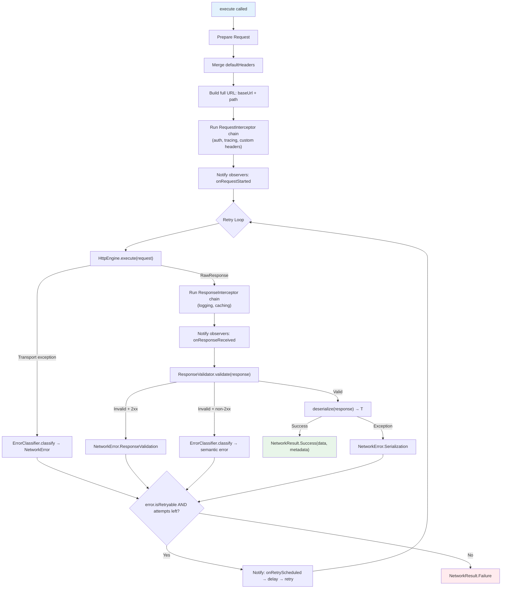

# :network-core

**Pure Network Abstractions for Kotlin Multiplatform**

This module defines the entire contract surface for HTTP execution, error modeling, response validation, retry policies, and observability — without depending on any HTTP client library.

---

## Purpose

`:network-core` is the **foundation layer** of the Core Data Platform SDK. It answers one question:

> *"How do I execute, validate, retry, and classify HTTP operations safely — without knowing which HTTP library is used underneath?"*

Every class in this module is either an **interface**, a **sealed class**, a **data class**, or a **default implementation** that can be overridden. There is no Ktor, no OkHttp, no URLSession — only pure Kotlin and `kotlinx-coroutines`.

---

## Responsibilities

| Responsibility | Owner |
|---|---|
| Define the transport abstraction | `HttpEngine` |
| Model HTTP requests and responses | `HttpRequest`, `RawResponse`, `HttpMethod` |
| Execute requests safely with error boundaries | `SafeRequestExecutor`, `DefaultSafeRequestExecutor` |
| Intercept requests before transport | `RequestInterceptor` |
| Intercept responses after transport | `ResponseInterceptor` |
| Validate responses before deserialization | `ResponseValidator`, `DefaultResponseValidator` |
| Classify errors into semantic types | `ErrorClassifier`, `DefaultErrorClassifier` |
| Model errors with user-safe messages + internal diagnostics | `NetworkError`, `Diagnostic` |
| Wrap results with success/failure semantics | `NetworkResult<T>`, `ResponseMetadata` |
| Configure retry behavior | `RetryPolicy` (None, FixedDelay, ExponentialBackoff) |
| Provide observability hooks | `NetworkEventObserver` |
| Provide a base class for remote data sources | `RemoteDataSource` |
| Hold network configuration | `NetworkConfig` |

---

## Principal Contracts

### Transport

```kotlin
interface HttpEngine {
    suspend fun execute(request: HttpRequest): RawResponse
    fun close()
}
```

**Contract rule:** `HttpEngine` must **never throw** for HTTP error status codes (4xx, 5xx). It returns them as `RawResponse`. Only transport-level failures (connectivity, timeout, TLS) should throw.

### Request Model

```kotlin
data class HttpRequest(
    val path: String,
    val method: HttpMethod = HttpMethod.GET,
    val headers: Map<String, String> = emptyMap(),
    val queryParams: Map<String, String> = emptyMap(),
    val body: ByteArray? = null
)
```

- `path` is relative (e.g., `/users/1`). The executor prepends `NetworkConfig.baseUrl`.
- `headers` are single-value. Multi-value headers are not needed for outbound requests in practice.
- `body` is raw `ByteArray` — the module is serialization-agnostic.

### Response Model

```kotlin
data class RawResponse(
    val statusCode: Int,
    val headers: Map<String, List<String>>,
    val body: ByteArray? = null
) {
    val isSuccessful: Boolean get() = statusCode in 200..299
    val contentType: String? get() = headers[...]
}
```

- `headers` are multi-value (standard HTTP allows multiple values per header name).
- `body` is nullable (e.g., 204 No Content).

### Execution Pipeline

```kotlin
interface SafeRequestExecutor {
    suspend fun <T> execute(
        request: HttpRequest,
        context: RequestContext? = null,
        deserialize: (RawResponse) -> T
    ): NetworkResult<T>
}
```

This is the **primary entry point** for all network operations. Consumers never call `HttpEngine` directly.

### Result Model

```kotlin
sealed class NetworkResult<out T> {
    data class Success<T>(val data: T, val metadata: ResponseMetadata)
    data class Failure(val error: NetworkError)

    // Functional API
    fun <R> map(transform: (T) -> R): NetworkResult<R>
    fun <R> flatMap(transform: (T) -> NetworkResult<R>): NetworkResult<R>
    fun <R> fold(onSuccess: (T) -> R, onFailure: (NetworkError) -> R): R
    fun onSuccess(action: (T) -> Unit): NetworkResult<T>
    fun onFailure(action: (NetworkError) -> Unit): NetworkResult<T>
    fun getOrNull(): T?
    fun errorOrNull(): NetworkError?
}
```

### Error Taxonomy

```kotlin
sealed class NetworkError {
    abstract val message: String           // Safe for end users
    abstract val diagnostic: Diagnostic?   // Internal debugging only
    open val isRetryable: Boolean = false   // Controls automatic retry

    // Transport layer
    class Connectivity   // isRetryable = true
    class Timeout        // isRetryable = true
    class Cancelled      // isRetryable = false

    // HTTP semantic layer
    class Authentication // 401
    class Authorization  // 403
    class ClientError    // 4xx (other)
    class ServerError    // 5xx — isRetryable = true

    // Data processing
    class Serialization
    class ResponseValidation

    // Catch-all
    class Unknown
}
```

---

## Internal Structure

```
network-core/src/commonMain/kotlin/com/dancr/platform/network/
│
├── client/                         # Transport abstraction
│   ├── HttpEngine.kt               # Interface — execute + close
│   ├── HttpMethod.kt               # Enum: GET, POST, PUT, DELETE, PATCH, HEAD, OPTIONS
│   ├── HttpRequest.kt              # Data class — path, method, headers, query, body
│   └── RawResponse.kt              # Data class — statusCode, headers, body
│
├── config/                         # Configuration
│   ├── NetworkConfig.kt            # baseUrl, timeouts, defaultHeaders, retryPolicy
│   └── RetryPolicy.kt             # Sealed: None, FixedDelay, ExponentialBackoff
│
├── datasource/                     # Base class for remote data sources
│   └── RemoteDataSource.kt         # Abstract — wraps SafeRequestExecutor.execute()
│
├── execution/                      # Execution pipeline
│   ├── SafeRequestExecutor.kt      # Interface — the public entry point
│   ├── DefaultSafeRequestExecutor.kt  # Full pipeline implementation
│   ├── RequestInterceptor.kt       # fun interface — pre-transport request modification
│   ├── ResponseInterceptor.kt      # fun interface — post-transport response processing
│   ├── ErrorClassifier.kt          # Interface — exception/response → NetworkError
│   ├── DefaultErrorClassifier.kt   # Heuristic classifier (open class)
│   ├── ResponseValidator.kt        # Interface + ValidationOutcome sealed class
│   ├── DefaultResponseValidator.kt # Default: 2xx = Valid
│   └── RequestContext.kt           # Per-request metadata (operationId, tags, tracing)
│
├── observability/                  # Observability hooks
│   └── NetworkEventObserver.kt     # Lifecycle callbacks with default no-op
│
└── result/                         # Result types
    ├── NetworkResult.kt            # Sealed: Success<T> | Failure
    ├── NetworkError.kt             # Semantic error sealed class
    ├── Diagnostic.kt               # Internal error details (description, cause, metadata)
    └── ResponseMetadata.kt         # statusCode, headers, durationMs, requestId, attemptCount
```

---

## How It Works

### DefaultSafeRequestExecutor Pipeline



### Key behaviors

1. **CancellationException is always rethrown** — never caught, never classified. Coroutine cancellation is propagated correctly.
2. **Retry is controlled by the error model** — `error.isRetryable` decides. The executor does not hardcode which errors to retry.
3. **Observers are notified at every lifecycle point** — start, response, retry, failure. All callbacks are no-op by default.
4. **Response interceptors run after transport but before validation** — they can modify the response (e.g., cache it) before the pipeline decides if it's valid.

---

## Usage Examples

### Creating an executor

```kotlin
val executor = DefaultSafeRequestExecutor(
    engine = myHttpEngine,
    config = NetworkConfig(
        baseUrl = "https://api.example.com",
        defaultHeaders = mapOf("Accept" to "application/json"),
        connectTimeout = 15.seconds,
        readTimeout = 30.seconds,
        retryPolicy = RetryPolicy.ExponentialBackoff(maxRetries = 3)
    ),
    classifier = MyErrorClassifier(),
    interceptors = listOf(authInterceptor, tracingInterceptor),
    responseInterceptors = listOf(loggingInterceptor),
    observers = listOf(metricsObserver)
)
```

### Building a data source

```kotlin
class OrderDataSource(executor: SafeRequestExecutor) : RemoteDataSource(executor) {

    private val json = Json { ignoreUnknownKeys = true }

    suspend fun fetchOrders(): NetworkResult<List<OrderDto>> = execute(
        request = HttpRequest(path = "/orders", method = HttpMethod.GET),
        deserialize = { response ->
            json.decodeFromString(response.body!!.decodeToString())
        }
    )
}
```

### Consuming results

```kotlin
dataSource.fetchOrders()
    .map { dtos -> dtos.map(OrderMapper::toDomain) }
    .fold(
        onSuccess = { orders -> display(orders) },
        onFailure = { error -> showError(error.message) }
    )
```

### Custom request interceptor

```kotlin
val tracingInterceptor = RequestInterceptor { request, context ->
    val spanId = context?.parentSpanId ?: generateSpanId()
    request.copy(headers = request.headers + ("X-Trace-Id" to spanId))
}
```

### Custom response interceptor

```kotlin
val loggingInterceptor = ResponseInterceptor { response, request, context ->
    logger.info("${request.method} ${request.path} → ${response.statusCode}")
    response
}
```

### Custom observer

```kotlin
class MetricsObserver(private val client: MetricsClient) : NetworkEventObserver {
    override fun onResponseReceived(request: HttpRequest, response: RawResponse, durationMs: Long, context: RequestContext?) {
        client.recordLatency("http.duration", durationMs)
    }
    override fun onRequestFailed(request: HttpRequest, error: NetworkError, durationMs: Long, context: RequestContext?) {
        client.increment("http.error", tags = mapOf("type" to error::class.simpleName.orEmpty()))
    }
}
```

---

## Design Decisions

| Decision | Rationale |
|---|---|
| **`HttpEngine` returns `RawResponse` for all status codes** | Separates transport from validation. The engine's job is to deliver the response; the validator's job is to judge it. |
| **`NetworkError` is sealed** | Exhaustive `when` matching at compile time. No "unknown" subtypes sneaking in. |
| **`isRetryable` is an `open val` on `NetworkError`** | Retry policy is a property of the error, not hardcoded in the executor. This makes retry behavior transparent and extensible. |
| **`DefaultErrorClassifier` uses class name heuristics** | In `commonMain`, platform exception types (e.g., `java.net.SocketTimeoutException`) are not available. Class name matching is a reasonable cross-platform heuristic. Platform modules override with type-safe matching. |
| **`Diagnostic` is separate from `message`** | `message` is safe for end users ("Unable to reach the server"). `Diagnostic` is for developers (includes `Throwable`, metadata). These audiences must never be mixed. |
| **Interceptors are `fun interface`** | Allows both class-based and lambda-based implementations. Idiomatic Kotlin. |
| **Observers have default no-op methods** | Implementors only override what they need. No adapter classes required. |
| **`ResponseMetadata` includes `attemptCount`** | Consumers can know if their request required retries without inspecting logs. |
| **`RemoteDataSource` is an abstract class, not an interface** | It provides a protected `execute()` method that wraps `SafeRequestExecutor`. Using a class prevents accidental re-exposure of the executor. |

---

## Extensibility

| Extension Point | How |
|---|---|
| **New transport** | Implement `HttpEngine` in a new module (e.g., `:network-okhttp`) |
| **Platform error classification** | Extend `DefaultErrorClassifier`, override `classifyThrowable()` for type-safe matching |
| **Custom response validation** | Implement `ResponseValidator` (e.g., reject responses missing a required header) |
| **Pre-request processing** | Add a `RequestInterceptor` (auth, tracing, custom headers) |
| **Post-response processing** | Add a `ResponseInterceptor` (logging, caching, header extraction) |
| **Observability** | Implement `NetworkEventObserver` (metrics, tracing, structured logging) |
| **Custom retry policies** | Add new `RetryPolicy` subtypes (requires modifying sealed class) |

---

## Current Limitations

| Limitation | Context |
|---|---|
| **No response interceptor can trigger a retry** | The retry loop only reacts to `error.isRetryable`. A response interceptor that detects a 401 cannot trigger a token refresh + retry. This requires a future `AuthRefreshInterceptor` pattern. |
| **`RetryPolicy` is sealed** | Adding new strategies (e.g., circuit breaker) requires modifying this file. Consider making it an interface in the future if more strategies emerge. |
| **No built-in caching** | `ResponseInterceptor` is the hook, but no caching implementation exists yet. |
| **`Diagnostic` is duplicated in `security-core`** | Both modules define identical `Diagnostic` data classes in different packages. A future `:platform-common` module should unify them. |
| **No streaming support** | `RawResponse.body` is `ByteArray?` — entire body in memory. Large payload streaming requires a future `Flow<ByteArray>` model. |

---

## TODOs and Future Work

| Item | Location | Description |
|---|---|---|
| `healthCheck()` | `HttpEngine` | Connection pool / liveness probing |
| `classifyForRetry()` | `ErrorClassifier` | Per-attempt classification for circuit breaker patterns |
| `MetricsObserver` | `observability/` | Collect request count, latency histograms, error rates |
| `TracingObserver` | `observability/` | Create spans per request, propagate `parentSpanId` via headers |
| `LoggingObserver` | `observability/` | Structured logging of the full request lifecycle |
| `LoggingResponseInterceptor` | `execution/` | Centralized response logging with `LogSanitizer` integration |
| `CachingResponseInterceptor` | `execution/` | Conditional caching based on `Cache-Control` headers |
| Circuit breaker `RetryPolicy` | `config/` | Open-circuit after N consecutive failures |

---

## Dependencies

```toml
# Only dependency — no HTTP client, no serialization
[dependencies]
kotlinx-coroutines-core = "1.10.1"
```

This module compiles to **all targets**: Android, iosX64, iosArm64, iosSimulatorArm64.
