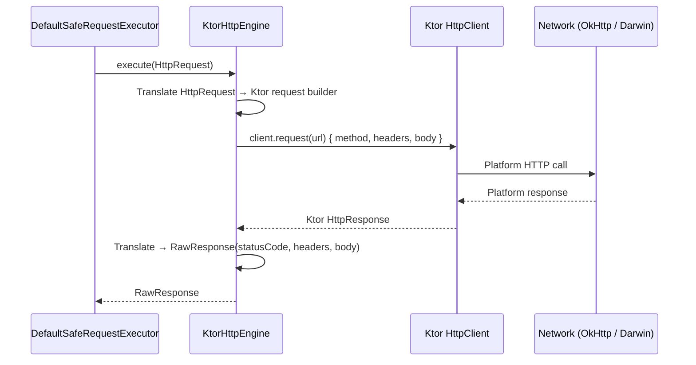
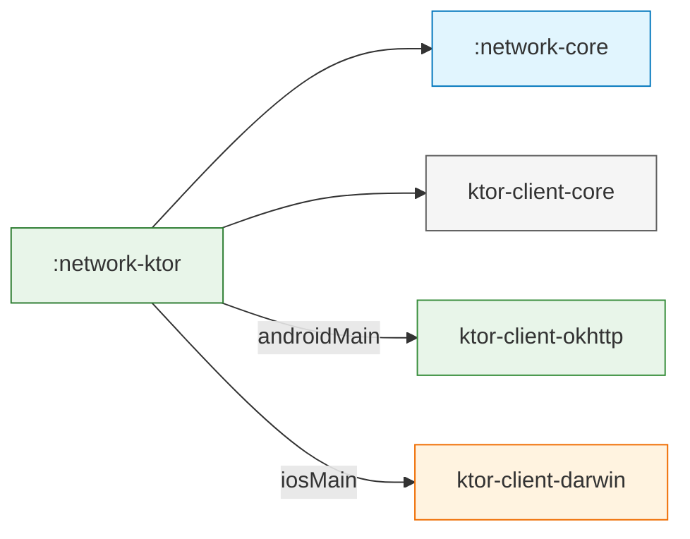

# :network-ktor

**Ktor-Based Transport Adapter for Core Data Platform**

This module provides the concrete HTTP transport implementation by adapting the [Ktor](https://ktor.io/) client library to the `HttpEngine` interface defined in `:network-core`. It encapsulates all Ktor-specific code so that no other module in the project ever imports a Ktor type.

---

## Purpose

`:network-ktor` answers one question:

> *"How do I send an `HttpRequest` over the wire and get back a `RawResponse` — using Ktor as the transport — without leaking any Ktor types to the rest of the SDK?"*

It is the **only module** in the project that depends on Ktor. Replacing it with `:network-okhttp` or `:network-urlsession` would require zero changes to `:network-core`, `:security-core`, or any domain module.

---

## Responsibilities

| Responsibility | Owner |
|---|---|
| Translate `HttpRequest` → Ktor request builder | `KtorHttpEngine` |
| Translate Ktor `HttpResponse` → `RawResponse` | `KtorHttpEngine` |
| Configure timeouts from `NetworkConfig` | `KtorHttpEngine.create()` |
| Classify Ktor-specific exceptions (e.g., `HttpRequestTimeoutException`) | `KtorErrorClassifier` |
| Select the platform engine automatically (OkHttp on Android, Darwin on iOS) | Gradle dependency resolution |

---

## Principal Contracts

### KtorHttpEngine

```kotlin
class KtorHttpEngine(private val client: HttpClient) : HttpEngine {

    override suspend fun execute(request: HttpRequest): RawResponse
    override fun close()

    companion object {
        fun create(config: NetworkConfig): KtorHttpEngine
    }
}
```

**Key behaviors:**

- **`expectSuccess = false`** — Ktor does NOT throw on 4xx/5xx. All HTTP status codes are returned as `RawResponse`, letting the `:network-core` pipeline handle validation and error classification.
- **Content-Type handling** — The `Content-Type` header is extracted from `HttpRequest.headers` and applied via `ByteArrayContent`, not as a raw header. This prevents Ktor from rejecting duplicate content-type declarations.
- **Timeouts** — Mapped directly from `NetworkConfig`:
  - `connectTimeout` → `connectTimeoutMillis`
  - `readTimeout` → `requestTimeoutMillis`
  - `writeTimeout` → `socketTimeoutMillis`

### KtorErrorClassifier

```kotlin
class KtorErrorClassifier : DefaultErrorClassifier() {

    override fun classifyThrowable(cause: Throwable): NetworkError
}
```

Extends `DefaultErrorClassifier` from `:network-core` to add **type-safe** matching for Ktor-specific exceptions:

| Ktor Exception | Mapped To |
|---|---|
| `HttpRequestTimeoutException` | `NetworkError.Timeout` |
| *(others fall through)* | `DefaultErrorClassifier` heuristic matching |

---

## Internal Structure

```
network-ktor/src/
└── commonMain/kotlin/com/dancr/platform/network/ktor/
    ├── KtorHttpEngine.kt        # HttpEngine implementation + factory
    └── KtorErrorClassifier.kt   # Ktor-aware error classification
```

Two private extension functions support the engine:

- `HttpMethod.toKtor()` — Maps SDK `HttpMethod` enum to Ktor's `HttpMethod`.
- `Headers.toMultiValueMap()` — Converts Ktor's `Headers` to `Map<String, List<String>>`.

---

## How It Works



### Request Translation

```
HttpRequest                              Ktor Request Builder
─────────────────────                    ─────────────────────
path: "/users/1"                    →    url: "https://api.example.com/users/1"
method: HttpMethod.GET              →    method = KtorHttpMethod.Get
headers: {"Accept": "application/json"} → headers.append("Accept", "application/json")
queryParams: {"page": "2"}         →    url.parameters.append("page", "2")
body: ByteArray                    →    setBody(ByteArrayContent(bytes, contentType))
```

### Response Translation

```
Ktor HttpResponse                        RawResponse
─────────────────────                    ─────────────────────
status.value: 200                   →    statusCode: 200
headers: Ktor Headers               →    headers: Map<String, List<String>>
readRawBytes(): ByteArray           →    body: ByteArray?
```

---

## Usage

### Standard usage (via factory)

```kotlin
val config = NetworkConfig(
    baseUrl = "https://api.example.com",
    connectTimeout = 15.seconds,
    readTimeout = 30.seconds,
    retryPolicy = RetryPolicy.ExponentialBackoff(maxRetries = 2)
)

val engine = KtorHttpEngine.create(config)
val classifier = KtorErrorClassifier()

val executor = DefaultSafeRequestExecutor(
    engine = engine,
    config = config,
    classifier = classifier
)
```

### Advanced usage (custom Ktor HttpClient)

For cases where you need to install additional Ktor plugins:

```kotlin
val customClient = HttpClient {
    install(HttpTimeout) {
        connectTimeoutMillis = 10_000
        requestTimeoutMillis = 30_000
    }
    // Custom plugins here
    expectSuccess = false  // REQUIRED — must always be false
}

val engine = KtorHttpEngine(customClient)
```

> **Warning:** If you provide a custom `HttpClient`, you **must** set `expectSuccess = false`. Otherwise Ktor will throw exceptions on 4xx/5xx, bypassing the SDK's error classification pipeline.

---

## Design Decisions

| Decision | Rationale |
|---|---|
| **`expectSuccess = false`** | The SDK's `ResponseValidator` and `ErrorClassifier` handle all error status codes. Ktor must deliver them as responses, not exceptions. |
| **Content-Type extracted from headers map** | Ktor has special handling for Content-Type. Passing it as both a raw header and via `setBody()` causes a duplicate header error. The engine extracts it from `HttpRequest.headers` and applies it only via `ByteArrayContent`. |
| **Factory method `create(config)`** | Encapsulates the `HttpClient` configuration. Consumers don't need to know about Ktor's `install()` DSL. |
| **`KtorErrorClassifier` extends `DefaultErrorClassifier`** | Only overrides `classifyThrowable()` for Ktor-specific exceptions. All other classification (response codes, heuristic class name matching) falls through to the default. |
| **No platform source sets** | Ktor's engine selection (OkHttp vs. Darwin) is handled entirely by Gradle dependency resolution (`ktor-client-okhttp` in `androidMain.dependencies`, `ktor-client-darwin` in `iosMain.dependencies`). No Kotlin code needed in platform source sets. |

---

## Extensibility

### Adding certificate pinning

The `KtorHttpEngine.create()` factory contains a TODO showing exactly where TLS configuration plugs in:

```kotlin
// Android (OkHttp): engine { config { certificatePinner(...) } }
// iOS (Darwin):     handleChallenge in NSURLSessionDelegate
```

This will require adding `androidMain` and `iosMain` source sets to this module.

### Adding logging at the transport level

The factory contains a TODO for Ktor's `Logging` plugin:

```kotlin
// install(Logging) { logger = SanitizedKtorLogger(logSanitizer) }
```

This would wire into `LogSanitizer` from `:security-core` for redacting sensitive headers in transport-level logs.

### Replacing Ktor entirely

Create a new module (e.g., `:network-okhttp`) that:

1. Implements `HttpEngine`.
2. Extends `DefaultErrorClassifier` for library-specific exception matching.
3. Provides a factory method.

Change the dependency in domain modules from `:network-ktor` to `:network-okhttp`. No code changes in `:network-core` or any repository/data source.

---

## Current Limitations

| Limitation | Context |
|---|---|
| **No certificate pinning** | The TODO is documented but the `TrustPolicy` integration requires platform source sets that don't exist in this module yet. |
| **No transport-level logging** | Ktor's `Logging` plugin is not installed. All logging should currently go through `ResponseInterceptor` and `NetworkEventObserver` in `:network-core`. |
| **No WebSocket support** | `HttpEngine` is request-response only. WebSocket would need a separate contract. |
| **No multipart upload** | `HttpRequest.body` is a flat `ByteArray`. Multipart would require extending the request model. |

---

## TODOs and Future Work

| Item | Description |
|---|---|
| **Certificate pinning** | Accept `TrustPolicy` in `create()`, configure OkHttp `CertificatePinner` (Android) and Darwin `SecTrust` (iOS) via platform source sets |
| **Logging plugin** | Install Ktor `Logging` wired to `LogSanitizer` for transport-level request/response logging |
| **Connection pooling config** | Expose OkHttp connection pool / Darwin session config via `NetworkConfig` |
| **Multipart support** | Extend `HttpRequest` with a multipart body model and translate to Ktor's `MultiPartFormDataContent` |

---

## Dependencies

```kotlin
// commonMain
implementation(project(":network-core"))
implementation(libs.ktor.client.core)          // io.ktor:ktor-client-core:3.0.3

// androidMain
implementation(libs.ktor.client.okhttp)        // io.ktor:ktor-client-okhttp:3.0.3

// iosMain
implementation(libs.ktor.client.darwin)        // io.ktor:ktor-client-darwin:3.0.3
```


