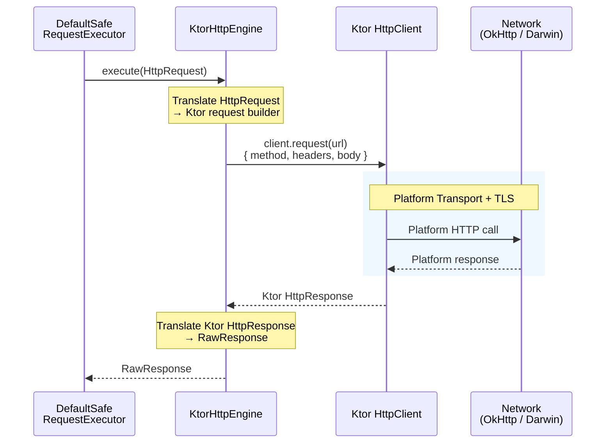
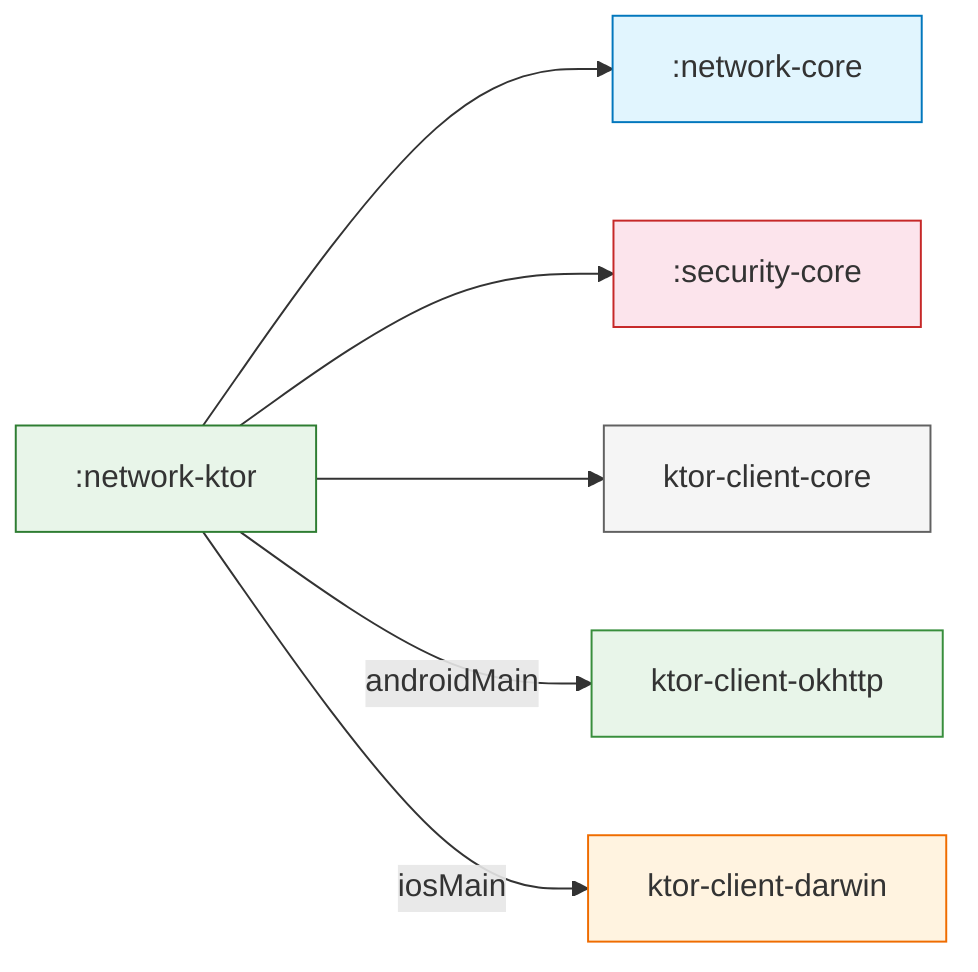

# :network-ktor

**Adaptador de Transporte Basado en Ktor para Core Data Platform**

Este módulo provee la implementación concreta de transporte HTTP adaptando la librería cliente [Ktor](https://ktor.io/) a la interfaz `HttpEngine` definida en `:network-core`. Encapsula todo el código específico de Ktor para que ningún otro módulo del proyecto importe un tipo de Ktor.

---

## Propósito

`:network-ktor` responde una pregunta:

> *"¿Cómo envío un `HttpRequest` por la red y obtengo un `RawResponse` — usando Ktor como transporte — sin filtrar ningún tipo de Ktor al resto del SDK?"*

Es el **único módulo** en el proyecto que depende de Ktor. Reemplazarlo con `:network-okhttp` o `:network-urlsession` requeriría cero cambios en `:network-core`, `:security-core`, o cualquier módulo de dominio.

---

## Responsabilidades

| Responsabilidad | Dueño |
|---|---|
| Traducir `HttpRequest` → builder de request de Ktor | `KtorHttpEngine` |
| Traducir `HttpResponse` de Ktor → `RawResponse` | `KtorHttpEngine` |
| Configurar timeouts desde `NetworkConfig` | `KtorHttpEngine.create()` |
| Clasificar excepciones específicas de Ktor (ej. `HttpRequestTimeoutException`) | `KtorErrorClassifier` |
| Seleccionar el engine de plataforma automáticamente (OkHttp en Android, Darwin en iOS) | Resolución de dependencias Gradle |

---

## Contratos Principales

### KtorHttpEngine

```kotlin
class KtorHttpEngine(private val client: HttpClient) : HttpEngine {

    override suspend fun execute(request: HttpRequest): RawResponse
    override fun close()

    companion object {
        fun create(config: NetworkConfig): KtorHttpEngine
    }
}
```

**Comportamientos clave:**

- **`expectSuccess = false`** — Ktor NO lanza excepciones en 4xx/5xx. Todos los códigos de estado HTTP se retornan como `RawResponse`, dejando que el pipeline de `:network-core` maneje la validación y clasificación de errores.
- **Manejo de Content-Type** — El header `Content-Type` se extrae de `HttpRequest.headers` y se aplica vía `ByteArrayContent`, no como header crudo. Esto evita que Ktor rechace declaraciones duplicadas de content-type.
- **Timeouts** — Mapeados directamente desde `NetworkConfig`:
  - `connectTimeout` → `connectTimeoutMillis`
  - `readTimeout` → `requestTimeoutMillis`
  - `writeTimeout` → `socketTimeoutMillis`

### KtorErrorClassifier

```kotlin
class KtorErrorClassifier : DefaultErrorClassifier() {

    override fun classifyThrowable(cause: Throwable): NetworkError
}
```

Extiende `DefaultErrorClassifier` de `:network-core` para agregar matching **type-safe** de excepciones específicas de Ktor:

| Excepción Ktor | Mapeada A |
|---|---|
| `HttpRequestTimeoutException` | `NetworkError.Timeout` |
| *(otras caen a)* | Matching heurístico de `DefaultErrorClassifier` |

---

## Estructura Interna

```
network-ktor/src/
└── commonMain/kotlin/com/dancr/platform/network/ktor/
    ├── KtorHttpEngine.kt        # Implementación de HttpEngine + factory
    └── KtorErrorClassifier.kt   # Clasificación de errores consciente de Ktor
```

Dos funciones de extensión privadas soportan el engine:

- `HttpMethod.toKtor()` — Mapea el enum `HttpMethod` del SDK al `HttpMethod` de Ktor.
- `Headers.toMultiValueMap()` — Convierte los `Headers` de Ktor a `Map<String, List<String>>`.

---

## Cómo Funciona



### Traducción de Request

```
HttpRequest                              Ktor Request Builder
─────────────────────                    ─────────────────────
path: "/users/1"                    →    url: "https://api.example.com/users/1"
method: HttpMethod.GET              →    method = KtorHttpMethod.Get
headers: {"Accept": "application/json"} → headers.append("Accept", "application/json")
queryParams: {"page": "2"}         →    url.parameters.append("page", "2")
body: ByteArray                    →    setBody(ByteArrayContent(bytes, contentType))
```

### Traducción de Respuesta

```
Ktor HttpResponse                        RawResponse
─────────────────────                    ─────────────────────
status.value: 200                   →    statusCode: 200
headers: Ktor Headers               →    headers: Map<String, List<String>>
readRawBytes(): ByteArray           →    body: ByteArray?
```

---

## Uso

### Uso estándar (vía factory)

```kotlin
val config = NetworkConfig(
    baseUrl = "https://api.example.com",
    connectTimeout = 15.seconds,
    readTimeout = 30.seconds,
    retryPolicy = RetryPolicy.ExponentialBackoff(maxRetries = 2)
)

val engine = KtorHttpEngine.create(config)
val classifier = KtorErrorClassifier()

val executor = DefaultSafeRequestExecutor(
    engine = engine,
    config = config,
    classifier = classifier
)
```

### Uso avanzado (HttpClient de Ktor personalizado)

Para casos donde necesitas instalar plugins adicionales de Ktor:

```kotlin
val customClient = HttpClient {
    install(HttpTimeout) {
        connectTimeoutMillis = 10_000
        requestTimeoutMillis = 30_000
    }
    // Plugins personalizados aquí
    expectSuccess = false  // REQUERIDO — siempre debe ser false
}

val engine = KtorHttpEngine(customClient)
```

> **Advertencia:** Si provees un `HttpClient` personalizado, **debes** establecer `expectSuccess = false`. De lo contrario, Ktor lanzará excepciones en 4xx/5xx, evitando el pipeline de clasificación de errores del SDK.

---

## Decisiones de Diseño

| Decisión | Razón |
|---|---|
| **`expectSuccess = false`** | El `ResponseValidator` y `ErrorClassifier` del SDK manejan todos los códigos de estado de error. Ktor debe entregarlos como respuestas, no excepciones. |
| **Content-Type extraído del mapa de headers** | Ktor tiene manejo especial para Content-Type. Pasarlo como header crudo y vía `setBody()` causa un error de header duplicado. El engine lo extrae de `HttpRequest.headers` y lo aplica solo vía `ByteArrayContent`. |
| **Método factory `create(config)`** | Encapsula la configuración del `HttpClient`. Los consumidores no necesitan conocer el DSL `install()` de Ktor. |
| **`KtorErrorClassifier` extiende `DefaultErrorClassifier`** | Solo sobreescribe `classifyThrowable()` para excepciones específicas de Ktor. Toda la demás clasificación (códigos de respuesta, matching heurístico por nombre de clase) cae al default. |
| **Sin source sets de plataforma** | La selección del engine de Ktor (OkHttp vs. Darwin) se maneja completamente por resolución de dependencias Gradle (`ktor-client-okhttp` en `androidMain.dependencies`, `ktor-client-darwin` en `iosMain.dependencies`). No se necesita código Kotlin en source sets de plataforma. |

---

## Extensibilidad

### Certificate pinning

`KtorHttpEngine.create()` acepta un parámetro opcional `TrustPolicy` de `:security-core`. Cuando se provee, el certificate pinning se aplica a nivel de plataforma:

- **Android (OkHttp):** vía `CertificatePinner`
- **iOS (Darwin):** vía `handleChallenge` con evaluación `SecTrust`

Cuando `trustPolicy` es `null` (default), se usa la confianza del sistema sin pinning.

### Agregar logging a nivel de transporte

El plugin `Logging` de Ktor aún no está instalado. El logging actualmente se maneja vía `NetworkEventObserver` en `:network-core`. Una futura mejora podría instalar el plugin conectado a `LogSanitizer`:

```kotlin
// install(Logging) { logger = SanitizedKtorLogger(logSanitizer) }
```

### Reemplazar Ktor completamente

Crea un nuevo módulo (ej. `:network-okhttp`) que:

1. Implemente `HttpEngine`.
2. Extienda `DefaultErrorClassifier` para matching de excepciones específicas de la librería.
3. Provea un método factory.

Cambia la dependencia en módulos de dominio de `:network-ktor` a `:network-okhttp`. Sin cambios de código en `:network-core` ni en ningún repository/data source.

---

## Limitaciones Actuales

| Limitación | Contexto |
|---|---|
| **Sin logging a nivel de transporte** | El plugin `Logging` de Ktor no está instalado. Todo el logging actualmente debe ir a través de `ResponseInterceptor` y `NetworkEventObserver` en `:network-core`. |
| **Sin soporte de WebSocket** | `HttpEngine` es solo request-response. WebSocket necesitaría un contrato separado. |
| **Sin subida multipart** | `HttpRequest.body` es un `ByteArray` plano. Multipart requeriría extender el modelo de request. |

---

## Completado

| Ítem | Descripción |
|---|---|
| ✅ **Certificate pinning** | `create(config, trustPolicy)` acepta `TrustPolicy` de `:security-core`. Configura `CertificatePinner` (Android/OkHttp) y `SecTrust` (iOS/Darwin) vía source sets de plataforma |

## Trabajo Futuro

| Ítem | Descripción |
|---|---|
| **Plugin de logging** | Instalar `Logging` de Ktor conectado a `LogSanitizer` para logging de request/response a nivel de transporte |
| **Configuración de pool de conexiones** | Exponer pool de conexiones de OkHttp / configuración de sesión de Darwin vía `NetworkConfig` |
| **Soporte multipart** | Extender `HttpRequest` con un modelo de body multipart y traducir al `MultiPartFormDataContent` de Ktor |

---

## Dependencias

### Maven Central

```kotlin
implementation("io.github.dancrrdz93:network-ktor:0.1.0")
```

### Dependencias transitivas

```kotlin
// commonMain
implementation("io.github.dancrrdz93:network-core:0.1.0")
implementation(libs.ktor.client.core)          // io.ktor:ktor-client-core:3.0.3

// androidMain
implementation(libs.ktor.client.okhttp)        // io.ktor:ktor-client-okhttp:3.0.3

// iosMain
implementation(libs.ktor.client.darwin)        // io.ktor:ktor-client-darwin:3.0.3
```


