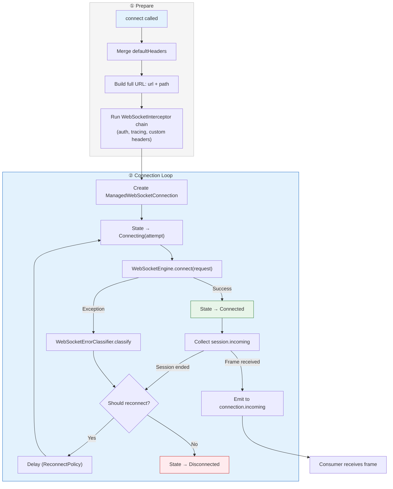

# :network-ws-core

**Abstracciones Puras de WebSocket para Kotlin Multiplatform**

Este módulo define toda la superficie de contratos para conexiones WebSocket, modelado de errores, políticas de reconexión y observabilidad — sin depender de ninguna librería de cliente WebSocket.

---

## Propósito

`:network-ws-core` es la **capa base** para comunicación WebSocket del SDK Core Data Platform. Responde una pregunta:

> *"¿Cómo establezco, mantengo, reconecto y observo conexiones WebSocket de forma segura — sin saber qué librería se usa por debajo?"*

Cada clase en este módulo es una **interfaz**, una **sealed class**, una **data class**, o una **implementación por defecto** que puede sobreescribirse. No hay Ktor, no hay OkHttp, no hay URLSession — solo Kotlin puro y `kotlinx-coroutines`.

---

## Responsabilidades

| Responsabilidad | Dueño |
|---|---|
| Definir la abstracción de transporte WebSocket | `WebSocketEngine` |
| Modelar frames y requests de conexión | `WebSocketFrame`, `WebSocketRequest` |
| Administrar conexiones con reconexión automática | `SafeWebSocketExecutor`, `DefaultSafeWebSocketExecutor` |
| Interceptar requests de conexión antes del transporte | `WebSocketInterceptor` |
| Clasificar errores en tipos semánticos | `WebSocketErrorClassifier`, `DefaultWebSocketErrorClassifier` |
| Modelar errores con mensajes seguros para usuario + diagnósticos internos | `WebSocketError`, `Diagnostic` |
| Observar estado de conexión | `WebSocketState` (Connecting, Connected, Disconnected) |
| Configurar comportamiento de reconexión | `ReconnectPolicy` (None, FixedDelay, ExponentialBackoff) |
| Proveer hooks de observabilidad | `WebSocketEventObserver`, `WebSocketLoggingObserver` |
| Proveer clase base para streaming data sources | `StreamingDataSource` |
| Contener configuración de WebSocket | `WebSocketConfig` |

---

## Contratos Principales

### Transporte

```kotlin
interface WebSocketEngine {
    suspend fun connect(request: WebSocketRequest): WebSocketSession
    fun close()
}

interface WebSocketSession {
    val incoming: Flow<WebSocketFrame>
    suspend fun send(frame: WebSocketFrame)
    suspend fun close(code: Int = 1000, reason: String? = null)
    val isActive: Boolean
}
```

**Regla del contrato:** `WebSocketEngine` solo maneja la conexión de transporte cruda. Reconexión, clasificación de errores y observabilidad son responsabilidad del executor.

### Modelo de Frame

```kotlin
sealed class WebSocketFrame {
    data class Text(val text: String)
    data class Binary(val data: ByteArray)
    data class Close(val code: Int = 1000, val reason: String? = null)
}
```

- Solo frames de datos se exponen al consumidor.
- Ping/Pong son manejados a nivel de engine — nunca se filtran.

### Modelo de Request

```kotlin
data class WebSocketRequest(
    val path: String,
    val headers: Map<String, String> = emptyMap(),
    val protocols: List<String> = emptyList()
)
```

- `path` es relativo (ej. `/ws/prices`). El executor antepone `WebSocketConfig.url`.
- `protocols` son sub-protocolos WebSocket (RFC 6455 §1.9).

### Pipeline de Conexión

```kotlin
interface SafeWebSocketExecutor {
    fun connect(request: WebSocketRequest): WebSocketConnection
}

interface WebSocketConnection {
    val state: StateFlow<WebSocketState>
    val incoming: Flow<WebSocketFrame>
    suspend fun send(frame: WebSocketFrame)
    suspend fun sendText(text: String)
    suspend fun sendBinary(data: ByteArray)
    suspend fun close(code: Int = 1000, reason: String? = null)
}
```

### Estados de Conexión

```kotlin
sealed class WebSocketState {
    data class Connecting(val attempt: Int = 0)
    data object Connected
    data class Disconnected(val error: WebSocketError? = null)
}
```

### Taxonomía de Errores

```kotlin
sealed class WebSocketError {
    abstract val message: String           // Seguro para usuarios finales
    abstract val diagnostic: Diagnostic?   // Solo debugging interno
    open val isRetryable: Boolean = false   // Controla reconexión automática

    // Conexión
    class ConnectionFailed   // isRetryable = true
    class ConnectionLost     // isRetryable = true
    class Timeout            // isRetryable = true

    // Protocolo
    class ProtocolError      // isRetryable = false
    class ClosedByServer     // isRetryable = code != 1000 && code != 1001

    // Seguridad
    class Authentication     // 401/403 durante handshake

    // Procesamiento
    class Serialization      // Deserialización de frame falló

    // Catch-all
    class Unknown
}
```

---

## Estructura Interna

```
network-ws-core/src/commonMain/kotlin/com/dancr/platform/network/ws/
│
├── client/                            # Abstracción de transporte
│   ├── WebSocketEngine.kt            # Interfaz — connect + close
│   ├── WebSocketSession.kt           # Interfaz — incoming Flow + send
│   ├── WebSocketFrame.kt             # Sealed: Text, Binary, Close
│   └── WebSocketRequest.kt           # Data class — path, headers, protocols
│
├── config/                            # Configuración
│   ├── WebSocketConfig.kt            # url, timeouts, pingInterval, reconnectPolicy
│   └── ReconnectPolicy.kt            # Sealed: None, FixedDelay, ExponentialBackoff
│
├── connection/                        # Conexión administrada
│   ├── WebSocketConnection.kt        # Interfaz — state, incoming, send, close
│   └── WebSocketState.kt             # Sealed: Connecting, Connected, Disconnected
│
├── datasource/                        # Clase base para streaming data sources
│   └── StreamingDataSource.kt        # Abstracta — envuelve SafeWebSocketExecutor
│
├── error/                             # Errores semánticos
│   └── WebSocketError.kt             # Sealed class con isRetryable
│
├── execution/                         # Pipeline de conexión
│   ├── SafeWebSocketExecutor.kt      # Interfaz — punto de entrada público
│   ├── DefaultSafeWebSocketExecutor.kt  # Implementación con reconexión
│   ├── WebSocketErrorClassifier.kt   # Interfaz — excepción → WebSocketError
│   ├── DefaultWebSocketErrorClassifier.kt  # Clasificador heurístico
│   └── WebSocketInterceptor.kt       # fun interface — modificación pre-conexión
│
├── observability/                     # Hooks de observabilidad
│   ├── WebSocketEventObserver.kt     # Callbacks de ciclo de vida con default no-op
│   ├── WebSocketLogger.kt            # Interfaz — abstracción de logging
│   └── WebSocketLoggingObserver.kt   # Observer que registra eventos vía WebSocketLogger
│
└── result/                            # Tipos compartidos
    └── Diagnostic.kt                 # Detalles internos de error
```

---

## Cómo Funciona

### Pipeline de DefaultSafeWebSocketExecutor



### Comportamientos Clave

1. **La conexión inicia inmediatamente** — `connect()` retorna un `WebSocketConnection` y lanza el loop de conexión en un scope interno.
2. **Reconexión transparente** — si la conexión se pierde y `error.isRetryable == true`, el executor reconecta automáticamente con el delay configurado.
3. **Backpressure via Channel** — los frames entrantes pasan por un `Channel.BUFFERED` (64 elementos). Si el consumidor no procesa a tiempo, el channel aplica backpressure.
4. **CancellationException siempre se relanza** — nunca se captura, la cancelación de coroutines se propaga correctamente.
5. **Observers notificados en cada evento** — connecting, connected, frame received/sent, disconnected, reconnect scheduled.
6. **`close()` cancela todo** — cierra la sesión, el channel, y el scope interno.

---

## Ejemplos de Uso

### Crear un executor

```kotlin
val executor = DefaultSafeWebSocketExecutor(
    engine = myWebSocketEngine,
    config = WebSocketConfig(
        url = "wss://api.example.com",
        pingInterval = 30.seconds,
        reconnectPolicy = ReconnectPolicy.ExponentialBackoff(
            maxAttempts = 10,
            initialDelay = 1.seconds,
            maxDelay = 30.seconds
        )
    ),
    classifier = MyWebSocketErrorClassifier(),
    interceptors = listOf(authInterceptor),
    observers = listOf(loggingObserver)
)
```

### Conectar y recibir frames

```kotlin
val connection = executor.connect(WebSocketRequest(path = "/ws/prices"))

// Observar estado
scope.launch {
    connection.state.collect { state ->
        when (state) {
            is WebSocketState.Connected -> showConnectedBanner()
            is WebSocketState.Connecting -> showReconnectingBanner(state.attempt)
            is WebSocketState.Disconnected -> showDisconnectedBanner(state.error?.message)
        }
    }
}

// Recibir frames
scope.launch {
    connection.incoming.collect { frame ->
        when (frame) {
            is WebSocketFrame.Text -> handleMessage(frame.text)
            is WebSocketFrame.Binary -> handleBinaryData(frame.data)
            is WebSocketFrame.Close -> handleClose(frame.code, frame.reason)
        }
    }
}

// Enviar
connection.sendText("""{"action":"subscribe","channel":"BTC-USD"}""")

// Cerrar cuando termine
connection.close()
```

### Construir un streaming data source

```kotlin
class PriceStreamDataSource(executor: SafeWebSocketExecutor) : StreamingDataSource(executor) {

    private val json = Json { ignoreUnknownKeys = true }

    fun observePrices(symbol: String): Flow<PriceTickDto> = observe(
        request = WebSocketRequest(path = "/ws/prices/$symbol"),
        deserialize = { frame ->
            when (frame) {
                is WebSocketFrame.Text -> json.decodeFromString(frame.text)
                else -> null
            }
        }
    )
}
```

### Logging con WebSocketLoggingObserver

```kotlin
val logger = WebSocketLogger { level, tag, message ->
    println("[$tag] ${level.name}: $message")
}

val loggingObserver = WebSocketLoggingObserver(
    logger = logger,
    tag = "WS",
    headerSanitizer = { key, value -> logSanitizer.sanitize(key, value) }
)
```

Output de ejemplo:
```
[WS] DEBUG: ⇌ CONNECTING wss://api.example.com/ws/prices
[WS] INFO: ⇌ CONNECTED wss://api.example.com/ws/prices
[WS] DEBUG: ▶ TEXT(42 chars) wss://api.example.com/ws/prices
[WS] DEBUG: ◀ TEXT(128 chars) wss://api.example.com/ws/prices
[WS] ERROR: ✕ DISCONNECTED wss://api.example.com/ws/prices — Connection lost
[WS] WARN: ⟳ Reconnect 1 for wss://api.example.com/ws/prices after 1000ms
[WS] INFO: ⇌ CONNECTED wss://api.example.com/ws/prices
```

---

## Decisiones de Diseño

| Decisión | Razón |
|---|---|
| **Conexión inicia inmediatamente en `connect()`** | Simplifica el modelo de uso. El consumidor no necesita llamar `start()` por separado. |
| **`incoming` es `Flow<WebSocketFrame>` vía Channel** | Backpressure-aware, cancellation-friendly. Un solo collector a la vez (si necesitas múltiples, usa `SharedFlow` externamente). |
| **`WebSocketError` es sealed** | Matching `when` exhaustivo en tiempo de compilación. |
| **`isRetryable` controla la reconexión** | La política de reconexión es propiedad del error. El executor no hardcodea qué errores reconectar. |
| **Close frame normal (1000, 1001) no es retryable** | El servidor cerró intencionalmente. Reconectar sería semánticamente incorrecto. |
| **Ping/Pong no se exponen** | Son control frames manejados por el engine. Exponerlos contamina el stream de datos sin beneficio. |
| **`StreamingDataSource` es clase abstracta** | Mismo patrón que `RemoteDataSource` — previene re-exposición accidental del executor. |
| **Diagnostic duplicado de `:network-core`** | Mantiene zero coupling entre módulos core. Un futuro `:platform-common` los unificará. |

---

## Extensibilidad

| Punto de Extensión | Cómo |
|---|---|
| **Nuevo transporte** | Implementar `WebSocketEngine` en un nuevo módulo (ej. `:network-ws-okhttp`) |
| **Clasificación de errores de plataforma** | Extender `DefaultWebSocketErrorClassifier`, sobreescribir `classifyThrowable()` |
| **Procesamiento pre-conexión** | Agregar un `WebSocketInterceptor` (auth headers, tracing, custom headers) |
| **Logging** | Usar `WebSocketLoggingObserver` con tu propio `WebSocketLogger` |
| **Observabilidad personalizada** | Implementar `WebSocketEventObserver` directamente |
| **Políticas de reconexión personalizadas** | Agregar nuevos subtipos de `ReconnectPolicy` |

---

## Dependencias

### Maven Central

```kotlin
implementation("io.github.dancrrdz93:network-ws-core:0.3.0")
```

### Dependencia transitiva

```toml
# Única dependencia — sin cliente WebSocket, sin serialización
[dependencies]
kotlinx-coroutines-core = "1.10.1"
```

Este módulo compila para **todos los targets**: Android, iosX64, iosArm64, iosSimulatorArm64.
