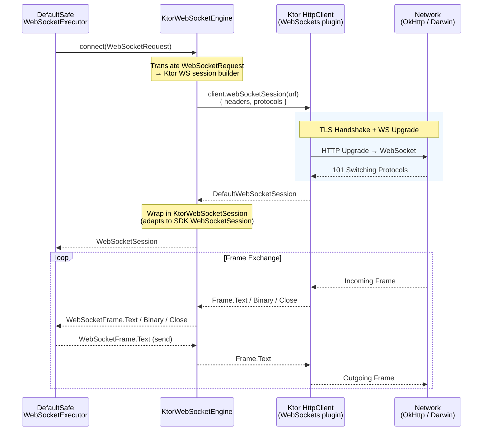
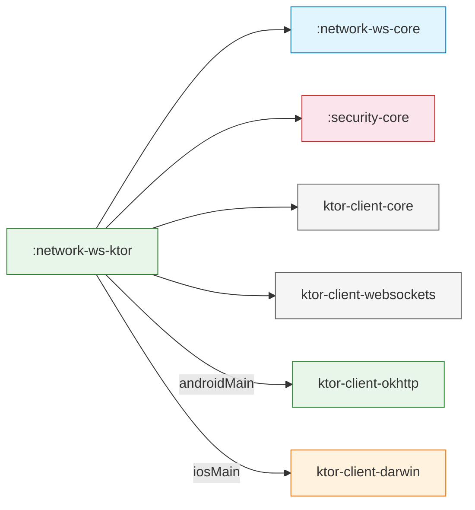

# :network-ws-ktor

**Adaptador de Transporte WebSocket Basado en Ktor para Core Data Platform**

Este módulo provee la implementación concreta de transporte WebSocket adaptando la librería cliente [Ktor](https://ktor.io/) a la interfaz `WebSocketEngine` definida en `:network-ws-core`. Encapsula todo el código específico de Ktor para que ningún otro módulo del proyecto importe un tipo de Ktor.

---

## Propósito

`:network-ws-ktor` responde una pregunta:

> *"¿Cómo establezco una conexión WebSocket y transmito frames — usando Ktor como transporte — sin filtrar ningún tipo de Ktor al resto del SDK?"*

Es el **único módulo** en el proyecto que depende de `ktor-client-websockets`. Reemplazarlo con `:network-ws-okhttp` requeriría cero cambios en `:network-ws-core`, `:security-core`, o cualquier módulo de dominio.

---

## Responsabilidades

| Responsabilidad | Dueño |
|---|---|
| Traducir `WebSocketRequest` → sesión WebSocket de Ktor | `KtorWebSocketEngine` |
| Traducir `Frame` de Ktor → `WebSocketFrame` del SDK | `KtorWebSocketSession` (interno) |
| Configurar timeouts y ping interval desde `WebSocketConfig` | `KtorWebSocketEngine.create()` |
| Clasificar excepciones específicas de Ktor | `KtorWebSocketErrorClassifier` |
| Configurar certificate pinning por plataforma | `createPlatformWebSocketClient()` |
| Seleccionar el engine de plataforma automáticamente | Resolución de dependencias Gradle |

---

## Contratos Principales

### KtorWebSocketEngine

```kotlin
class KtorWebSocketEngine(private val client: HttpClient) : WebSocketEngine {

    override suspend fun connect(request: WebSocketRequest): WebSocketSession
    override fun close()

    companion object {
        fun create(
            config: WebSocketConfig,
            trustPolicy: TrustPolicy? = null
        ): KtorWebSocketEngine
    }
}
```

**Comportamientos clave:**

- **`expectSuccess = false`** — Ktor NO lanza excepciones en errores de handshake HTTP. El pipeline de `:network-ws-core` maneja la clasificación de errores.
- **Ping/Pong automático** — El plugin `WebSockets` de Ktor maneja ping/pong internamente con el intervalo configurado en `WebSocketConfig.pingInterval`.
- **Traducción de frames** — Solo `Frame.Text`, `Frame.Binary` y `Frame.Close` se exponen. `Frame.Ping` y `Frame.Pong` son filtrados.
- **`webSocketSession()`** — Usa la API de Ktor 3.x que retorna una sesión persistente directamente, sin bloque scope.

### KtorWebSocketErrorClassifier

```kotlin
class KtorWebSocketErrorClassifier : DefaultWebSocketErrorClassifier() {

    override fun classifyThrowable(cause: Throwable): WebSocketError
}
```

| Excepción Ktor | Mapeada A |
|---|---|
| `HttpRequestTimeoutException` | `WebSocketError.Timeout` |
| *(otras caen a)* | Matching heurístico de `DefaultWebSocketErrorClassifier` |

---

## Estructura Interna

```
network-ws-ktor/src/
├── commonMain/kotlin/com/dancr/platform/network/ws/ktor/
│   ├── KtorWebSocketEngine.kt           # WebSocketEngine impl + factory
│   ├── KtorWebSocketErrorClassifier.kt  # Clasificación de errores Ktor
│   └── PlatformWebSocketClient.kt       # expect — factory de HttpClient
│
├── androidMain/kotlin/com/dancr/platform/network/ws/ktor/
│   └── PlatformWebSocketClient.android.kt  # OkHttp + WebSockets + CertificatePinner
│
└── iosMain/kotlin/com/dancr/platform/network/ws/ktor/
    └── PlatformWebSocketClient.ios.kt      # Darwin + WebSockets + SecTrust pinning
```

---

## Cómo Funciona



### Traducción de Frames

```
Ktor Frame                                SDK WebSocketFrame
─────────────────────                    ─────────────────────
Frame.Text("hello")                  →    WebSocketFrame.Text("hello")
Frame.Binary(true, bytes)            →    WebSocketFrame.Binary(bytes)
Frame.Close(code, reason)            →    WebSocketFrame.Close(code, reason)
Frame.Ping / Frame.Pong              →    (filtrado — no se expone)
```

---

## Uso

### Uso estándar (vía factory)

```kotlin
val config = WebSocketConfig(
    url = "wss://api.example.com",
    connectTimeout = 15.seconds,
    pingInterval = 30.seconds,
    reconnectPolicy = ReconnectPolicy.ExponentialBackoff(maxAttempts = 10)
)

val engine = KtorWebSocketEngine.create(config)
val classifier = KtorWebSocketErrorClassifier()

val executor = DefaultSafeWebSocketExecutor(
    engine = engine,
    config = config,
    classifier = classifier,
    observers = listOf(loggingObserver)
)
```

### Con certificate pinning

```kotlin
val trustPolicy = DefaultTrustPolicy(
    pins = mapOf(
        "api.example.com" to setOf(
            CertificatePin(algorithm = "sha256", hash = "AAAA...=")
        )
    )
)

val engine = KtorWebSocketEngine.create(config, trustPolicy)
```

### Uso avanzado (HttpClient de Ktor personalizado)

```kotlin
val customClient = HttpClient {
    install(WebSockets) {
        pingIntervalMillis = 15_000
        maxFrameSize = 1_048_576  // 1 MB
    }
    install(HttpTimeout) {
        connectTimeoutMillis = 10_000
    }
    expectSuccess = false  // REQUERIDO
}

val engine = KtorWebSocketEngine(customClient)
```

> **Advertencia:** Si provees un `HttpClient` personalizado, **debes** instalar el plugin `WebSockets` y establecer `expectSuccess = false`.

---

## Decisiones de Diseño

| Decisión | Razón |
|---|---|
| **`webSocketSession()` en lugar de `webSocket { }`** | La API de Ktor 3.x retorna una sesión persistente. Evita la complejidad del bloque scope y permite un modelo de propiedad más limpio. |
| **`expectSuccess = false`** | El clasificador del SDK maneja errores de handshake. Ktor debe entregarlos como excepciones de transporte, no lanzar sus propias. |
| **Ping/Pong filtrados** | Son control frames del protocolo. Ktor los maneja internamente. Exponerlos contamina el stream de datos. |
| **Certificate pinning vía `createPlatformWebSocketClient()`** | Mismo patrón que `:network-ktor` para HTTP. CertificatePinner (Android) y SecTrust (iOS). |
| **SHA-256 puro en Kotlin para iOS** | Evita `CommonCrypto` que no compila en `iosMain` metadata. Mismo enfoque que `:network-ktor`. |

---

## Extensibilidad

### Certificate pinning

`KtorWebSocketEngine.create()` acepta un parámetro opcional `TrustPolicy` de `:security-core`:

- **Android (OkHttp):** vía `CertificatePinner`
- **iOS (Darwin):** vía `handleChallenge` con evaluación `SecTrust`

### Reemplazar Ktor

Crea un nuevo módulo (ej. `:network-ws-okhttp`) que:

1. Implemente `WebSocketEngine`.
2. Extienda `DefaultWebSocketErrorClassifier` para matching de excepciones específicas.
3. Provea un método factory.

---

## Dependencias

### Maven Central

```kotlin
implementation("io.github.dancrrdz93:network-ws-ktor:0.3.0")
```

### Dependencias transitivas

```kotlin
// commonMain
implementation("io.github.dancrrdz93:network-ws-core:0.3.0")
implementation("io.github.dancrrdz93:security-core:0.3.0")
implementation(libs.ktor.client.core)          // io.ktor:ktor-client-core:3.0.3
implementation(libs.ktor.client.websockets)    // io.ktor:ktor-client-websockets:3.0.3

// androidMain
implementation(libs.ktor.client.okhttp)        // io.ktor:ktor-client-okhttp:3.0.3

// iosMain
implementation(libs.ktor.client.darwin)        // io.ktor:ktor-client-darwin:3.0.3
```


