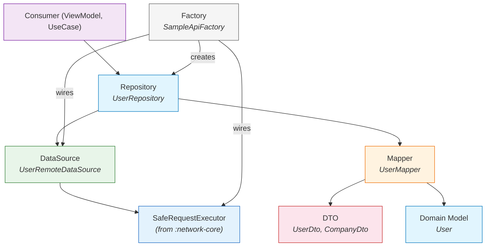
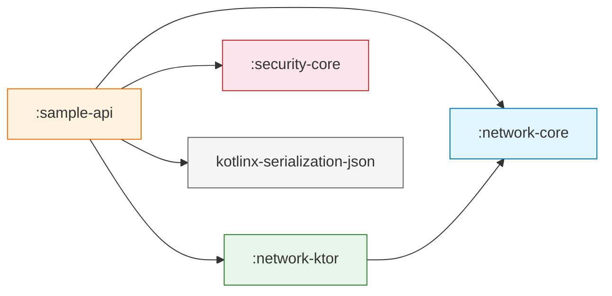

# :sample-api

**Módulo Piloto de Referencia para Integración de API de Dominio**

Este módulo es un ejemplo completamente funcional que demuestra el patrón arquitectónico correcto para construir módulos de API específicos de dominio sobre `:network-core`, `:network-ktor` y `:security-core`. Sirve como plantilla que cada futuro módulo de dominio (`:payments-api`, `:loyalty-api`, `:users-api`, etc.) debería seguir.

---

## Propósito

`:sample-api` responde una pregunta:

> *"¿Cómo luce un módulo de API de dominio bien estructurado al consumir el SDK Core Data Platform?"*

**No** es un módulo de producción. Usa [JSONPlaceholder](https://jsonplaceholder.typicode.com) como backend de prueba. Su valor es arquitectónico: valida que los contratos del SDK funcionan de extremo a extremo y establece el patrón por capas que los módulos de dominio reales replicarán.

---

## Responsabilidades

| Responsabilidad | Dueño |
|---|---|
| Definir modelos técnicos que coincidan con el contrato del API | `UserDto`, `CompanyDto` |
| Definir modelos de dominio limpios para consumidores | `User` |
| Convertir DTOs a modelos de dominio | `UserMapper` |
| Construir requests HTTP y deserializar respuestas | `UserRemoteDataSource` |
| Exponer resultados tipados de dominio a consumidores | `UserRepository` |
| Ensamblar el grafo de dependencias completo | `SampleApiFactory` |

---

## El Patrón por Capas

Cada módulo de API de dominio sigue exactamente esta estructura de capas:



### Flujo de datos

```
El consumidor llama repository.getUsers()
    │
    ▼
UserRepository
    │  llama dataSource.fetchUsers()
    │  mapea resultado: .map(UserMapper::toDomain)
    ▼
UserRemoteDataSource : RemoteDataSource
    │  construye HttpRequest(path = "/users", method = GET)
    │  provee lambda de deserialización (JSON → List<UserDto>)
    │  delega a SafeRequestExecutor.execute()
    ▼
DefaultSafeRequestExecutor (de :network-core)
    │  preparar → interceptar → transportar → validar → deserializar
    ▼
NetworkResult<List<UserDto>>
    │
    ▼  (de vuelta en UserRepository)
.map(UserMapper::toDomain)
    │
    ▼
NetworkResult<List<User>>  ← el consumidor recibe modelos de dominio limpios
```

---

## Estructura Interna

```
sample-api/src/commonMain/kotlin/com/dancr/platform/sample/
│
├── dto/
│   └── UserDto.kt              # Modelos técnicos @Serializable (contrato del API)
│
├── model/
│   └── User.kt                 # Modelo de dominio limpio (sin anotaciones)
│
├── mapper/
│   └── UserMapper.kt           # Conversión DTO → Dominio (object sin estado)
│
├── datasource/
│   └── UserRemoteDataSource.kt # Extiende RemoteDataSource, construye requests
│
├── repository/
│   └── UserRepository.kt       # Capa de mapeo de dominio, superficie de API público
│
└── di/
    └── SampleApiFactory.kt     # Cableado completo: config → engine → executor → repo
```

---

## Contratos y Clases

### DTOs (Modelos Técnicos)

```kotlin
@Serializable
data class UserDto(
    val id: Long,
    val name: String,
    val username: String,
    val email: String,
    val phone: String? = null,
    val website: String? = null,
    @SerialName("company") val companyDto: CompanyDto? = null
)

@Serializable
data class CompanyDto(
    val name: String,
    @SerialName("catchPhrase") val catchPhrase: String? = null
)
```

- `@Serializable` — usa `kotlinx-serialization`. Estas anotaciones nunca aparecen en modelos de dominio.
- `@SerialName` — mapea nombres de campos JSON a nombres de propiedades Kotlin cuando difieren.
- Los campos nullable tienen defaults — tolera respuestas parciales del API.

### Modelo de Dominio

```kotlin
data class User(
    val id: Long,
    val displayName: String,
    val handle: String,
    val email: String,
    val company: String?
)
```

- **Sin anotaciones de serialización** — este modelo es agnóstico del API.
- **Campos renombrados** — `name` → `displayName`, `username` → `handle`. El vocabulario de dominio es independiente del contrato del API.
- **Estructura aplanada** — `companyDto.name` → `company: String?`. La estructura anidada del DTO se simplifica para consumidores.

### Mapper

```kotlin
object UserMapper {
    fun toDomain(dto: UserDto): User = User(
        id = dto.id,
        displayName = dto.name,
        handle = dto.username,
        email = dto.email,
        company = dto.companyDto?.name
    )

    fun toDomain(dtos: List<UserDto>): List<User> = dtos.map(::toDomain)
}
```

- **`object` sin estado** — sin dependencias, sin efectos secundarios, trivialmente testeable.
- **Sobrecargado para listas** — evita el boilerplate `.map { UserMapper.toDomain(it) }` en el repository.

### DataSource

```kotlin
class UserRemoteDataSource(
    executor: SafeRequestExecutor
) : RemoteDataSource(executor) {

    private val json = Json { ignoreUnknownKeys = true }

    suspend fun fetchUsers(): NetworkResult<List<UserDto>>
    suspend fun fetchUser(id: Long): NetworkResult<UserDto>
}
```

- **Extiende `RemoteDataSource`** — obtiene acceso a `protected fun execute()`.
- **La instancia de `Json` se reutiliza** — creada una vez, compartida entre todas las requests.
- **`ignoreUnknownKeys = true`** — tolera evolución del API (campos nuevos no rompen la deserialización).
- **Retorna `NetworkResult<UserDto>`** — resultados a nivel de DTO. El mapeo de dominio es trabajo del repository.

### Repository

```kotlin
class UserRepository(
    private val dataSource: UserRemoteDataSource
) {
    suspend fun getUsers(): NetworkResult<List<User>> =
        dataSource.fetchUsers().map(UserMapper::toDomain)

    suspend fun getUser(id: Long): NetworkResult<User> =
        dataSource.fetchUser(id).map(UserMapper::toDomain)
}
```

- **Responsabilidad única** — mapea resultados DTO a resultados de dominio usando `NetworkResult.map()`.
- **Sintaxis de referencia a método** — `UserMapper::toDomain` es limpio y legible.
- **La superficie de API público** — los consumidores interactúan con `UserRepository`, nunca con `UserRemoteDataSource` directamente.

### Factory

```kotlin
object SampleApiFactory {

    fun create(
        config: NetworkConfig = defaultConfig,
        credentialProvider: CredentialProvider? = null
    ): UserRepository
}
```

- **Ensambla el grafo completo**: `NetworkConfig` → `KtorHttpEngine` → `DefaultSafeRequestExecutor` → `UserRemoteDataSource` → `UserRepository`.
- **Acepta `NetworkConfig`** — testeable, configurable por entorno.
- **`CredentialProvider` opcional** — si se provee, cablea un interceptor de auth usando `CredentialHeaderMapper`.
- **Configuración por defecto** — URL base de JSONPlaceholder, backoff exponencial con 2 reintentos.

---

## Uso

### Inicio rápido

```kotlin
val repository = SampleApiFactory.create()

val result: NetworkResult<List<User>> = repository.getUsers()

result.fold(
    onSuccess = { users ->
        users.forEach { println("${it.displayName} (@${it.handle})") }
    },
    onFailure = { error ->
        println("Error: ${error.message}")
    }
)
```

### Con autenticación

```kotlin
val myProvider = object : CredentialProvider {
    override suspend fun current() = Credential.Bearer("my-token")
}

val repository = SampleApiFactory.create(credentialProvider = myProvider)
```

### Con configuración personalizada

```kotlin
val config = NetworkConfig(
    baseUrl = "https://my-test-server.com",
    connectTimeout = 5.seconds,
    readTimeout = 10.seconds,
    retryPolicy = RetryPolicy.None
)

val repository = SampleApiFactory.create(config = config)
```

---

## Decisiones de Diseño

| Decisión | Razón |
|---|---|
| **DTOs y modelos de dominio siempre están separados** | Los contratos del API cambian independientemente del vocabulario de la app. `UserDto` puede evolucionar (campos nuevos, renombramientos) sin tocar `User`. |
| **Mapper es un `object` sin estado** | Sin dependencias, sin ciclo de vida. Se puede testear con una sola llamada a función. |
| **DataSource retorna resultados tipados a DTO** | El trabajo del data source es transporte + deserialización. El mapeo de dominio es una preocupación separada (repository). |
| **Repository usa `NetworkResult.map()`** | Preserva la semántica `Success`/`Failure`. Sin try-catch, sin desenvolver resultados, sin re-envolver. |
| **Factory es un `object` con `create()`** | Simple, sin framework de DI requerido. Se puede llamar desde cualquier plataforma. Los parámetros permiten configuración. |
| **El interceptor de auth usa `CredentialHeaderMapper`** | La conversión de credencial a header vive en `:security-core`. El factory solo necesita 2 líneas para cablear auth. Sin lógica de Base64, sin switch de tipo de credencial. |
| **`Json` con `ignoreUnknownKeys = true`** | Deserialización defensiva. Si el API agrega un campo nuevo mañana, las versiones existentes de la app no se rompen. |

---

## Cómo Crear un Nuevo Módulo de Dominio

Usa este módulo como tu plantilla:

### 1. Crea el módulo

```
your-domain-api/
└── src/commonMain/kotlin/com/dancr/platform/yourdomain/
    ├── dto/          # Modelos @Serializable que coinciden con tu API
    ├── model/        # Modelos de dominio limpios
    ├── mapper/       # Conversión DTO → Dominio
    ├── datasource/   # Extiende RemoteDataSource
    ├── repository/   # Mapea NetworkResult<Dto> → NetworkResult<Model>
    └── di/           # Cableado de factory
```

### 2. Agrega dependencias

```kotlin
// build.gradle.kts
plugins {
    alias(libs.plugins.kotlin.multiplatform)
    alias(libs.plugins.android.kotlin.multiplatform.library)
    alias(libs.plugins.kotlin.serialization)
}

kotlin {
    // targets...
    sourceSets {
        commonMain.dependencies {
            implementation(project(":network-core"))
            implementation(project(":network-ktor"))
            implementation(project(":security-core"))
            implementation(libs.kotlinx.coroutines.core)
            implementation(libs.kotlinx.serialization.json)
        }
    }
}
```

### 3. Sigue el checklist

- [ ] Los DTOs tienen `@Serializable`, los modelos de dominio no
- [ ] El Mapper es un `object` sin estado con funciones `toDomain()`
- [ ] El DataSource extiende `RemoteDataSource` y retorna `NetworkResult<Dto>`
- [ ] El Repository mapea resultados DTO a resultados de dominio vía `.map()`
- [ ] El Factory acepta `NetworkConfig` y `CredentialProvider` opcional
- [ ] Sin tipos de Ktor importados en ningún lado
- [ ] Sin `RawResponse` expuesto más allá del data source
- [ ] Instancia de `Json` creada una vez y reutilizada

---

## Extensibilidad

| Extensión | Cómo |
|---|---|
| **Agregar un nuevo endpoint** | Agregar un nuevo `suspend fun` en el data source + método correspondiente en el repository |
| **Agregar parámetros de request** | Usar `HttpRequest.queryParams` o `HttpRequest.body` en el data source |
| **Agregar contexto por request** | Pasar `RequestContext` con `operationId` y `tags` a `execute()` |
| **Agregar caching** | Envolver `UserRepository` con un decorator de caching, o agregar un `ResponseInterceptor` |
| **Agregar paginación** | Retornar un `NetworkResult<PagedResult<User>>` con metadata de siguiente página |

---

## Limitaciones Actuales

| Limitación | Contexto |
|---|---|
| **Usa JSONPlaceholder** | No es un API de producción. Reemplaza `baseUrl` en `NetworkConfig` para uso real. |
| **Sin recuperación de errores** | El repository no intenta reintentos ni fallbacks más allá de lo que provee el executor. |
| **`response.body!!`** | El data source usa force-unwrap en el body de respuesta. Un body null (ej. 204 No Content) produciría un `NetworkError.Serialization` con un diagnostic confuso. |
| **Sin paginación** | `fetchUsers()` retorna todos los usuarios. Sin soporte de offset/limit. |
| **Sin tests unitarios** | El módulo valida la arquitectura pero aún no incluye cobertura de tests. |

---

## Dependencias

```kotlin
// commonMain
implementation(project(":network-core"))
implementation(project(":network-ktor"))
implementation(project(":security-core"))
implementation(libs.kotlinx.coroutines.core)        // 1.10.1
implementation(libs.kotlinx.serialization.json)      // 1.7.3
```


