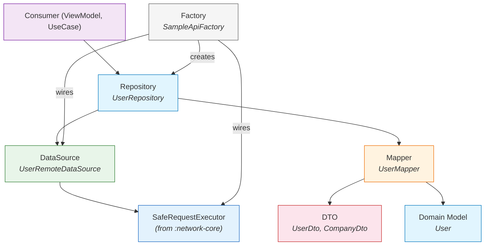
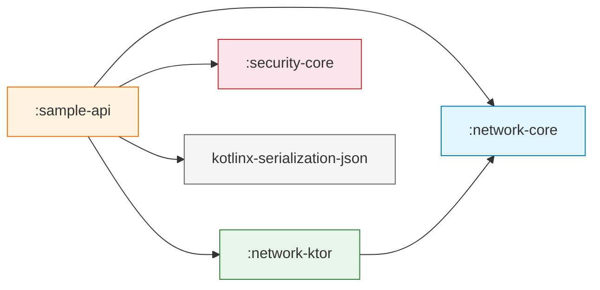

# :sample-api

**Pilot Reference Module for Domain API Integration**

This module is a fully functional example demonstrating the correct architectural pattern for building domain-specific API modules on top of `:network-core`, `:network-ktor`, and `:security-core`. It serves as a blueprint that every future domain module (`:payments-api`, `:loyalty-api`, `:users-api`, etc.) should follow.

---

## Purpose

`:sample-api` answers one question:

> *"What does a well-structured domain API module look like when consuming the Core Data Platform SDK?"*

It is **not** a production module. It uses [JSONPlaceholder](https://jsonplaceholder.typicode.com) as a test backend. Its value is architectural: it validates that the SDK contracts work end-to-end and establishes the layered pattern that real domain modules will replicate.

---

## Responsibilities

| Responsibility | Owner |
|---|---|
| Define technical models matching the API contract | `UserDto`, `CompanyDto` |
| Define clean domain models for consumers | `User` |
| Convert DTOs to domain models | `UserMapper` |
| Build HTTP requests and deserialize responses | `UserRemoteDataSource` |
| Expose domain-typed results to consumers | `UserRepository` |
| Assemble the full dependency graph | `SampleApiFactory` |

---

## The Layered Pattern

Every domain API module follows this exact layer structure:



### Data flow

```
Consumer calls repository.getUsers()
    │
    ▼
UserRepository
    │  calls dataSource.fetchUsers()
    │  maps result: .map(UserMapper::toDomain)
    ▼
UserRemoteDataSource : RemoteDataSource
    │  builds HttpRequest(path = "/users", method = GET)
    │  provides deserialize lambda (JSON → List<UserDto>)
    │  delegates to SafeRequestExecutor.execute()
    ▼
DefaultSafeRequestExecutor (from :network-core)
    │  prepare → intercept → transport → validate → deserialize
    ▼
NetworkResult<List<UserDto>>
    │
    ▼  (back in UserRepository)
.map(UserMapper::toDomain)
    │
    ▼
NetworkResult<List<User>>  ← consumer receives clean domain models
```

---

## Internal Structure

```
sample-api/src/commonMain/kotlin/com/dancr/platform/sample/
│
├── dto/
│   └── UserDto.kt              # @Serializable technical models (API contract)
│
├── model/
│   └── User.kt                 # Clean domain model (no annotations)
│
├── mapper/
│   └── UserMapper.kt           # DTO → Domain conversion (stateless object)
│
├── datasource/
│   └── UserRemoteDataSource.kt # Extends RemoteDataSource, builds requests
│
├── repository/
│   └── UserRepository.kt       # Domain mapping layer, public API surface
│
└── di/
    └── SampleApiFactory.kt     # Full wiring: config → engine → executor → repo
```

---

## Contracts and Classes

### DTOs (Technical Models)

```kotlin
@Serializable
data class UserDto(
    val id: Long,
    val name: String,
    val username: String,
    val email: String,
    val phone: String? = null,
    val website: String? = null,
    @SerialName("company") val companyDto: CompanyDto? = null
)

@Serializable
data class CompanyDto(
    val name: String,
    @SerialName("catchPhrase") val catchPhrase: String? = null
)
```

- `@Serializable` — uses `kotlinx-serialization`. These annotations never appear on domain models.
- `@SerialName` — maps JSON field names to Kotlin property names when they differ.
- Nullable fields have defaults — tolerates partial API responses.

### Domain Model

```kotlin
data class User(
    val id: Long,
    val displayName: String,
    val handle: String,
    val email: String,
    val company: String?
)
```

- **No serialization annotations** — this model is API-agnostic.
- **Renamed fields** — `name` → `displayName`, `username` → `handle`. The domain vocabulary is independent from the API contract.
- **Flattened structure** — `companyDto.name` → `company: String?`. The nested DTO structure is simplified for consumers.

### Mapper

```kotlin
object UserMapper {
    fun toDomain(dto: UserDto): User = User(
        id = dto.id,
        displayName = dto.name,
        handle = dto.username,
        email = dto.email,
        company = dto.companyDto?.name
    )

    fun toDomain(dtos: List<UserDto>): List<User> = dtos.map(::toDomain)
}
```

- **Stateless `object`** — no dependencies, no side effects, trivially testable.
- **Overloaded for lists** — avoids `.map { UserMapper.toDomain(it) }` boilerplate in the repository.

### DataSource

```kotlin
class UserRemoteDataSource(
    executor: SafeRequestExecutor
) : RemoteDataSource(executor) {

    private val json = Json { ignoreUnknownKeys = true }

    suspend fun fetchUsers(): NetworkResult<List<UserDto>>
    suspend fun fetchUser(id: Long): NetworkResult<UserDto>
}
```

- **Extends `RemoteDataSource`** — gains access to `protected fun execute()`.
- **`Json` instance is reused** — created once, shared across all requests.
- **`ignoreUnknownKeys = true`** — tolerates API evolution (new fields don't break deserialization).
- **Returns `NetworkResult<UserDto>`** — DTO-level results. Domain mapping is the repository's job.

### Repository

```kotlin
class UserRepository(
    private val dataSource: UserRemoteDataSource
) {
    suspend fun getUsers(): NetworkResult<List<User>> =
        dataSource.fetchUsers().map(UserMapper::toDomain)

    suspend fun getUser(id: Long): NetworkResult<User> =
        dataSource.fetchUser(id).map(UserMapper::toDomain)
}
```

- **Single responsibility** — maps DTO results to domain results using `NetworkResult.map()`.
- **Method reference syntax** — `UserMapper::toDomain` is clean and readable.
- **The public API surface** — consumers interact with `UserRepository`, never with `UserRemoteDataSource` directly.

### Factory

```kotlin
object SampleApiFactory {

    fun create(
        config: NetworkConfig = defaultConfig,
        credentialProvider: CredentialProvider? = null
    ): UserRepository
}
```

- **Assembles the full graph**: `NetworkConfig` → `KtorHttpEngine` → `DefaultSafeRequestExecutor` → `UserRemoteDataSource` → `UserRepository`.
- **Accepts `NetworkConfig`** — testable, configurable per environment.
- **Optional `CredentialProvider`** — if provided, wires an auth interceptor using `CredentialHeaderMapper`.
- **Default config** — JSONPlaceholder base URL, exponential backoff with 2 retries.

---

## Usage

### Quick start

```kotlin
val repository = SampleApiFactory.create()

val result: NetworkResult<List<User>> = repository.getUsers()

result.fold(
    onSuccess = { users ->
        users.forEach { println("${it.displayName} (@${it.handle})") }
    },
    onFailure = { error ->
        println("Error: ${error.message}")
    }
)
```

### With authentication

```kotlin
val myProvider = object : CredentialProvider {
    override suspend fun current() = Credential.Bearer("my-token")
}

val repository = SampleApiFactory.create(credentialProvider = myProvider)
```

### With custom configuration

```kotlin
val config = NetworkConfig(
    baseUrl = "https://my-test-server.com",
    connectTimeout = 5.seconds,
    readTimeout = 10.seconds,
    retryPolicy = RetryPolicy.None
)

val repository = SampleApiFactory.create(config = config)
```

---

## Design Decisions

| Decision | Rationale |
|---|---|
| **DTOs and domain models are always separate** | API contracts change independently from app vocabulary. `UserDto` can evolve (new fields, renames) without touching `User`. |
| **Mapper is a stateless `object`** | No dependencies, no lifecycle. Can be tested with a single function call. |
| **DataSource returns DTO-typed results** | The data source's job is transport + deserialization. Domain mapping is a separate concern (repository). |
| **Repository uses `NetworkResult.map()`** | Preserves the `Success`/`Failure` semantics. No try-catch, no result unwrapping, no re-wrapping. |
| **Factory is an `object` with `create()`** | Simple, no DI framework required. Can be called from any platform. Parameters allow configuration. |
| **Auth interceptor uses `CredentialHeaderMapper`** | The credential-to-header conversion lives in `:security-core`. The factory only needs 2 lines to wire auth. No Base64 logic, no credential type switching. |
| **`Json` with `ignoreUnknownKeys = true`** | Defensive deserialization. If the API adds a new field tomorrow, existing versions of the app don't crash. |

---

## How to Create a New Domain Module

Use this module as your template:

### 1. Create the module

```
your-domain-api/
└── src/commonMain/kotlin/com/dancr/platform/yourdomain/
    ├── dto/          # @Serializable models matching your API
    ├── model/        # Clean domain models
    ├── mapper/       # DTO → Domain conversion
    ├── datasource/   # Extends RemoteDataSource
    ├── repository/   # Maps NetworkResult<Dto> → NetworkResult<Model>
    └── di/           # Factory wiring
```

### 2. Add dependencies

```kotlin
// build.gradle.kts
plugins {
    alias(libs.plugins.kotlin.multiplatform)
    alias(libs.plugins.android.kotlin.multiplatform.library)
    alias(libs.plugins.kotlin.serialization)
}

kotlin {
    // targets...
    sourceSets {
        commonMain.dependencies {
            implementation(project(":network-core"))
            implementation(project(":network-ktor"))
            implementation(project(":security-core"))
            implementation(libs.kotlinx.coroutines.core)
            implementation(libs.kotlinx.serialization.json)
        }
    }
}
```

### 3. Follow the checklist

- [ ] DTOs have `@Serializable`, domain models do not
- [ ] Mapper is a stateless `object` with `toDomain()` functions
- [ ] DataSource extends `RemoteDataSource` and returns `NetworkResult<Dto>`
- [ ] Repository maps DTO results to domain results via `.map()`
- [ ] Factory accepts `NetworkConfig` and optional `CredentialProvider`
- [ ] No Ktor types imported anywhere
- [ ] No `RawResponse` exposed beyond the data source
- [ ] `Json` instance created once and reused

---

## Extensibility

| Extension | How |
|---|---|
| **Add a new endpoint** | Add a new `suspend fun` in the data source + corresponding method in repository |
| **Add request parameters** | Use `HttpRequest.queryParams` or `HttpRequest.body` in the data source |
| **Add per-request context** | Pass `RequestContext` with `operationId` and `tags` to `execute()` |
| **Add caching** | Wrap `UserRepository` with a caching decorator, or add a `ResponseInterceptor` |
| **Add pagination** | Return a `NetworkResult<PagedResult<User>>` with next-page metadata |

---

## Current Limitations

| Limitation | Context |
|---|---|
| **Uses JSONPlaceholder** | Not a production API. Replace `baseUrl` in `NetworkConfig` for real use. |
| **No error recovery** | The repository does not attempt retries or fallbacks beyond what the executor provides. |
| **`response.body!!`** | The data source uses force-unwrap on response body. A null body (e.g., 204 No Content) would produce a `NetworkError.Serialization` with a confusing diagnostic. |
| **No pagination** | `fetchUsers()` returns all users. No offset/limit support. |
| **No unit tests** | The module validates the architecture but does not include test coverage yet. |

---

## Dependencies

```kotlin
// commonMain
implementation(project(":network-core"))
implementation(project(":network-ktor"))
implementation(project(":security-core"))
implementation(libs.kotlinx.coroutines.core)        // 1.10.1
implementation(libs.kotlinx.serialization.json)      // 1.7.3
```


